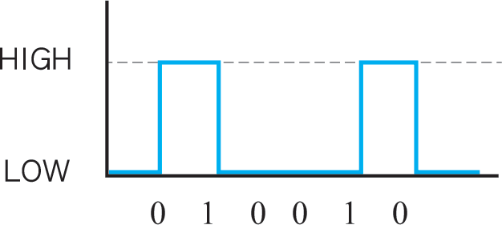
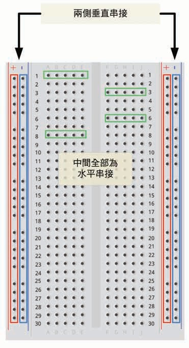
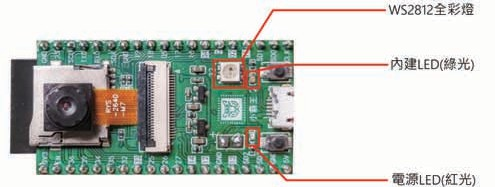

# 6. 數位輸入與輸出

## 數位輸出

`pinMode(pin, OUTPUT)` 將 GPIO 設為輸出；`digitalWrite()` 輸出 `HIGH` 或 `LOW`。



*圖：數位輸出只在 HIGH 與 LOW 兩種狀態間切換。來源：AB143 第四版第 3 章。*

### 認識麵包板與課程板燈號



*圖：麵包板中央每排五孔相通，兩側電源軌縱向相通；實際使用前仍要確認手邊麵包板是否有中途斷開。來源：AB143 第四版第 3 章，原書頁 P31。*



*圖：AB143 課本所示課程板的燈號位置；不同批次板子仍需依實物確認。來源：AB143 第四版第 3 章，原書頁 P30。*

一般 LED 接線：

```text
GPIO ── LED 正極
LED 負極 ── GND
```


*圖：一般 LED 長腳為正極、短腳為負極；若零件已剪腳，應再從外殼平邊或內部電極辨識。來源：AB143 第四版第 3 章，原書頁 P32。*

## 數位輸入與內建上拉

外接按鈕使用 GPIO 13 與 GND：

```text
GPIO 13 ── 按鈕 ── GND
```

程式使用：

```cpp
pinMode(BUTTON_PIN, INPUT_PULLUP);
```

放開按鈕時讀到 `HIGH`，按下時讀到 `LOW`。這個邏輯必須在教材與程式中明確標示。

## 防彈跳

機械按鈕按下或放開時可能在幾毫秒內快速跳動。`04_button_toggle` 只有在狀態穩定一段時間後才承認一次按鍵，避免按一次卻切換多次。

防彈跳驗收：連續按十次，LED 應正好切換十次；長按不應連續切換。

## 紅綠燈

| 顏色 | GPIO | 亮燈時間 |
|---|---:|---:|
| 綠 | 15 | 5 秒 |
| 黃 | 2 | 1 秒 |
| 紅 | 4 | 3 秒 |

`05_traffic_light` 在 `setup()` 先關閉全部輸出，再以紅燈作為安全起點，依紅、綠、黃順序循環。三色持續時間保留 AB143 原範例的紅 3 秒、綠 5 秒、黃 1 秒。若實際模組為低電位觸發，必須修改 ON／OFF 邏輯，不能直接套用一般 LED 範例。

## 常見錯誤

- LED 極性接反或沒有共地。
- 按鈕接到 3.3V，卻仍以 `INPUT_PULLUP` 的低電位有效邏輯判斷。
- 使用啟動相關腳位時，外部電路在重啟期間強制錯誤電位。
