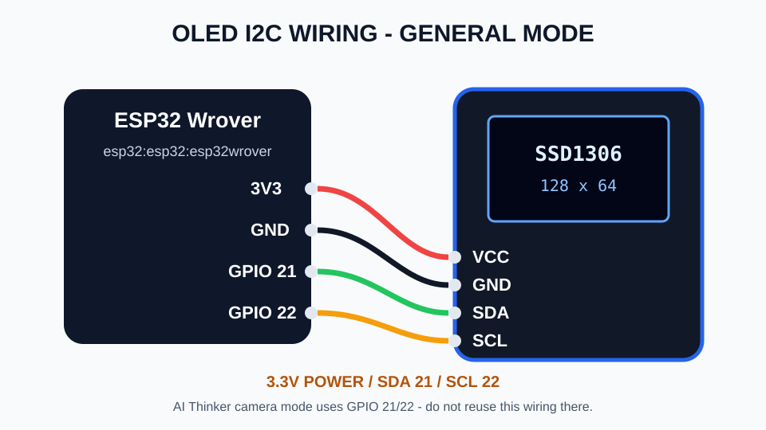
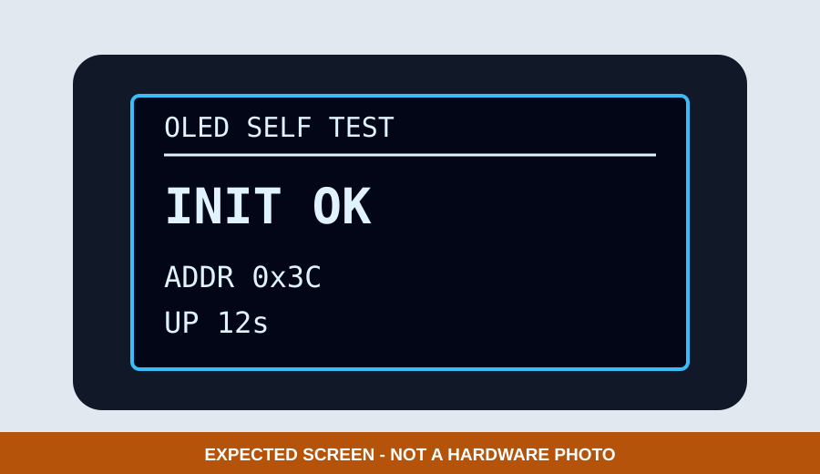
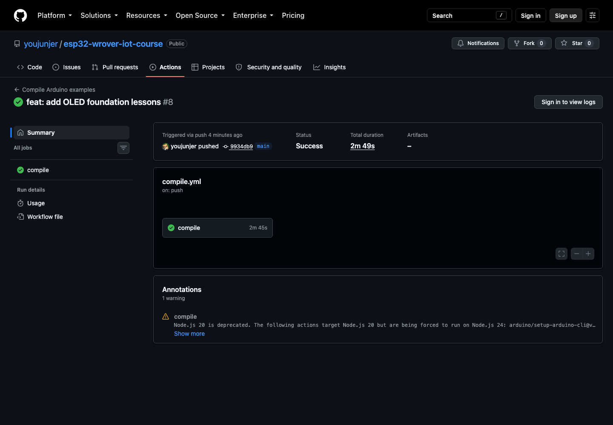

# 1. I²C 與 OLED 啟動自測

第一個 OLED 範例只解決一件事：在沒有 Serial Monitor 的情況下，確認 ESP32 能否找到並初始化顯示器。感測器、Wi-Fi 與 MQTT 都先不要接入。

## 接線



*圖：本教材的一般模式接線。OLED 使用 3.3V、GND、SDA GPIO 21 與 SCL GPIO 22；AI Thinker 相機模式不可沿用。這是接線示意，不是實體驗證照片。*

接線前先拔除 USB 電源：

| OLED | ESP32 Wrover | 檢查重點 |
|---|---|---|
| VCC | 3V3 | 本章不使用來源不明的 5V I²C 接法 |
| GND | GND | 必須共地 |
| SDA | GPIO 21 | 不要與 SCL 對調 |
| SCL | GPIO 22 | 不要與 SDA 對調 |

## 程式流程

1. 設定 GPIO 2 為備援狀態 LED。
2. 以 GPIO 21／22 啟動 `Wire`。
3. 依序檢查 `0x3C` 與 `0x3D`。
4. 找到位址後初始化 128×64 SSD1306。
5. 顯示 `INIT OK`、實際位址與遞增秒數。
6. 找不到 OLED 時改用 GPIO 2 閃爍碼，不把錯誤只寫入 Serial。



*圖：程式偵測到 `0x3C` 時的預期畫面示意；不是實機 OLED 照片，位址應以學生畫面為準。*

## CLI 操作

先確認環境，再安裝 Repository 鎖定的函式庫：

```bash
arduino-cli version
arduino-cli core list
./scripts/install-libraries.sh
```

編譯：

```bash
arduino-cli --config-file arduino-cli.yaml compile \
  --fqbn esp32:esp32:esp32wrover \
  examples/02_sensors_display/01_oled_self_test
```

確認序列埠後燒錄：

```bash
arduino-cli board list
arduino-cli --config-file arduino-cli.yaml upload \
  -p YOUR_SERIAL_PORT \
  --fqbn esp32:esp32:esp32wrover \
  examples/02_sensors_display/01_oled_self_test
```



*圖：Commit `9934db9` 的 GitHub Actions Run 33474648376 已使用鎖定工具鏈編譯全部 11 個 Sketch。這張真實畫面只證明 CI 編譯成功，不代表已燒錄、已接線或 OLED 實機已顯示。*

畫面下方的 `1 warning` 是 GitHub Actions 執行環境的 Node.js 版本提醒，不是 OLED Sketch 的編譯錯誤；本次 Run 結論仍為 `Success`。

截圖只能協助辨識按過哪些步驟；指令仍保留為文字，學生可以直接複製。Windows 的連接埠常見為 `COM4`，macOS 常見為 `/dev/cu.usbserial-*`，Linux 常見為 `/dev/ttyUSB0` 或 `/dev/ttyACM0`，但都必須以 `board list` 的實際結果為準。

## 閃爍碼與排錯

| GPIO 2 閃爍 | 意義 | 最小檢查 |
|---:|---|---|
| 2 下後停頓 | 找不到 `0x3C`／`0x3D` | 斷電後檢查 VCC、GND、SDA、SCL；確認模組是 I²C SSD1306 |
| 3 下後停頓 | 找到 I²C 位址但顯示器初始化失敗 | 核對 128×64 規格、函式庫版本與供電穩定度 |

GPIO 2 必須是已確認接線的狀態 LED；不能只因某個開發板看起來有 LED，就假定它一定接在 GPIO 2。

## 完成判定

- OLED 顯示 `INIT OK`。
- `ADDR` 為實際偵測到的 `0x3C` 或 `0x3D`。
- `UP` 秒數持續增加，代表 `loop()` 仍在運作。
- 畫面方向錯誤時只調整 `OLED_ROTATION`，不要交換 SDA／SCL。

目前 Repository 已由 [GitHub Actions Run 33474648376](https://github.com/youjunjer/esp32-wrover-iot-course/actions/runs/33474648376) 驗證編譯；完成實體測試後，請補回 OLED 正面照、完整接線照、板型、Core 版本與燒錄結果。
