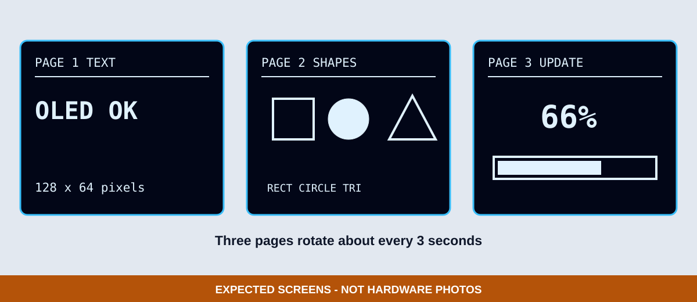

# 2. OLED 基礎顯示

通過第一章的 `INIT OK` 後，再學習文字大小、座標、線條、圖形與畫面更新。這樣如果第二個範例失敗，可以把問題限制在繪圖程式，而不是重新懷疑接線與位址。

## 三個頁面



*圖：文字、圖形與進度條頁面的預期畫面示意；不是實機 OLED 照片。*

1. `PAGE 1 TEXT`：比較 `setTextSize(1)` 與 `setTextSize(2)`。
2. `PAGE 2 SHAPES`：使用 `drawRect()`、`fillCircle()` 與 `drawTriangle()`。
3. `PAGE 3 UPDATE`：清除緩衝區、重畫百分比與進度條，再以 `display()` 一次送出。

## 緩衝區更新

Adafruit SSD1306 使用記憶體緩衝區。這四個步驟不可混淆：

```cpp
display.clearDisplay();
// 在緩衝區畫文字與圖形
display.setCursor(0, 0);
display.print("OLED OK");
display.display();
```

如果忘記 `display.display()`，程式可能已執行但實體畫面不會更新；如果忘記 `clearDisplay()`，前一頁內容可能殘留。

## 可見驗收

- 三頁約每 3 秒依序切換。
- 文字沒有超出 128×64 邊界。
- 矩形、圓形與三角形完整可辨識。
- 進度條與百分比同步變化。
- 畫面沒有殘影或上一頁內容。

若仍完全沒有畫面，先回到 `01_oled_self_test`；不要同時修改位址、腳位、驅動與圖形座標。
