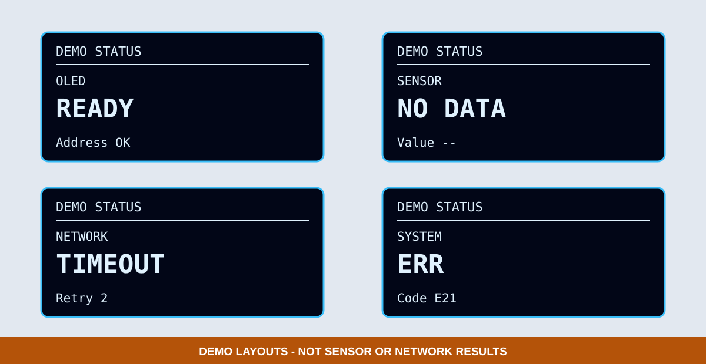

# 3. OLED 可視化診斷

後續感測器、Wi-Fi、NTP、HTTP、MQTT 與 PZEM 都會失敗或重試，因此本章先固定診斷畫面的結構。範例目前使用明確標示的 `DEMO STATUS`，只教版型，不宣稱已取得任何感測或網路結果。

*圖：診斷畫面版型示意。所有畫面都有 `DEMO STATUS`，不是感測器或網路實測截圖。*

## 畫面欄位

128×64 畫面固定保留：

1. `DEMO STATUS` 或功能標題。
2. 模組名稱，例如 `OLED`、`SENSOR`、`NETWORK`。
3. 大字狀態，例如 `READY`、`NO DATA`、`TIMEOUT`、`STALE`、`ERR`。
4. 細節，例如 `Retry 2`、`Age 12s` 或錯誤碼。

## 狀態意義

| 狀態 | 使用時機 | 不可做法 |
|---|---|---|
| `BOOT` | 程式剛啟動 | 開機後長時間保持空白 |
| `READY` | 模組完成初始化 | 尚未確認就固定顯示成功 |
| `NO DATA` | 尚無有效資料 | 用零值冒充讀值 |
| `TIMEOUT` | 操作在期限內未完成 | 無限等待且不更新畫面 |
| `STALE` | 曾有資料但已過期 | 繼續顯示舊值而不標示年齡 |
| `ERR` | 明確錯誤 | 只顯示 `ERR` 而沒有模組或代碼 |

## 後續整合規則

- 未接感測器時，不顯示看似真實的固定溫度或濕度。
- 教學版型若需要假資料，畫面與圖說必須同時標示 `DEMO`。
- 錯誤狀態保留到條件改變，不只閃現幾毫秒。
- OLED 不顯示 Wi-Fi 密碼、Token、API Key 或私人 URL。
- Serial 可以同步複製同一個狀態，但不可成為唯一輸出。

## 可見驗收

- 六個 DEMO 狀態約每 3 秒切換。
- 每頁都能辨識模組、狀態與細節。
- `NO DATA`、`TIMEOUT`、`STALE`、`ERR` 不會變成空白畫面。
- 學生能從 OLED 照片直接回報畫面上的模組與錯誤碼。

完整共通規範見 [OLED 執行狀態與除錯訊息規範](../oled-status-standard.md)。
