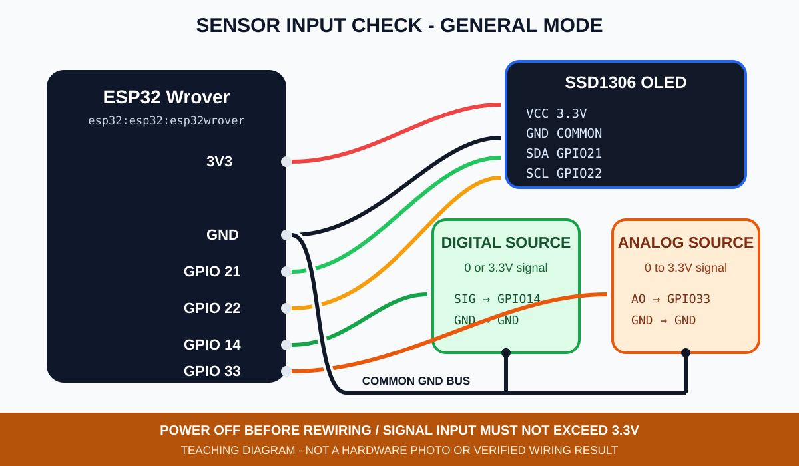
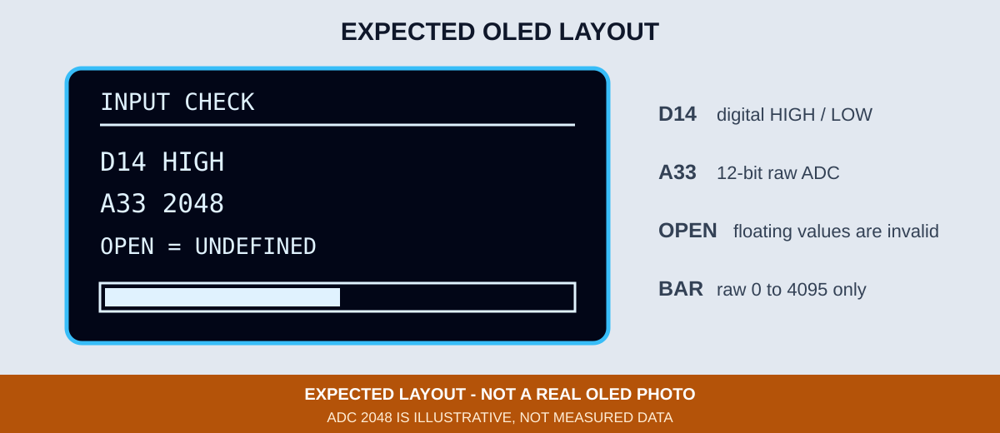
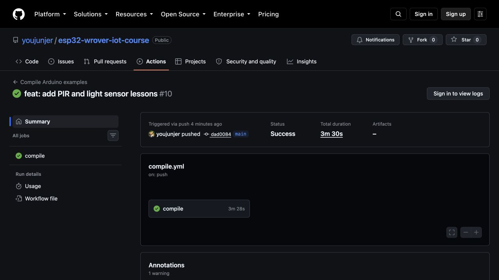

# 4. 感測器接線與輸入診斷

本章先建立所有低電壓感測器共用的接線原則，再進入 PIR 與光敏模組。目標不是看到一個數字就算成功，而是能從 OLED 分辨數位輸入、類比原始值、腳位及資料邊界。

## 數位與類比輸入

| 類型 | Arduino C | 畫面結果 | 本章腳位 |
|---|---|---|---:|
| 數位 | `digitalRead()` | `HIGH` 或 `LOW` | GPIO 14 |
| 類比 | `analogRead()` | 12-bit 原始值 `0～4095` | GPIO 33（ADC1） |

數位輸入可使用 `INPUT`、`INPUT_PULLUP` 或 `INPUT_PULLDOWN`。本章使用 `INPUT_PULLDOWN`，讓未接 GPIO 14 時維持 LOW；接上會主動輸出 HIGH／LOW 的 PIR 後，再依模組 OUT 判斷。類比 GPIO 33 不套用數位上拉／下拉，未接時的 ADC 數字沒有意義。


*圖：模組上的 AO 是類比輸出、DO 是比較器判斷後的數位輸出；本教材後續使用 AO。來源：AB143 第四版第 4 章，原書頁 P43。*

## 接線前的五項檢查

1. 拔除 USB 與外部電源後再更動接線。
2. 先確認模組的 `VCC`、`GND`、`AO`／`DO`，不可只依外觀猜腳位順序。
3. 感測器與 ESP32 必須共地；GPIO 輸入不得超過 `3.3V`。
4. GPIO 21／22 已保留給 OLED；數位模組使用 GPIO 14，類比模組優先使用 ADC1 的 GPIO 33。
5. 切換章節前先斷電並拆除上一章接線；尤其不要保留第一篇 GPIO 13 按鈕接地線，再把其他模組接到同一腳位。



*圖：第 4 章輸入診斷接線示意，並非實體接線照片。感測器輸出必須維持在 0～3.3V。*

## ADC 原始值不是物理量

`04_sensor_input_basics.ino` 明確使用：

```cpp
analogReadResolution(12);
analogSetAttenuation(ADC_11db);
```

12-bit 原始值範圍是 `0～4095`。Espressif 的 ESP32 ADC 文件指出，`ADC_11db` 的建議量測範圍約為 150～3100 mV；原始值沒有經過感測器曲線、零點或環境校正，因此不能直接寫成 lux、ppm 或溫度。詳見鎖定版本的 [Arduino-ESP32 3.3.11 ADC API](https://github.com/espressif/arduino-esp32/blob/3.3.11/docs/en/api/adc.rst)。



*圖：輸入診斷預期版型，不是實機 OLED 照片；圖中的 ADC 數字只是版型範例，未接 GPIO 33 時數字沒有意義。*

## 編譯與燒錄

```bash
arduino-cli --config-file arduino-cli.yaml compile \
  --fqbn esp32:esp32:esp32wrover \
  examples/02_sensors_display/04_sensor_input_basics

arduino-cli board list
arduino-cli --config-file arduino-cli.yaml upload \
  -p YOUR_SERIAL_PORT \
  --fqbn esp32:esp32:esp32wrover \
  examples/02_sensors_display/04_sensor_input_basics
```



*圖：Commit `dad0084` 的 GitHub Actions Run 33478348736 已使用鎖定工具鏈編譯全部 14 個 Sketch。這張未登入公開頁面的真實截圖只證明 CI 編譯成功，不代表已燒錄、已接線或感測器已有實測資料。*

## 可見驗收

- OLED 標題顯示 `INPUT CHECK`。
- GPIO 14 的來源改變時，`D14` 在 `HIGH`／`LOW` 間改變。
- GPIO 33 的輸入改變時，`A33` 數字與下方長條同步改變。
- 畫面保留 `OPEN = UNDEFINED`，提醒浮接 GPIO 33 的數字不能判定為有效感測資料。
- 找不到 OLED 時，GPIO 2 重複閃 2 次；OLED 初始化失敗則重複閃 3 次。

浮動腳位也可能出現變動數字，因此「畫面有值」不是接線成功的充分證據。失敗時請回傳 OLED 正面照、ESP32／OLED／感測器完整接線照、模組型號及編譯或燒錄結果。

GPIO 14 使用內建下拉，未接數位來源時通常仍會顯示 `LOW`；這也不能證明模組已接妥或已供電。

目前 Repository 已由 [GitHub Actions Run 33478348736](https://github.com/youjunjer/esp32-wrover-iot-course/actions/runs/33478348736) 驗證本章程式可編譯；實體輸入與 OLED 畫面仍待指定課程板驗證。
