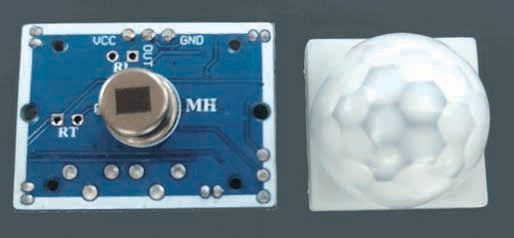
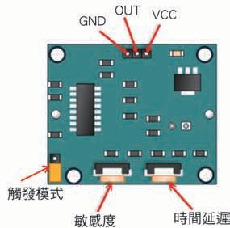
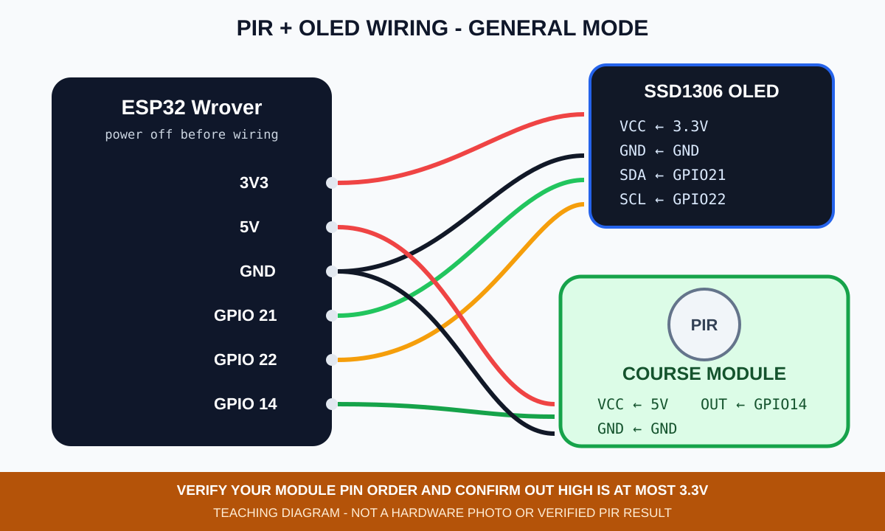
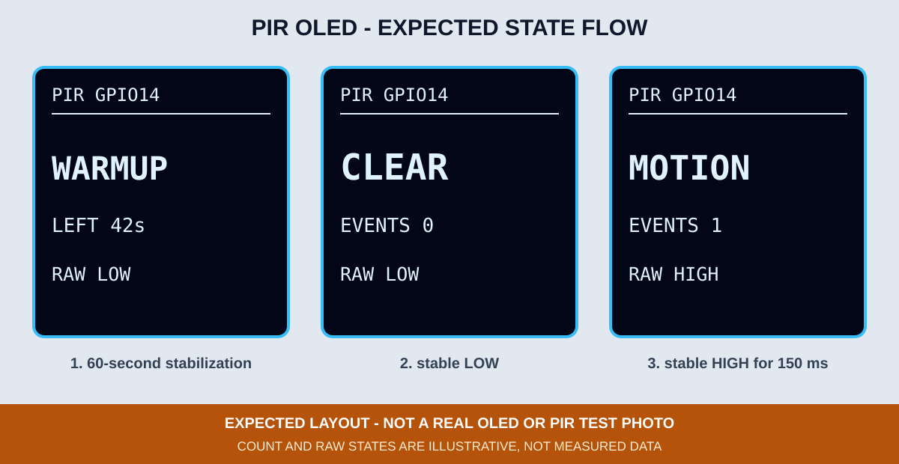

# 5. PIR 人體感測器與 OLED

PIR（Passive Infrared Sensor）偵測的是紅外線能量的變化，不是辨識人的身分，也不能把事件次數直接當成人數。這一章只讀取 PIR 狀態並在 OLED 顯示，不加入錄放音模組，先把單一輸入驗證清楚。



*圖：PIR 模組正面菲涅耳透鏡與背面感測元件。來源：AB143 第四版第 3 章，原書頁 P35。不同批次的腳位順序仍應依實物標示確認。*



*圖：PIR 背面的 VCC、OUT、GND、觸發模式、靈敏度與時間延遲位置。來源：AB143 第四版第 3 章，原書頁 P35。*

## 接線

| PIR | ESP32 Wrover |
|---|---|
| VCC | 指定課程模組的 5V 供電端 |
| OUT | GPIO 14 |
| GND | GND |

OLED 維持 3.3V、GND、SDA GPIO 21、SCL GPIO 22。



*圖：PIR 與 OLED 一般模式接線示意，不是實體接線照片。模組批次不同時，先確認供電範圍、腳位順序及 OUT 高電位不超過 3.3V。*

## 為什麼先顯示 WARMUP

PIR 上電後需要一段時間穩定。程式前 60 秒顯示 `WARMUP` 與剩餘秒數，這段時間即使 `RAW` 改變也不計入事件。暖機結束時先以當下狀態建立基準，之後輸入必須穩定 150 ms 才承認變化，避免把瞬間雜訊或暖機末端的 HIGH 誤算成事件。若手邊模組說明要求更長時間，應修改 `PIR_WARMUP_MS`。

暖機後的狀態：

| OLED | 意義 |
|---|---|
| `CLEAR` | 已穩定確認的狀態為 LOW |
| `MOTION` | 已穩定確認的狀態為 HIGH |
| `RAW LOW/HIGH` | 最新一次 GPIO 14 讀值；150 ms 確認期間可能短暫與大字狀態不同 |
| `EVENTS n` | LOW→HIGH 的事件次數，不是現場人數 |

`CLEAR` 只代表 GPIO 14 目前為 LOW；未供電、未接線或故障的模組也可能呈現 LOW，因此不能只靠 `CLEAR` 判定 PIR 正常。



*圖：PIR OLED 預期版型，不是 PIR 實測結果或實機照片。*

## 編譯與燒錄

```bash
arduino-cli --config-file arduino-cli.yaml compile \
  --fqbn esp32:esp32:esp32wrover \
  examples/02_sensors_display/05_pir_oled

arduino-cli board list
arduino-cli --config-file arduino-cli.yaml upload \
  -p YOUR_SERIAL_PORT \
  --fqbn esp32:esp32:esp32wrover \
  examples/02_sensors_display/05_pir_oled
```

## 操作與排錯

1. 先將靈敏度與延遲調到較低，再逐步增加，避免教室內多人移動造成誤判。
2. 完成暖機後，靜止時應回到 `CLEAR`；手在鏡頭前移動時應出現 `MOTION`。
3. 若長時間停在 `MOTION`，先檢查延遲旋鈕、觸發模式及附近持續移動的熱源。
4. 若一直 `CLEAR`，檢查 VCC／GND／OUT 順序、供電要求、GPIO 14 接線及暖機時間。
5. OLED 本身失敗時仍使用 GPIO 2 的 2 次／3 次閃爍碼，不把錯誤只留在 Serial。

完成條件是 `WARMUP → CLEAR → MOTION → CLEAR` 可重複觀察，而且每次 LOW→HIGH 只增加一次事件。CI 只能證明程式可編譯；PIR 距離、角度、旋鈕、實體接線與事件結果仍需拍照或錄影驗證。
