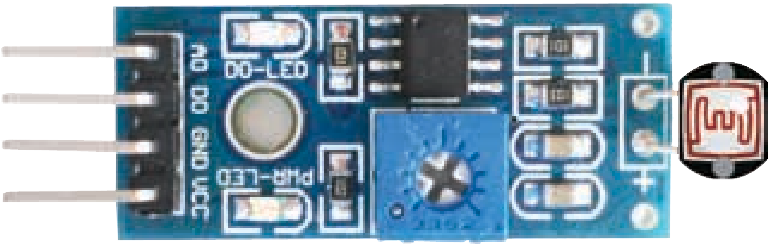
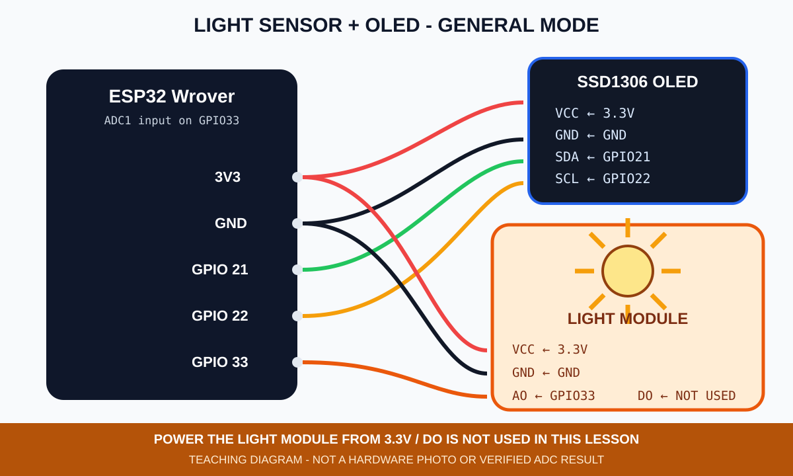
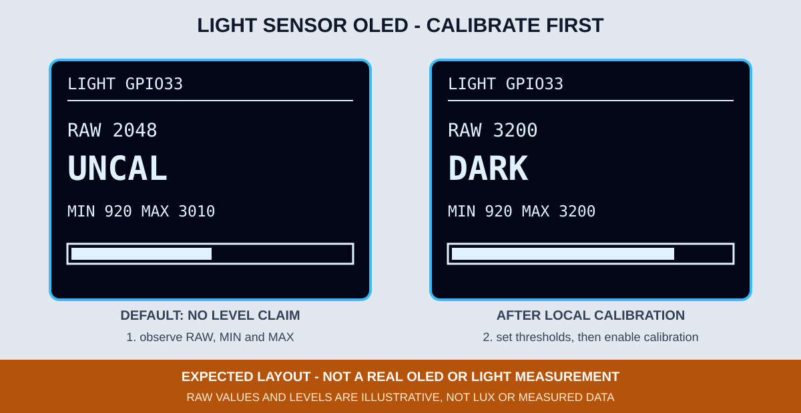

# 6. 光敏電阻、ADC 校正與 OLED

光敏模組常同時提供 `AO` 與 `DO`。本章使用 `AO` 連續觀察環境變化，不使用模組上的比較器 `DO`；這樣可以先看原始數值，再由課程程式設定明暗門檻。



*圖：AB143 教材中的四線式光敏模組；AO、DO、GND、VCC 的實際排列要依手邊模組絲印確認。來源：AB143 第四版第 4 章，原書頁 P43。*

## 接線

| 光敏模組 | ESP32 Wrover |
|---|---|
| VCC | 3.3V |
| AO | GPIO 33（ADC1） |
| DO | 不接 |
| GND | GND |

OLED 維持 3.3V、GND、SDA GPIO 21、SCL GPIO 22。光敏模組使用 3.3V 供電，避免 AO 高於 ESP32 的輸入範圍。



*圖：光敏 AO 與 OLED 一般模式接線示意，不是實體接線照片。*

## 程式做了什麼

`06_light_oled.ino` 每次取 8 個 ADC 樣本平均，降低畫面抖動，並記錄本次開機後觀察到的 `MIN` 與 `MAX`。畫面分成：

- `RAW`：GPIO 33 的 12-bit ADC 原始值。
- `UNCAL`：尚未完成本機校正；預設狀態不宣稱明暗。
- `BRIGHT`／`MID`／`DARK`：只有在完成校正並啟用門檻後才顯示。
- `MIN`／`MAX`：本次開機後的觀察範圍。
- 底部長條：原始值相對於 0～4095 的位置。



*圖：光敏 OLED 預期版型；數字是排版範例，不是照度、實測 ADC 或實機照片。*

## 先校正再決定門檻

1. 燒錄後先保持正常教室光線，記下 `RAW`。
2. 用手完整遮住感測元件，記下新的 `RAW`。
3. 使用手電筒或較亮環境照射，記下新的 `RAW`。
4. 判斷「越暗數值越高」或「越暗數值越低」。方向相反時修改 `DARK_IS_HIGH`。
5. 依實際明、暗範圍修改 `BRIGHT_THRESHOLD` 與 `DARK_THRESHOLD`，不要直接沿用範例數字當作所有模組的標準。暗時較高須設定 `BRIGHT_THRESHOLD < DARK_THRESHOLD`；亮時較高則設定 `BRIGHT_THRESHOLD > DARK_THRESHOLD`。

```cpp
constexpr bool CALIBRATION_READY = false;
constexpr bool DARK_IS_HIGH = true;
constexpr int BRIGHT_THRESHOLD = 1200;
constexpr int DARK_THRESHOLD = 2800;
```

預設必須保持 `CALIBRATION_READY = false`；完成上述觀察、設定門檻後才改為 `true`。`RAW` 不是 lux。若要得到可比較的照度，還需要感測元件規格、電路參數與實際校正；本章只教 ADC 原始值與相對分級。

## 編譯與燒錄

```bash
arduino-cli --config-file arduino-cli.yaml compile \
  --fqbn esp32:esp32:esp32wrover \
  examples/02_sensors_display/06_light_oled

arduino-cli board list
arduino-cli --config-file arduino-cli.yaml upload \
  -p YOUR_SERIAL_PORT \
  --fqbn esp32:esp32:esp32wrover \
  examples/02_sensors_display/06_light_oled
```

## 可見驗收與排錯

- 遮住與照亮感測元件時，`RAW` 及長條應有可重複的方向性變化。
- `MIN`／`MAX` 應擴張並保留本次開機觀察到的範圍。
- 調整門檻後，`BRIGHT`、`MID`、`DARK` 應符合手邊環境，而不是只追求範例數字。
- 固定為 0、4095 或劇烈亂跳時，先檢查 VCC、GND、AO、GPIO 33、共地與模組供電，不把極端值直接判定為真實亮度。
- OLED 初始化失敗時，GPIO 2 仍使用 2 次／3 次閃爍碼。

CI 只能證明程式可編譯；ADC 方向、門檻、實體亮度、接線與 OLED 畫面仍待指定課程板驗證。
