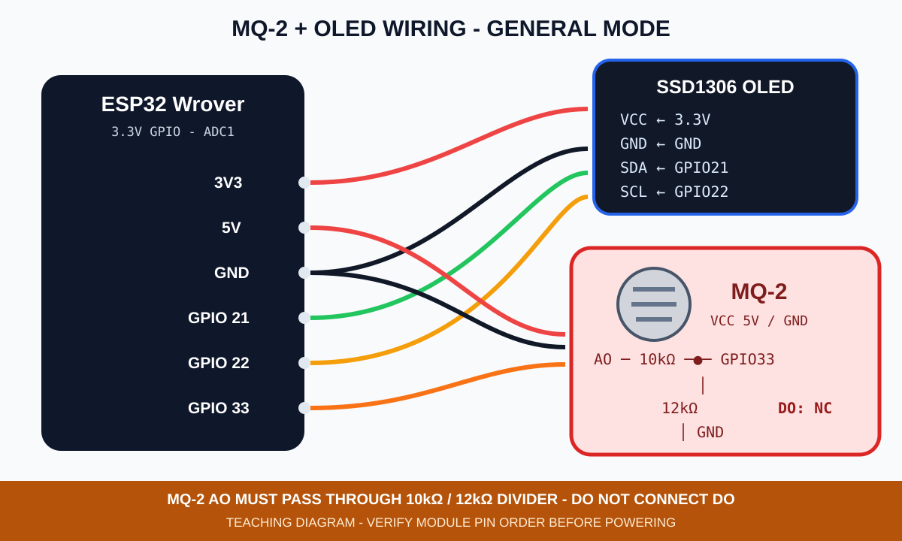
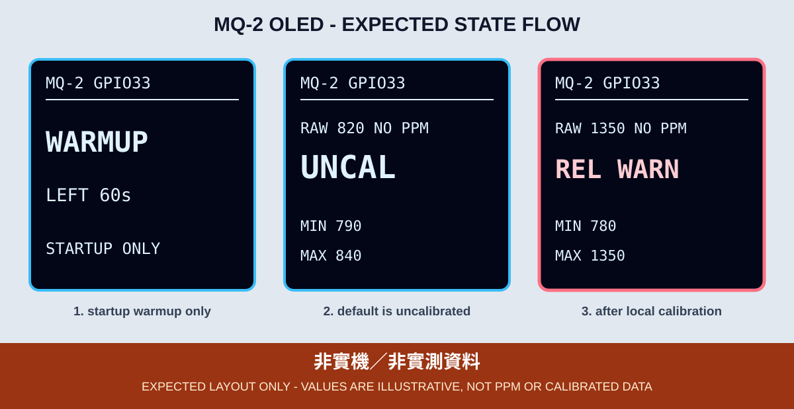
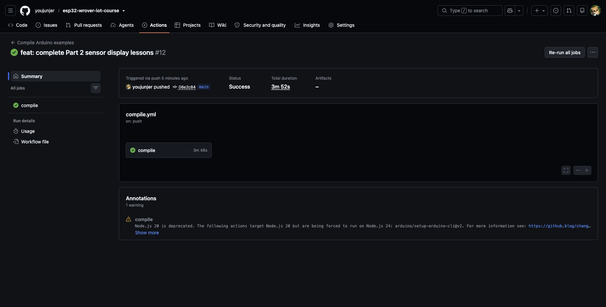

# 7. MQ-2 氣體感測器與 OLED

MQ-2 可對煙霧及多種可燃性氣體產生反應，但低成本模組的個體差異、環境溫濕度與暖機狀態都會影響讀值。本章只把 GPIO 33 的 ADC 原始值當成「相對變化」，不宣稱測得 ppm，也不將它當成符合安全法規的瓦斯警報器。

## 接線與 3.3V 保護

MQ-2 加熱器依指定課程模組使用 5V，但模組 `AO` 可能高於 ESP32 GPIO 可承受的 3.3V。因此 `AO` 不得直接 GPIO 33，必須先經過 10kΩ／12kΩ 分壓：

- MQ-2 `AO` → 10kΩ → GPIO 33。
- GPIO 33 → 12kΩ → GND。
- MQ-2 GND、分壓 GND 與 ESP32 GND 必須共地。
- `DO` 本章不接。



*圖：一般模式接線示意，不是實體接線照片。分壓電阻的上下位置不可對調，實際 AO 電壓仍應以電錶確認不超過 3.3V。*

| MQ-2／OLED | ESP32 Wrover／接點 |
|---|---|
| MQ-2 VCC | 指定課程模組的 5V 供電端 |
| MQ-2 GND | GND |
| MQ-2 AO | 先經 10kΩ／12kΩ 分壓，中點再接 GPIO 33（ADC1） |
| MQ-2 DO | 不接 |
| OLED | 3.3V、GND、SDA 21、SCL 22 |

改動接線前先斷開 USB 與外部電源。本章沿用光敏章的 GPIO 33，因此切換 Sketch 前要先拆除光敏模組，不可讓兩個類比輸出同時接在同一腳。

## 暖機與本機校正

`07_mq2_oled.ino` 上電後先在 OLED 顯示 60 秒 `WARMUP`。這只是課堂的啟動觀察期，不代表感測器已達資料表要求的完整預熱或校正時間；模組說明若要求更長預熱，必須延長時間。

暖機後預設仍顯示 `UNCAL`，同時提供 `RAW`、`MIN`與 `MAX`：

1. 先在通風、無測試氣體的環境觀察穩定基準。
2. 使用課程允許的低風險方式製造相對變化；不使用明火、漏氣或密閉空間測試。
3. 記錄基準值、數值增減方向及警戒差值。
4. 只在本機觀察完成後，才修改 `LOCAL_BASELINE`、`REL_WARN_DELTA`、`HIGH_DELTA`、`RAW_RISES_WITH_GAS`，並將 `CALIBRATION_READY` 改為 `true`。

更換 MQ-2 模組、供電方式、分壓電阻或主要使用環境後，都要重新建立本機基準；舊基準不能直接沿用。

範例門檻只是程式排版用的起點，不是任何模組或氣體的安全標準。



*圖：程式版型示意，數字不是實測資料，也不是 ppm。*

## OLED 狀態

| OLED | 意義 |
|---|---|
| `INIT` | OLED 已建立，準備進入 MQ-2 暖機 |
| `WARMUP` | 啟動觀察期，畫面顯示剩餘秒數 |
| `ADC CHECK` | 第 1～2 筆 ADC 接近 0 或 4095；先暫停分級，等待確認是否持續 |
| `ADC ERR` | 連續 3 筆 ADC 接近 0 或 4095；先斷電檢查 AO、分壓與共地；恢復 3 筆有效值後才解除 |
| `UNCAL` | 可顯示 ADC 原始值，但未允許分級 |
| `BASELINE` | 已完成本機校正，目前接近本機基準；不表示環境安全 |
| `REL WARN` | 相對變化達第一個教學門檻 |
| `REL HIGH` | 相對變化達較高教學門檻；不代表法規濃度或危險判定 |
| GPIO 2 閃 2 下 | 找不到 OLED `0x3C/0x3D` |
| GPIO 2 閃 3 下 | OLED 驅動初始化失敗 |

## 編譯與燒錄

```bash
arduino-cli --config-file arduino-cli.yaml compile \
  --fqbn esp32:esp32:esp32wrover \
  examples/02_sensors_display/07_mq2_oled

arduino-cli board list
arduino-cli --config-file arduino-cli.yaml upload \
  -p YOUR_SERIAL_PORT \
  --fqbn esp32:esp32:esp32wrover \
  examples/02_sensors_display/07_mq2_oled
```



*圖：Commit `08e2c84` 的 [GitHub Actions Run 33950027529](https://github.com/youjunjer/esp32-wrover-iot-course/actions/runs/33950027529) 使用鎖定工具鏈編譯全部 20 個 Sketch。這張真實 Run Summary 只證明 CI 編譯成功，不代表已燒錄、已接線、MQ-2 已校正或其他硬體已實測。*

畫面中的 `1 warning` 是 GitHub Actions 對 `arduino/setup-arduino-cli@v2` 所用 Node 執行環境的淘汰提醒，不是 Sketch 編譯警告；擷取時 Arduino 官方 action 的最新正式版仍為 [`v2.0.0`](https://github.com/arduino/setup-arduino-cli/releases/tag/v2.0.0)，本次 Run 結論為 `Success`，且 20 個 Sketch 的編譯紀錄均無 `warning:` 或 `error:`。

## 可見驗收與證據邊界

- OLED 在暖機期間持續顯示階段與剩餘時間，不保持空白。
- 暖機後預設顯示 `UNCAL`，而不是假的正常或安全結論。
- `RAW`、`MIN`、`MAX` 在環境變化時應呈現可重複的方向性變化。
- ADC 接近 0 或 4095 時先顯示 `ADC CHECK`，連續 3 筆後鎖定 `ADC ERR`；極端值不納入 `MIN/MAX`，也不進行相對分級。先斷電檢查供電、共地、AO 分壓與 GPIO 33；劇烈亂跳時也不校正。
- 實體 AO 電壓、暖機時間、ADC 方向、門檻、接線與 OLED 畫面尚未在指定課程板驗證。編譯通過也不等於氣體感測或安全警報成功。
