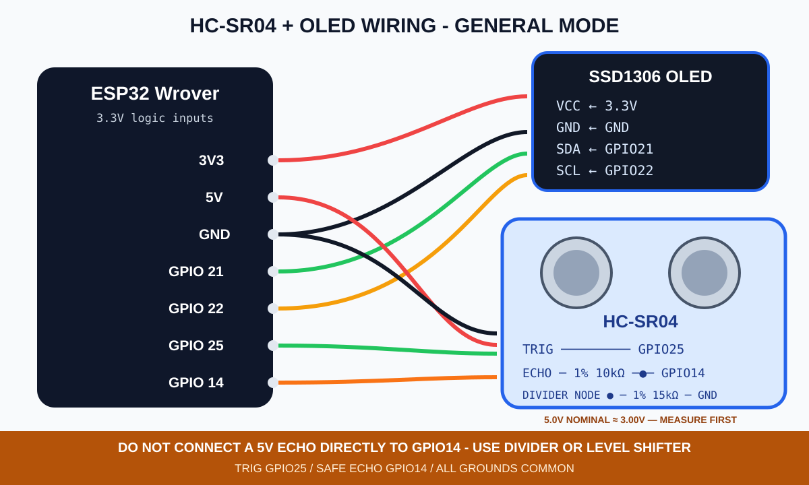
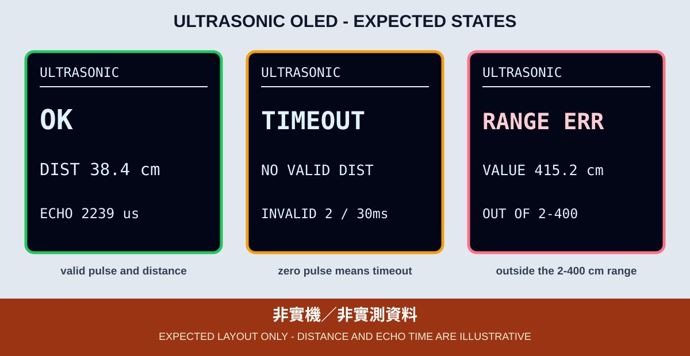

# 8. HC-SR04 超音波測距與 OLED

本章使用 HC-SR04 發出超音波，再以 Echo 高電位的持續時間估算障礙物距離。舊範例只把數字寫入 Serial，而且 `pulseIn()` 無限時參數；本章改為 OLED 主要輸出，並使用 30 ms 逾時，避免程式長時間卡住或把逾時的 0 當成 0 cm。

## 接線與 Echo 電壓

| HC-SR04／OLED | ESP32 Wrover／接點 |
|---|---|
| HC-SR04 VCC | 5V |
| HC-SR04 GND | GND |
| HC-SR04 TRIG | GPIO 25 |
| HC-SR04 ECHO | 先經分壓或雙向位準轉換，再接 GPIO 14 |
| OLED | 3.3V、GND、SDA 21、SCL 22 |

HC-SR04 Echo 通常是 5V 邏輯，不可直接連接至 ESP32。本課程使用 1% 電阻：Echo → 10kΩ → GPIO 14，並由 GPIO 14 → 15kΩ → GND；5.0V 名目輸出分壓後約為 3.00V，保留供電與電阻誤差裕量。實際仍須量測，也可使用已確認適用於 5V 至 3.3V 的位準轉換器。所有 GND 必須共地。

GPIO 14 在第 5 章曾用於 PIR；本章燒錄與接線前必須斷電並拆除 PIR，不可讓 PIR OUT 與 HC-SR04 Echo 同時驅動這個腳位。



*圖：一般模式接線示意，不是實體驗證照片。GPIO 25 與 14 是本章腳位，不沿用舊範例的 GPIO 12。*

## 測距流程

1. TRIG 先保持 LOW。
2. 輸出 10 µs HIGH 脈衝後回到 LOW。
3. 使用 `pulseIn(ECHO_PIN, HIGH, 30000UL)` 等待 Echo，最多 30 ms。
4. Echo 時間為 0 代表 `TIMEOUT`，不轉換成距離。
5. 有效時以 `distance = echo_us × 0.0343 ÷ 2` 估算公分數。
6. 本教材只把 2～400 cm 作為範例顯示範圍；範圍外顯示 `RANGE ERR`，不保留舊距離假裝是新資料。



*圖：預期版型示意，距離與 Echo 時間不是實測資料。*

## OLED 狀態

| OLED | 意義 |
|---|---|
| `INIT` | OLED、TRIG 與 ECHO 腳位已初始化 |
| `OK` | 顯示本次有效距離與 Echo 時間 |
| `TIMEOUT` | 30 ms 內沒有 Echo；畫面顯示連續無效讀值次數，包含前一筆 `RANGE ERR` |
| `RANGE ERR` | 有 Echo，但換算結果超出本章 2～400 cm 範圍 |
| GPIO 2 閃 2 下 | 找不到 OLED `0x3C/0x3D` |
| GPIO 2 閃 3 下 | OLED 驅動初始化失敗 |

`TIMEOUT` 可能來自障礙物過遠、角度不適、吸音表面、多組超音波相互干擾、接線或供電問題。不能只根據一次逾時就宣稱模組損壞。

## 編譯與燒錄

```bash
arduino-cli --config-file arduino-cli.yaml compile \
  --fqbn esp32:esp32:esp32wrover \
  examples/02_sensors_display/08_ultrasonic_oled

arduino-cli board list
arduino-cli --config-file arduino-cli.yaml upload \
  -p YOUR_SERIAL_PORT \
  --fqbn esp32:esp32:esp32wrover \
  examples/02_sensors_display/08_ultrasonic_oled
```

## 可見驗收與證據邊界

- 在範圍內前後移動平面障礙物，OLED 距離應有可重複的同向變化。
- 拿走障礙物或遮住感測器時，畫面應顯示 `TIMEOUT`，而不是 0 cm 或前一次距離。
- 範圍外數值顯示 `RANGE ERR`，並保留錯誤直到下一次測量得到新狀態。
- Echo 電壓、實際可用距離、視角、接線與 OLED 畫面尚未在指定課程板驗證；CI 編譯不能當成實機證據。
