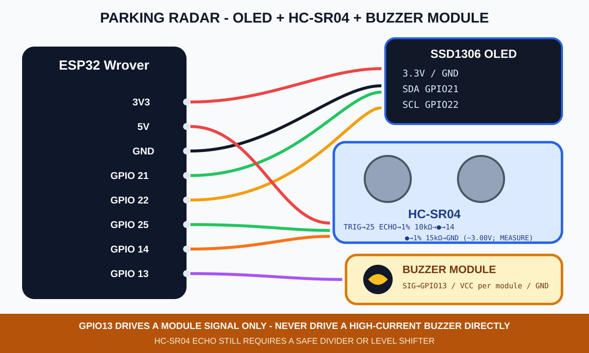
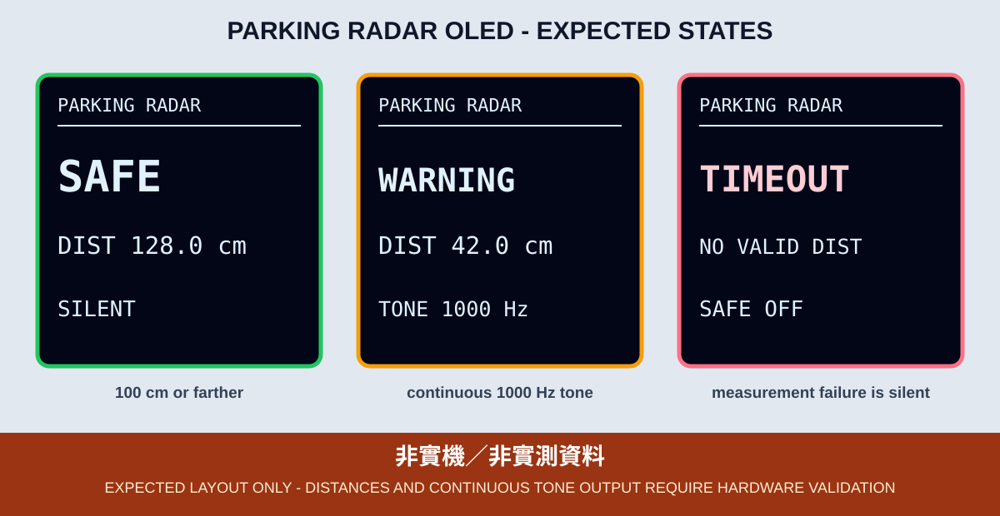

# 9. 蜂鳴器與超音波倒車雷達

本章在第 8 章的 HC-SR04 測距上加入無源蜂鳴器，以距離分級提供聲音警示。啟動、測距逾時、距離超出範圍或 PWM 失敗時，蜂鳴器一律保持靜音，並由 OLED 顯示原因。

## 接線

| 元件 | ESP32 Wrover／接點 |
|---|---|
| HC-SR04 VCC／GND | 5V／GND |
| HC-SR04 TRIG | GPIO 25 |
| HC-SR04 ECHO | 使用 1% 電阻：Echo → 10kΩ → GPIO 14，GPIO 14 → 15kΩ → GND；5.0V 名目輸出約分壓為 3.00V，仍須量測，或使用合適位準轉換器 |
| 三線無源蜂鳴器模組 SIG | GPIO 13；只接受 3.3V 邏輯、高阻抗、HIGH 發聲的控制輸入 |
| 蜂鳴器模組 VCC | 依模組規格供電，不從 GPIO 供電 |
| 蜂鳴器模組 GND | GND |
| OLED | 3.3V、GND、SDA 21、SCL 22 |



*圖：一般模式接線示意，不是實體接線照片。蜂鳴器規格、電流或音量若超出 GPIO 能力，必須加入適當驅動電路，不得直接大功率警報器。*

本章鎖定「帶驅動級的三線無源蜂鳴器模組」，由 PWM 頻率發聲；GPIO 13 只接模組的高阻抗訊號輸入。裸蜂鳴器、高電流模組、LOW 觸發模組及有源蜂鳴器都不直接套用本接法。接線前先斷開 USB 與外部電源，並先完成第 8 章的 Echo 降壓測試。

ESP32 在重設、上電到 `setup()` 執行前，腳位不一定已受程式控制。若課堂模組可能在訊號浮接時發聲，SIG 必須另加 10 kΩ 下拉到 GND，或使用已包含可靠關閉偏壓的驅動模組；實機驗收要包含多次冷開機，確認沒有短鳴。

GPIO 14 不能同時接著第 5 章的 PIR OUT；GPIO 13 也不能保留第一篇按鈕接線。切換範例前應斷電拆除舊元件，再依本章接線。

## Core 3.x PWM 與安全靜音

範例使用 ESP32 Core 3.x API：

```cpp
ledcAttach(BUZZER_PIN, 1000, 8);
ledcWriteTone(BUZZER_PIN, frequencyHz);
```

不沿用舊版 `ledcSetup()`、`ledcAttachPin()`、`analogWrite()` 或阻塞式旋律。程式在附加 LEDC 前先將 GPIO 13 設為 LOW；需要靜音時用可回報成功／失敗的 `ledcWrite(BUZZER_PIN, 0)` 將 duty 設為零。若 LEDC 寫入失敗，立即解除 LEDC、退回 GPIO OUTPUT LOW，並在 OLED 保留 `BUZZER ERR`。

## 距離分級

| 距離 | OLED | 蜂鳴器 |
|---:|---|---|
| 100～400 cm | `SAFE` | 靜音 |
| 50～小於 100 cm | `CAUTION` | 500 Hz |
| 15～小於 50 cm | `WARNING` | 1000 Hz |
| 2～小於 15 cm | `DANGER` | 2000 Hz |
| 逾時或超出 2～400 cm | `TIMEOUT`／`RANGE ERR` | `SAFE OFF`，靜音 |

上表是課程示範分級，不是車用產品的安全認證參數。此 Sketch 不可用來代替正式車輛雷達。



*圖：預期版型示意，距離與頻率不是實機測試結果。*

## OLED 狀態與錯誤碼

| OLED／備援訊號 | 意義 |
|---|---|
| `INIT / SAFE OFF` | 啟動中，蜂鳴器已靜音 |
| `SAFE` | 距離在課程安全區，蜂鳴器靜音 |
| `CAUTION` / `WARNING` / `DANGER` | 有效距離對應的警示層級 |
| `TIMEOUT / SAFE OFF` | 30 ms 無 Echo，不得以 0 cm 啟動最高警示 |
| `RANGE ERR / SAFE OFF` | 距離超出本章範圍，蜂鳴器靜音 |
| `BUZZER ERR / SAFE OFF` | LEDC 附加或頻率輸出失敗 |
| GPIO 2 閃 2 下 | 找不到 OLED `0x3C/0x3D`；蜂鳴器仍靜音 |
| GPIO 2 閃 3 下 | OLED 驅動初始化失敗；蜂鳴器仍靜音 |

## 編譯與燒錄

```bash
arduino-cli --config-file arduino-cli.yaml compile \
  --fqbn esp32:esp32:esp32wrover \
  examples/02_sensors_display/09_parking_radar

arduino-cli board list
arduino-cli --config-file arduino-cli.yaml upload \
  -p YOUR_SERIAL_PORT \
  --fqbn esp32:esp32:esp32wrover \
  examples/02_sensors_display/09_parking_radar
```

## 可見驗收與證據邊界

- 重啟後先看到 `INIT / SAFE OFF`，不得在啟動過程出現非預期長鳴。
- 障礙物移動時，OLED 的距離、分級與頻率要一致。
- 拿走障礙物或讀值超範圍時，必須靜音並顯示 `SAFE OFF`。若要驗證 Echo 斷線，只能先斷開 USB 與外部電源再改線、重新上電，或由教師使用預先安裝的電氣隔離治具；學生禁止運轉中熱插拔。
- OLED 錯誤期間仍以 GPIO 2 閃爍碼顯示原因，不使用蜂鳴器取代視覺錯誤碼。
- 蜂鳴器規格、音量、LEDC 輸出、Echo 電壓、接線與完整狀態轉換尚未在指定課程板驗證；CI 編譯不是實機驗收。
