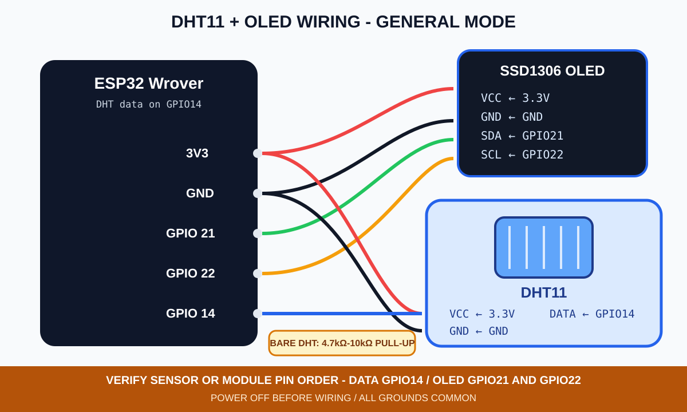
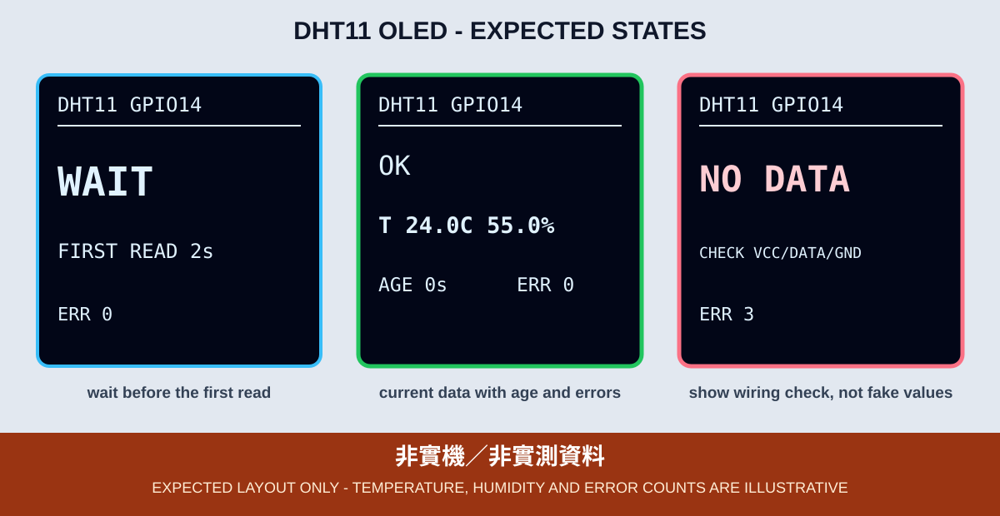

# 10. DHT11 溫濕度與 OLED

DHT11 以單一資料線回傳溫度與相對溼度。本章使用 GPIO 14，先在 OLED 顯示初始化與等待狀態，再以固定間隔讀取資料；序列監控器不是完成本章的必要條件。



*圖：DHT11 與 OLED 的一般模式接線示意，不是實體接線照片。裸 DHT11 與模組版的腳位排列可能不同，接線前須依實物標示確認。*

## 接線

| DHT11 | ESP32 Wrover |
|---|---|
| VCC | 3.3V |
| DATA | GPIO 14 |
| GND | GND |

OLED 維持 3.3V、GND、SDA GPIO 21、SCL GPIO 22。裸 DHT11 的 DATA 通常需要 4.7 kΩ～10 kΩ 上拉到 3.3V；三腳模組通常已經有上拉元件，但仍應依模組電路確認。不要把 DATA 上拉到 5V。

GPIO 14 也用在前面的 PIR 章及超音波章。這些是分開進行的範例，切換章節前必須斷電並拆除上一個模組，不能同時接在 GPIO 14。

## 為什麼不能連續快速讀取

本教材鎖定 `DHT sensor library` 1.4.7。DHT11 的更新速度慢，程式將讀取間隔固定為至少 2000 ms。OLED 在第一次讀取前顯示 `WAIT`；畫面仍會持續更新等待秒數，不會停在空白畫面。

每次讀取會同時檢查溫度與溼度：

| OLED | 意義 |
|---|---|
| `WAIT` | 感測器剛啟動，尚未到第一次讀取時間 |
| `OK` | 本次溫度與溼度皆有效 |
| `NO DATA` | 從開機到現在仍沒有任何成功讀值 |
| `READ ERR` | 本次回傳 `NaN`，但先前有成功資料 |
| `STALE` | 最後成功資料已超過 10 秒，不能當成目前讀值 |
| `LAST ... AGE ...` | 明確標示為舊資料及其年齡，不冒充即時值 |

`NaN` 不是 0°C 或 0%RH。接線錯誤、供電不穩、讀取太快或資料線問題都可能造成 `NaN`，程式不會把它轉成零，也不會讓上一筆數字繼續顯示成 `OK`。

OLED 為避免長時間運行後文字超出 128 像素寬度，`AGE` 秒數與累計讀取失敗次數均最多顯示 `9999`；`9999` 表示已達顯示上限，不是計數器重置。



*圖：DHT11 OLED 預期版型；數字只是排版示例，不是實測溫溼度或實機照片。*

## 函式庫

本章使用以下鎖定版本：

```text
DHT sensor library@1.4.7
Adafruit Unified Sensor@1.1.15
```

即使程式只引用 `DHT.h`，仍將相依版本明確列出，避免不同電腦自動安裝到不同版本。

## 編譯與燒錄

```bash
arduino-cli --config-file arduino-cli.yaml compile \
  --fqbn esp32:esp32:esp32wrover \
  examples/02_sensors_display/10_dht11_oled

arduino-cli board list
arduino-cli --config-file arduino-cli.yaml upload \
  -p YOUR_SERIAL_PORT \
  --fqbn esp32:esp32:esp32wrover \
  examples/02_sensors_display/10_dht11_oled
```

## 可見驗收與排錯

1. 開機先看到 `WAIT`，約 2 秒後才進入第一次讀取。
2. 正常時 OLED 顯示 `OK`、溫度、溼度及資料年齡。
3. 一般驗收必須先斷開 USB 與外部電源，再移除 DATA 或感測器供電；重新上電後，從未取得成功資料時應顯示 `NO DATA`。只有教師預先安裝、具備電氣隔離的測試治具，才可在運轉中模擬斷線以驗證 `READ ERR` 與 `STALE`；學生禁止熱插拔。
4. 最後成功資料超過 10 秒後必須顯示 `STALE`，即使畫面保留上一筆數字，也要同時標示 `LAST` 與 `AGE`。
5. 找不到 OLED 時，GPIO 2 重複閃 2 次；OLED 初始化失敗時重複閃 3 次。

CI 只能證明程式可由 Arduino CLI、ESP32 Core 3.3.11 與鎖定函式庫編譯。DHT11 腳位、上拉、讀取間隔、溫溼度準確度及 OLED 畫面都尚未在指定課程板完成實測。
