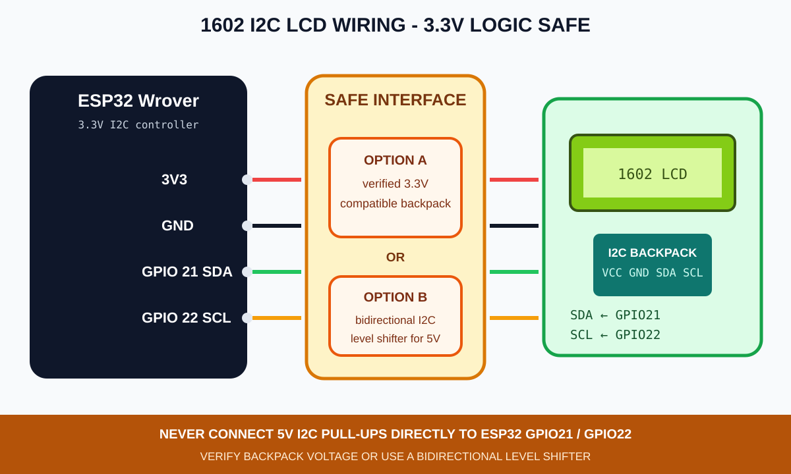
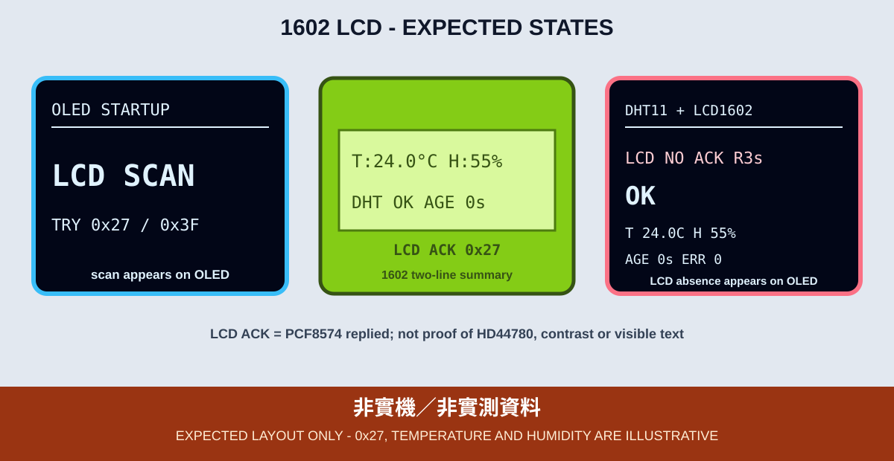

# 11. I²C 1602 LCD、DHT11 與 OLED 診斷

1602 LCD 每列 16 個字元、共 2 列，搭配 PCF8574 I²C 背板後可與 OLED 共用 SDA GPIO 21、SCL GPIO 22。本章保留 OLED 作為主要狀態與錯誤介面；1602 是第二個顯示器，不會取代 OLED。



*圖：OLED、1602 LCD 與 DHT11 的一般模式接線示意，不是實體接線照片。正式接線前必須先確認背板工作電壓及 I²C 上拉電壓。*

## 接線與 I²C 位址

| 功能 | ESP32 Wrover |
|---|---|
| OLED SDA | GPIO 21 |
| OLED SCL | GPIO 22 |
| 1602 SDA | GPIO 21 |
| 1602 SCL | GPIO 22 |
| DHT11 DATA | GPIO 14 |

OLED 常見位址為 `0x3C` 或 `0x3D`；PCF8574 背板常見為 `0x27` 或 `0x3F`。程式會先尋找 OLED，再掃描 `0x27` 與 `0x3F`，不能只因網路範例寫 `0x27` 就假定手邊背板相同。

## 5V I²C 背板的必要安全關卡

許多 1602 背板以 5V 供電，且 SDA／SCL 上拉電阻也接到 5V。ESP32 GPIO 是 3.3V 邏輯，這類背板不可直接與 ESP32 或 3.3V OLED 共用匯流排。

本課程只接受下列其中一種已確認方案：

1. 指定背板、LCD 與背光已實測可全程使用 3.3V，而且 SDA／SCL 不高於 3.3V。
2. LCD 側維持 5V，SDA／SCL 經雙向 I²C 位準轉換器連到 ESP32 的 3.3V 匯流排。
3. 由具備硬體能力的人員調整背板上拉，再於 3.3V 側提供正確上拉；學生不自行改板。

未完成上述確認前，不得把 1602 接入開發板。只看到背光亮起不代表 I²C 電壓安全，也不代表 LCD 已初始化。

## OLED 與 LCD 各自負責什麼

OLED 必須顯示：

- `LCD SCAN`、`LCD ACK 0x27/0x3F` 或含下次重試倒數的 `LCD NO ACK R3s`。
- DHT11 的 `WAIT`、`OK`、`NO DATA`、`READ ERR` 與 `STALE`。
- 最後成功資料的年齡，不讓舊資料冒充目前讀值。

1602 在 PCF8574 回應後顯示溫度、溼度與 DHT 狀態。程式以固定 16 字元覆寫有變化的列，不在每次 `loop()` 呼叫 `clear()`，避免明顯閃爍。為降低單次 I²C 傳輸失敗後快取仍記住舊內容的影響，程式每 10 秒讓快取失效並重寫兩列。`AGE` 與讀取失敗次數最多顯示 `9999`，代表已達畫面上限。自訂字元使用第 1 格 CGRAM 示範溫度符號。



*圖：OLED 與 1602 預期版型，不是 I²C 位址、感測資料或實體板測試結果。*

## 函式庫

```text
LiquidCrystal_PCF8574@2.3.0
DHT sensor library@1.4.7
Adafruit Unified Sensor@1.1.15
```

`LiquidCrystal_PCF8574` 的 `isConnected()` 只能確認 I²C 匯流排可使用且 PCF8574 位址有 ACK，所以畫面使用 `LCD ACK`，不把它稱為 LCD 顯示器已完全正常。程式會定期重試 PCF8574 NACK 的情境，並在 OLED 顯示下次重試倒數。

若 SDA 或 SCL 被拉低、背板將 5V 帶入 3.3V 匯流排，或 HD44780 本體故障但 PCF8574 仍回應，程式不能保證 OLED 繼續顯示，也不能保證自動復原。每 10 秒重寫兩列也不是 HD44780 自我診斷。

## 編譯與燒錄

```bash
arduino-cli --config-file arduino-cli.yaml compile \
  --fqbn esp32:esp32:esp32wrover \
  examples/02_sensors_display/11_lcd1602_dht

arduino-cli board list
arduino-cli --config-file arduino-cli.yaml upload \
  -p YOUR_SERIAL_PORT \
  --fqbn esp32:esp32:esp32wrover \
  examples/02_sensors_display/11_lcd1602_dht
```

## 可見驗收與排錯

- 先量測 SDA／SCL 的 HIGH 電位，確認不高於 3.3V，再連接 ESP32。
- OLED 應先出現 `LCD SCAN`，找到背板 ACK 後顯示實際位址與 `LCD ACK`。
- LCD 缺席時，OLED 應顯示 `LCD NO ACK Rns` 與下次重試倒數，不能只在 Serial 留下錯誤。學生測試前必須先斷開 USB 與外部電源才能改線；只有教師預先安裝、具備電氣隔離的測試治具，才可在運轉中模擬 NACK 與恢復 ACK，禁止學生熱插拔 LCD。
- 有背光但無文字時，檢查對比旋鈕、位址、背板接點及 LCD 排針焊接。
- DHT11 失敗時，LCD 與 OLED 都不能把上一筆資料標成即時 `OK`。

CI 只能驗證函式庫 API 與程式可編譯。I²C 上拉電壓、位準轉換、背板位址、對比、字元方向、DHT11 與兩個顯示器均尚未完成指定課程板實測。
