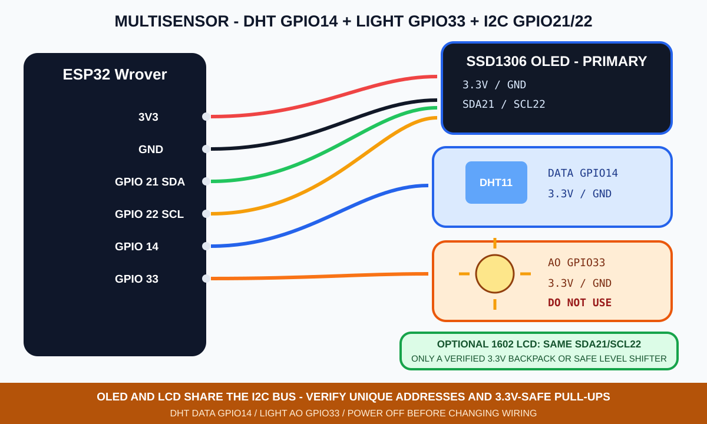
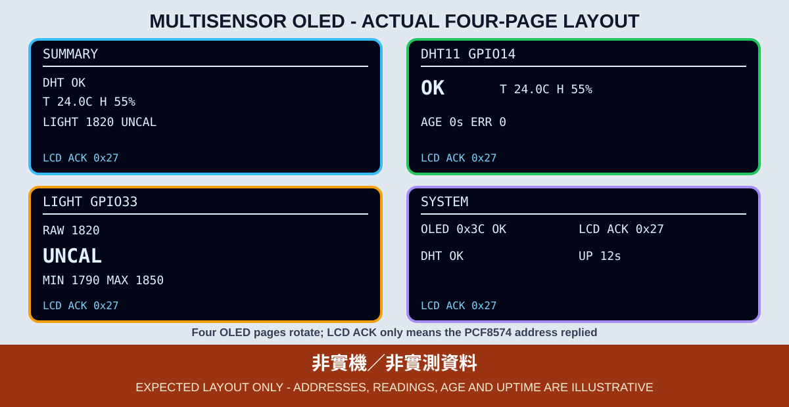

# 12. DHT11、光敏、OLED 多頁與 1602 整合

本章只整合已在第二篇出現的 DHT11 與光敏模組：DHT11 使用 GPIO 14，光敏 AO 使用 GPIO 33，OLED 與 1602 共用 GPIO 21／22。MQ-2、PIR、超音波與蜂鳴器不加入本章，避免共用腳位與問題來源一次增加太多。



*圖：第二篇多感測顯示的一般模式接線示意，不是實體接線照片。1602 的 3.3V 相容背板或雙向位準轉換仍是必要前提。*

## 整合腳位

| 模組 | 接點 |
|---|---|
| OLED | 3.3V、GND、SDA 21、SCL 22 |
| 1602 LCD | 經確認的電源／位準轉換、SDA 21、SCL 22 |
| DHT11 | 3.3V、GND、DATA 14 |
| 光敏模組 | 3.3V、GND、AO 33；DO 不接 |

DHT11 裸感測器的 DATA 上拉到 3.3V。光敏 AO 必須保持在 0～3.3V。1602 的 SDA／SCL 不得被背板拉到 5V；詳細安全條件沿用第 11 章。

## 不同速度的工作不能綁在一起

- DHT11：每 2000 ms 才讀取一次。
- 光敏 ADC：每 300 ms 取 8 次平均。
- OLED：每 250 ms 更新目前頁面。
- OLED 換頁：每 3000 ms 切換一次。
- LCD 離線重試：每 5000 ms 掃描 `0x27`／`0x3F`。
- LCD 內容完整重寫：每 10000 ms 讓 16 字元快取失效一次。

這些工作都以 `millis()` 排程。程式不使用長時間 `delay()` 卡住畫面；只有 ADC 取樣間的短延遲及 OLED 初始化失敗時的 LED 閃爍碼。

## OLED 四個頁面

| 頁面 | 內容 |
|---|---|
| `SUMMARY` | DHT11 狀態、溫度、溼度、光敏原始值 |
| `DHT11` | `WAIT`／`OK`／`NO DATA`／`READ ERR`／`STALE`、最後成功資料及年齡 |
| `LIGHT` | GPIO 33 `RAW`、`MIN`／`MAX` 及 `UNCAL`／相對分級 |
| `SYSTEM` | OLED 位址、LCD 位址或 `NO ACK`、運行時間與資料狀態 |

每一頁底部都顯示 `LCD ACK` 或含倒數的 `LCD NO ACK Rns`，因此 PCF8574 不再回應時不必等到系統頁才看見錯誤。`LCD ACK` 只代表匯流排健康且 PCF8574 位址回應，不證明 HD44780、對比或畫面內容已正常。1602 顯示兩個感測器的摘要；程式只覆寫內容有變化的列，並每 10 秒讓快取失效後完整重寫，不反覆清屏。

上述離線與重試邏輯只處理 I²C 匯流排仍健康時的 PCF8574 NACK。若 SDA／SCL 卡在 LOW、5V 上拉造成電氣問題，或 HD44780 失效但 PCF8574 仍 ACK，不保證 OLED 繼續運作或 LCD 自動復原。



*圖：四頁 OLED 與 1602 摘要的預期版型；所有數字都是排版示例，不是實測資料或實機照片。*

## 光敏校正與資料有效性

程式保留第 6 章的參數：

```cpp
constexpr bool CALIBRATION_READY = false;
constexpr bool DARK_IS_HIGH = true;
constexpr int BRIGHT_THRESHOLD = 1200;
constexpr int DARK_THRESHOLD = 2800;
```

未在手邊模組完成遮光、一般光線與照亮測試前，必須保持 `CALIBRATION_READY = false`，畫面顯示 `UNCAL`。`RAW` 不是 lux。

DHT11 在下一次 2000 ms 排程讀取回傳 `NaN` 後，狀態立即改為 `NO DATA` 或 `READ ERR`；程式強制切到 DHT11 頁，並在 `NO DATA`、`READ ERR` 或 `STALE` 期間停止輪播，直到 DHT 回復 `OK`。`WAIT` 只顯示 `FIRST READ`，不冒充接線錯誤。最後成功資料只能在 DHT11 頁以 `LAST` 與 `AGE` 顯示。超過 10 秒後狀態為 `STALE`，不能因 1602 空間較小就省略資料失效提示。`AGE` 與 DHT 失敗次數最多顯示 `9999`，代表已達畫面上限。

## 編譯與燒錄

```bash
arduino-cli --config-file arduino-cli.yaml compile \
  --fqbn esp32:esp32:esp32wrover \
  examples/02_sensors_display/12_multisensor_display

arduino-cli board list
arduino-cli --config-file arduino-cli.yaml upload \
  -p YOUR_SERIAL_PORT \
  --fqbn esp32:esp32:esp32wrover \
  examples/02_sensors_display/12_multisensor_display
```

## 整合驗收

1. OLED 四頁可持續輪播，沒有因 DHT11 的 2 秒間隔而停住。
2. 遮住與照亮光敏元件時，`RAW`、`MIN`、`MAX` 有可重複變化；未校正前仍顯示 `UNCAL`。
3. 學生只能在斷開 USB 與外部電源後更動 DHT11 接線；缺席狀態重新上電後應顯示 `NO DATA`。只有教師預先安裝的電氣隔離測試治具，才可在運轉中模擬斷線，驗證強制 DHT11 頁、`LAST`、`READ ERR` 與 10 秒後的 `STALE`。
4. LCD 的 NACK、倒數與恢復 ACK 只能用教師預先安裝的電氣隔離測試治具在運轉中模擬；學生禁止熱插拔。一般改線一律先斷電，斷電重開不視為運轉中重連驗證。
5. 至少連續運行 30 分鐘，確認換頁、資料年齡及 I²C 匯流排沒有停住。

CI 只能證明整合程式可編譯。多模組供電、I²C 上拉、LCD 重新連線、DHT11 準確度、光敏門檻、OLED 換頁與 30 分鐘運行都尚未在指定課程板完成實測。
