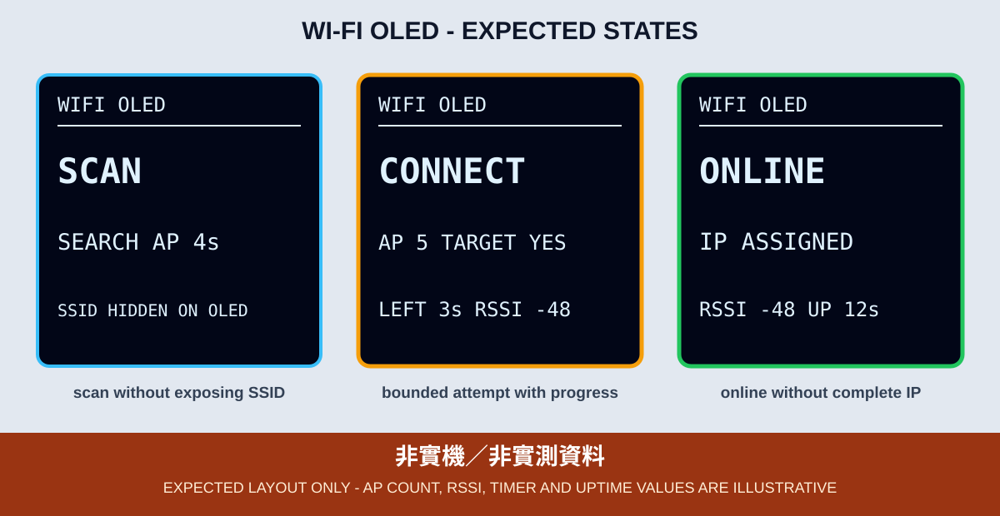

# 1. Wi-Fi 掃描、連線與自動恢復

第三篇從 Wi-Fi 開始，但不使用傳統的無限等待寫法。ESP32 在掃描、連線及退避重試期間，OLED 都要顯示當前階段與倒數，其他工作才不會被空白畫面或 `while` 迴圈卡住。



*圖：依本章程式字串繪製的預期版型，不是實機照片；AP 數、RSSI、倒數與上線時間均非實測。*

## 本章目標

- 以 `WIFI_STA` 模式連接 2.4 GHz 無線網路。
- 用 `WiFi.scanNetworks(true)` 啟動非同步掃描，再用 `WiFi.scanComplete()` 查詢結果。
- 連線最多等待 15 秒，失敗後依 3、6、12、30 秒上限重試。
- 不在 OLED、程式碼或 Git 內暴露無線網路憑證。

## OLED 接線

| OLED | ESP32 Wrover |
|---|---|
| VCC | 3V3 |
| GND | GND |
| SDA | GPIO 21 |
| SCL | GPIO 22 |

本章是一般模式，OLED 旋轉設為 `2`。若 OLED 本身無法初始化，GPIO 2 已確認接線的狀態 LED 依然使用第二篇的 2 下／3 下閃爍碼。

## 憑證分離

Repository 只提交 `secrets.example.h`。學生必須複製為同目錄的 `secrets.h`，再填入：

```cpp
constexpr char WIFI_SSID[] = "YOUR_WIFI_SSID";
constexpr char WIFI_PASSWORD[] = "YOUR_WIFI_PASSWORD";
```

`secrets.h` 已由根目錄 `.gitignore` 排除。程式透過 `__has_include("secrets.h")` 選擇實際檔或編譯用範本；只要還是範本佔位字，實機就停在 `CONFIG ERR`，不會啟動 Wi-Fi。

請勿把 `secrets.h` 內容貼入 Issue、課堂訊息或 OLED 照片。即使 SSID 不是密碼，也可能暴露地點或組織資訊，所以本章畫面只顯示 AP 數、目標是否出現及 RSSI。

## 狀態機

```text
CONFIG CHECK
  ├─ placeholder ─> CONFIG ERR（保留）
  └─ valid ─> SCAN START -> SCAN WAIT
                          ├─ target found -> CONNECT START -> CONNECT WAIT
                          │                                  ├─ connected -> ONLINE
                          │                                  └─ error/15s -> BACKOFF
                          └─ no AP/error/12s -> BACKOFF -> SCAN START
ONLINE -> link lost -> BACKOFF -> CONNECT START
```

不要把官方範例中的 `while (WiFi.status() != WL_CONNECTED)` 直接搬入本教材。本章在每次 `loop()` 查詢狀態，並持續刷新 OLED。掃描結束後必須執行 `WiFi.scanDelete()` 釋放結果佔用的記憶體。

## OLED 狀態字串

| OLED | 意義 | 下一個最小檢查 |
|---|---|---|
| `CONFIG ERR` | 缺少實際憑證 | 建立並編輯本機 `secrets.h` |
| `SCAN` | 非同步掃描中 | 等待最多 12 秒 |
| `CONNECT` | 已發起連線 | 觀察 `LEFT Ns` |
| `ONLINE` | 已取得 IP | 檢查 RSSI 是否會合理變化 |
| `NO AP` | 目標未出現 | 檢查 AP 電源、2.4 GHz 與 SSID |
| `SCAN ERR` / `SCAN T/O` | 掃描失敗 | 重新啟動開發板後再測 |
| `CONN ERR` / `TIMEOUT` | 無法完成連線 | 檢查憑證與訊號強度 |
| `LINK LOST` | 原有連線中斷 | 觀察自動恢復 |
| `RETRY Ns` | 退避倒數 | 不要在倒數期間快速重置 |

`WL_CONNECT_FAILED` 本身不足以唯一判定密碼錯誤，因此基礎範例使用較誠實的 `CONN ERR`，不誤報 `AUTH ERR`。若後續要細分原因，Wi-Fi event callback 只能記錄 reason code，不能從另一個 FreeRTOS task 直接更新 OLED。

## CLI 編譯與燒錄

```bash
arduino-cli --config-file arduino-cli.yaml compile \
  --fqbn esp32:esp32:esp32wrover \
  examples/03_network_cloud_mqtt/01_wifi_oled

arduino-cli board list
arduino-cli --config-file arduino-cli.yaml upload \
  -p YOUR_SERIAL_PORT \
  --fqbn esp32:esp32:esp32wrover \
  examples/03_network_cloud_mqtt/01_wifi_oled
```

## 可見驗收

1. 佔位憑證下，OLED 持續顯示 `CONFIG ERR`。
2. 設定正確後，畫面依序出現 `SCAN`、`CONNECT`、`ONLINE`。
3. `ONLINE` 畫面的 RSSI 是負值 dBm，且開發板遠離 AP 時應整體變差。
4. 關閉課堂 AP 後，OLED 不能停在舊的 `ONLINE`；應顯示 `LINK LOST`或 `NO AP` 及重試倒數。
5. 恢復 AP 後，不重置 ESP32 也能再度進入 `ONLINE`。

## 證據邊界

Arduino CLI 或 GitHub Actions 的成功結果只能證明本範例在鎖定 FQBN、ESP32 Core 與 OLED 函式庫下可編譯。它不能證明課堂 AP、密碼、DHCP、實際 RSSI、斷線重連或 OLED 實機畫面。

實機驗收請保留 OLED 正面照、ESP32 與 OLED 完整接線照、使用板型、Core 版本與燒錄結果；拍攝前先確認畫面與背景沒有 SSID 或密碼。
