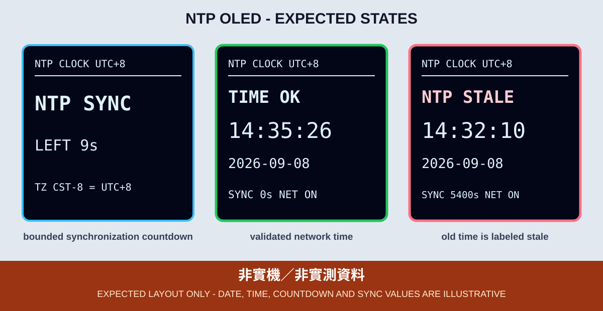

# 2. NTP 網路校時與 UTC+8 OLED 時鐘

NTP（Network Time Protocol）讓 ESP32 在連上網路後取得日期與時間。本章排在 HTTP 之前，先建立後續 HTTPS 憑證驗證、雲端資料時間戳與 MQTT 時間欄位會使用的網路時鐘。



*圖：依本章程式字串繪製的預期版型，不是實機照片；日期、時間、倒數與同步年齡均非實測。*

## 時區設計

程式使用：

```cpp
configTzTime("CST-8", "pool.ntp.org", "time.nist.gov");
```

POSIX `TZ` 字串的位移方向與一般 `UTC+8` 寫法相反，所以 `CST-8` 在這裡代表台灣使用的 UTC+8。不要把 `CST+8` 寫進程式，也不要把桌面作業系統的 `Asia/Taipei` 名稱當成 ESP32 必然可解讀的 POSIX 規則。

台灣目前課程不需要夏令時間切換，但教材仍使用 `configTzTime()` 而不只是在顯示時手動加八小時，以免後續日期、時間戳與排程使用不同基準。

## OLED 與憑證

OLED 使用 3.3V、GND、SDA GPIO 21、SCL GPIO 22，畫面旋轉為 `2`。GPIO 2 依第二篇規範作為 OLED 初始化失敗時的 2 下／3 下備援碼。

憑證繼續使用每個 Sketch 目錄內的 `secrets.example.h` 與本機 `secrets.h`。範例檔可供 CI 編譯，但佔位字在實機執行時只會顯示 `CONFIG ERR`。OLED 與程式皆不顯示 SSID、密碼或完整內網 IP。

## 非阻塞狀態機

```text
CONFIG CHECK
  ├─ placeholder -> CONFIG ERR
  └─ valid -> WIFI CONNECT START -> WIFI CONNECT WAIT
                                      ├─ online -> NTP CONFIG -> NTP SYNC WAIT
                                      │                              ├─ valid time -> TIME OK
                                      │                              └─ 15s -> NTP BACKOFF
                                      └─ error/15s -> WIFI BACKOFF
TIME OK -> Wi-Fi lost -> WIFI BACKOFF -> WIFI CONNECT START
NTP BACKOFF -> 30s -> NTP CONFIG
```

`configTzTime()` 只啟動校時，不代表立即取得時間。程式不使用長時間的 `getLocalTime()` 等待，而是在 `loop()` 中查詢 epoch 是否已達 2024-01-01，並讓 OLED 持續顯示同步剩餘時間。

NTP callback 可能在網路任務中執行，所以本章 callback 只設定一個原子通知旗標；真正的 I²C/OLED 更新仍由主 `loop()` 執行。

## 狀態、逾時與新鮮度

| OLED | 意義 |
|---|---|
| `CONFIG ERR` | Wi-Fi 憑證未完成 |
| `WIFI` / `CONNECT LEFT Ns` | 15 秒 Wi-Fi 連線視窗 |
| `NTP SYNC` / `LEFT Ns` | 15 秒校時視窗 |
| `NTP T/O` / `NO TIME` | 從開機至今還沒有可用的已同步時間 |
| `TIME OK` | 已成功取得 UTC+8 日期時間 |
| `SYNC Ns` | 最後校時通知的年齡，最多顯示 `9999s` |
| `NTP STALE` | 校時通知已超過 90 分鐘 |
| `NET LOST` / `CLOCK LOCAL` | 網路斷線，裝置只是用本地時鐘繼續走 |

`NTP STALE` 不等於時鐘立即變成錯誤，但它表示不應再宣稱裝置「剛剛已與 NTP 同步」。斷網後若保留時間，畫面會明確標成 `CLOCK LOCAL`，而不是 `TIME OK / NET ON`。

## CLI 編譯與燒錄

```bash
arduino-cli --config-file arduino-cli.yaml compile \
  --fqbn esp32:esp32:esp32wrover \
  examples/03_network_cloud_mqtt/02_ntp_clock_oled

arduino-cli board list
arduino-cli --config-file arduino-cli.yaml upload \
  -p YOUR_SERIAL_PORT \
  --fqbn esp32:esp32:esp32wrover \
  examples/03_network_cloud_mqtt/02_ntp_clock_oled
```

## 可見驗收

1. 開機依序顯示 Wi-Fi 連線、`NTP SYNC`、`TIME OK`。
2. OLED 日期與時間要與當下台灣 UTC+8 交叉比對，誤差應只有人工比對所需的少數秒。
3. 秒數要持續前進；靜止的時間字串不算通過。
4. 在首次同步前關閉 AP，OLED 應保留錯誤與重試進度，不顯示偽造時間；若通過 Wi-Fi 後才阻斷 NTP，應顯示 `NTP T/O`。
5. 成功同步後關閉 AP，時鐘可繼續走，但畫面必須顯示 `NET LOST` 與 `CLOCK LOCAL`；恢復 AP 後能回到網路正常狀態。

## 證據邊界

Arduino CLI 或 GitHub Actions 可以證明程式使用的 `configTzTime()`、SNTP、Wi-Fi 及 OLED API 可在 ESP32 Core 3.3.11 與 `esp32:esp32:esp32wrover` 下編譯。它不能證明 DNS、UDP 123、NTP 伺服器可達、台灣時區轉換、斷線後漂移或 OLED 畫面已在課程板顯示。

實機證據至少包含 OLED 正面照、完整接線照、當下台灣時間對照、板型、Core 版本與燒錄結果。
