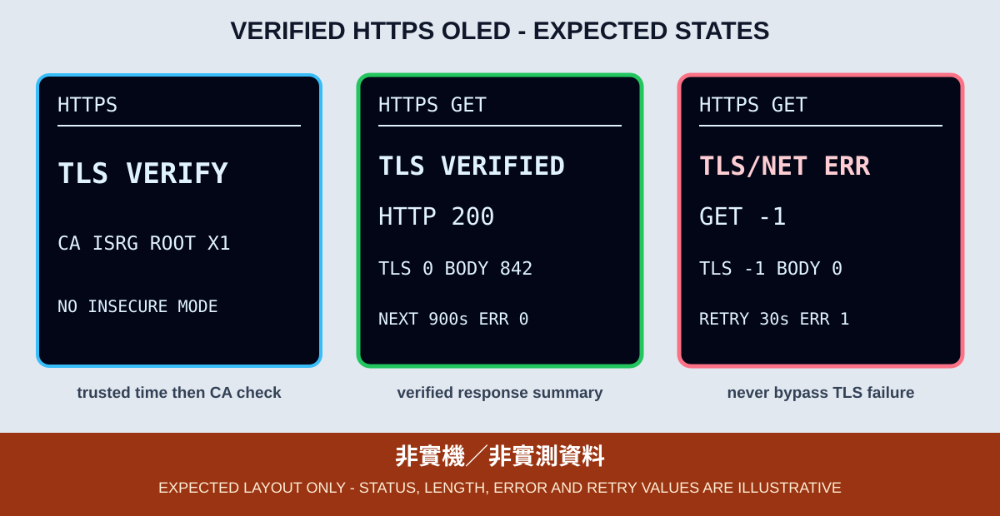

# 3. 經過憑證驗證的 HTTPS GET

本章建立在第 1 章 Wi-Fi 與第 2 章 NTP 已通過實機驗收的前提上。ESP32 必須先取得已同步且落在合理範圍、足供憑證日期檢查的時間，才開始驗證 HTTPS 伺服器憑證；一般 SNTP 並非密碼學認證時間。若時間尚未校正，程式保留在 NTP 錯誤與重試畫面，不會用跳過驗證的方式假裝成功。



*圖：預期 OLED 版型，不是實機照片。HTTP 狀態碼、TLS 錯誤碼與 body 大小只作畫面示例。*

## 本章目標

- 在 ESP32 Core 3.3.11 使用 `<NetworkClientSecure.h>` 與 `NetworkClientSecure`。
- 以 `setCACert()` 載入公開 CA，驗證伺服器提供的 TLS 憑證鏈。
- 使用 `HTTPClient` 發出 HTTPS GET，分開觀察 HTTP、TLS／網路與回應大小。
- 限制回應本體的大小、單次讀取量與停滯時間，避免不受控內容耗盡記憶體。
- 不使用 Serial Monitor；所有等待、成功、錯誤與重試資訊都由 OLED 顯示。

## OLED 與備援錯誤碼

| OLED | ESP32 Wrover |
|---|---|
| VCC | 3V3 |
| GND | GND |
| SDA | GPIO 21 |
| SCL | GPIO 22 |

OLED 使用 `setRotation(2)`。找不到 OLED I²C 位址時，GPIO 2 重複閃 2 下；找到位址但 SSD1306 初始化失敗時重複閃 3 下。GPIO 2 只作低風險狀態指示，不接繼電器或其他負載。

## 為什麼先校時再驗證 TLS

TLS 驗證不只確認簽發者與主機名稱，也要檢查憑證是否在有效期間內。剛開機且尚未校時的 ESP32 可能只有錯誤的預設日期，因此本範例依序執行：

```text
CONFIG CHECK -> WIFI -> NTP -> TLS VERIFY -> HTTP GET -> BODY READ
```

Wi-Fi 與 NTP 採主迴圈狀態機，有截止時間與退避倒數。`HTTPClient::GET()` 本身仍是同步呼叫，所以程式在呼叫前先把 `GET` 與 `MAX WAIT 8s` 顯示到 OLED，並設定 8 秒連線／讀取逾時；這是「等待有上限」，不是宣稱底層 HTTP 呼叫完全非阻塞。

## CA 驗證，不使用 `setInsecure()`

範例的 `open_meteo_root_ca.h` 收錄 [Let's Encrypt 官方 ISRG Root X1 PEM](https://letsencrypt.org/certificates/)，再交給：

```cpp
NetworkClientSecure tlsClient;
tlsClient.setCACert(OPEN_METEO_ROOT_CA);
```

禁止用 `setInsecure()`、明文 HTTP 或忽略憑證錯誤作為完成方式。這會失去伺服器身分驗證，讓中間人可偽造回應。

Root CA 不是永遠不變的程式常數。教材所附 ISRG Root X1 的官方有效期限到 2035-06-04，但伺服器提供的憑證鏈可能更早調整；如果日後 TLS 驗證失敗，應先以官方憑證頁及服務端實際鏈重新確認，再經審查更新 CA，不要下載不明網站的憑證，也不要改成不驗證模式。

## 教學端點與請求頻率

本章為了練習 HTTPS，會對 Open-Meteo Air Quality API 發出與第 4 章相同的有限欄位請求，但只計算 body bytes，不解釋數值。該端點的空氣品質資料來自 Open-Meteo 與 Copernicus Atmosphere Monitoring Service（CAMS）模式產品，不是 ESP32 或現地測站實測。

使用前應以 [Open-Meteo Air Quality API 文件](https://open-meteo.com/en/docs/air-quality-api) 與 [Open-Meteo Terms](https://open-meteo.com/en/terms) 當下版本為準。免費 open-access API 無 SLA，且依當前條款限非商業使用；付費課程、公司用途或正式服務需先確認條款，並採用合適方案或經核准的資料源。

多塊教學板共用同一 NAT 時，每台會在首次請求前加入 0–15 秒 jitter；成功後至少等待 15 分鐘，再加 0–30 秒 jitter；失敗後從 60 秒逐步退避到 15 分鐘並加 jitter；HTTP 429 直接採 15 分鐘退避。Wi-Fi 重連不會清除原有輪詢或退避期限。

## 有界回應本體

本章只計算回應 body 大小，不把內容輸出到畫面。程式採用以下界線：

- 使用 HTTP/1.0，讓未知長度的回應能以連線關閉作為結束條件。
- 若 `Content-Length` 已宣告超過 2048 bytes，立即拒絕。
- 即使伺服器沒有宣告長度，實際讀取也不得超過 2048 bytes。
- 若連線提早結束且實收 bytes 少於已宣告的 `Content-Length`，以 `BODY SHORT` 判定失敗。
- HTTP 200 的空 body 以 `BODY EMPTY` 判定失敗，不冒充完成。
- 每次 `loop()` 最多讀 128 bytes，讓 OLED 與連線狀態仍有機會更新。
- 連續 5 秒沒有任何 body 進度時，以 `BODY TIMEOUT` 結束並退避重試。

「宣告長度符合」不能取代實際計數；兩者都必須檢查。成功畫面保留 HTTP 狀態、TLS 結果與實際 body bytes，下一次成功輪詢至少在 15 分鐘後。

## OLED 狀態與診斷順序

| OLED | 意義 | 下一個檢查 |
|---|---|---|
| `CONFIG ERR` | 未建立有效的本機 `secrets.h` | 複製範本並填入 Wi-Fi 設定 |
| `WIFI CONNECT` / `OFFLINE` | Wi-Fi 連線或退避中 | 接續第 1 章排錯 |
| `NTP SYNC` / `TIMEOUT` | 尚未取得已同步時間 | 接續第 2 章排錯 |
| `JITTER` / `START IN Ns` | 首次請求分散等待 | 不要用重開開發板繞過限制 |
| `TLS VERIFY` | 已載入 Root CA，準備驗證 | 不可改用 `setInsecure()` |
| `GET` / `MAX WAIT 8s` | 正在執行有限時的同步 GET | 等待逾時或 HTTP 結果 |
| `HTTP 200` / `BODY n/2048 B` | 主迴圈分段讀取 body | 觀察數字是否前進 |
| `TLS VERIFIED` | HTTPS、HTTP 200 與 body 讀取完成 | 核對 HTTP、TLS、BODY 三欄 |
| `TLS/NET ERR` | TLS、DNS 或連線層失敗 | 先查時間、DNS、CA 與網路，不只看單一數字 |
| `HTTP ERR` | 已取得 HTTP 回應，但不是 200 | 記錄狀態碼，勿把它誤判成 JSON 錯誤 |
| `BODY EMPTY` / `BODY SHORT` / `BODY TOO LARGE` / `BODY TIMEOUT` | 回應為空、短於宣告長度、超限或停止前進 | 保留實際 bytes 與重試倒數 |

負值 GET 結果與 TLS `lastError()` 數字是排錯線索，不足以單獨證明根因。回報時應同時提供 OLED 完整畫面、當時網路條件與時間同步證據。

## CLI 編譯與燒錄

先依範例 README 建立不追蹤的 `secrets.h`，再從 Repository 根目錄執行：

```bash
arduino-cli --config-file arduino-cli.yaml compile \
  --fqbn esp32:esp32:esp32wrover \
  examples/03_network_cloud_mqtt/03_https_get_oled

arduino-cli board list
arduino-cli --config-file arduino-cli.yaml upload \
  -p YOUR_SERIAL_PORT \
  --fqbn esp32:esp32:esp32wrover \
  examples/03_network_cloud_mqtt/03_https_get_oled
```

## 可見驗收

1. 有效設定下，OLED 依序出現 Wi-Fi、NTP、`TLS VERIFY`、`GET` 與 `HTTP 200`。
2. 首次請求前顯示 `JITTER`；成功畫面同時顯示 `TLS VERIFIED`、`HTTP 200`、`TLS 0` 與大於 0 且不超過 2048 的 `BODY` bytes。
3. 停用網路後不能保留舊的成功狀態；畫面應顯示連線失敗與有限重試倒數。
4. 把系統置於尚未完成 NTP 的情境時，HTTPS 不應先行啟動。
5. 程式及 Repository 中不得出現 `setInsecure()`，OLED、照片與回報不得露出 SSID、密碼或完整內網 IP。
6. 重連 Wi-Fi 不得提前觸發新請求；HTTP 429 必須保留 15 分鐘退避。

## 證據邊界

Arduino CLI 或 GitHub Actions 可以證明 Sketch 在鎖定的 ESP32 Core 3.3.11、FQBN 與函式庫下可編譯，也可以用靜態檢查確認程式載入 CA、設定上限且沒有呼叫 `setInsecure()`。它不能證明裝置時間正確、DNS 可達、伺服器目前憑證鏈能通過、HTTP 實際內容未改變或 OLED 已在課程板顯示。

實機證據至少包含 OLED 正面照、完整低壓接線照、板型、Core 版本、燒錄結果，以及成功與斷網失敗各一組畫面。範例位於 [`examples/03_network_cloud_mqtt/03_https_get_oled`](../../examples/03_network_cloud_mqtt/03_https_get_oled)。
