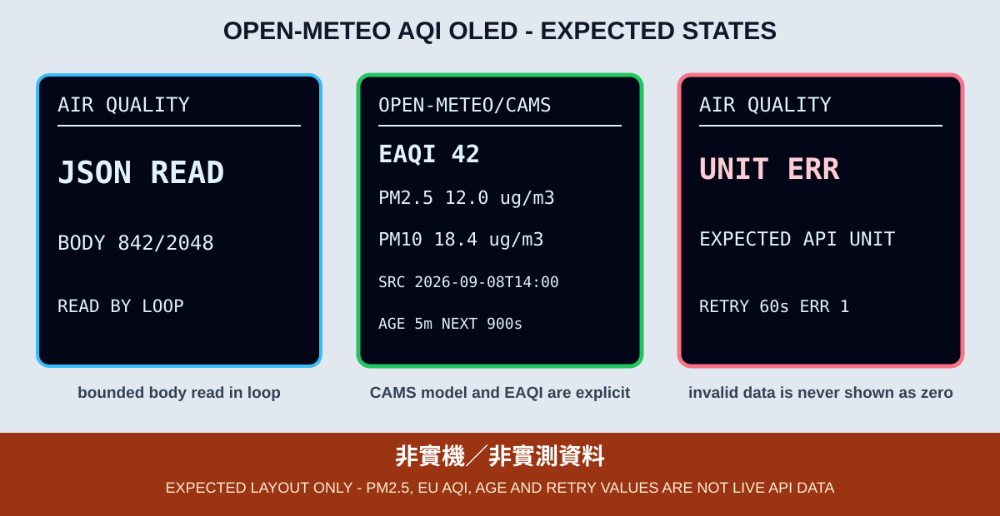

# 4. ArduinoJson 與 Open-Meteo 空氣品質資料

本章沿用第 3 章已驗證的 Wi-Fi、NTP、TLS 與有界 HTTPS GET，再加入 ArduinoJson 7.4.3。學生不只要讓 JSON「解析成功」，還要確認必要物件、欄位型別、合理範圍與來源時間，避免把空值、錯欄位或舊資料當成有效量測。



*圖：預期 OLED 版型，不是實機照片，數值不是當時實測資料。*

## 資料來源與意義

範例查詢 Open-Meteo Air Quality API 的教學座標，要求目前值：

- `pm10`：PM10，單位由 `current_units.pm10` 驗證。
- `pm2_5`：PM2.5，單位由 `current_units.pm2_5` 驗證。
- `european_aqi`：European AQI。
- `time` 與 `interval`：來源時間及資料時間間隔。

這些空氣品質數值來自 Copernicus Atmosphere Monitoring Service（CAMS）模型／再分析與預報產品的估算，不是 ESP32 旁邊的感測器讀值，也不等同附近測站的即時觀測。畫面使用 `OPEN-METEO/CAMS`，轉載教材與衍生作品也必須保留 Open-Meteo 與 CAMS attribution。

資料說明及使用條款應以 [Open-Meteo Air Quality API 官方文件](https://open-meteo.com/en/docs/air-quality-api) 與 [Open-Meteo Terms](https://open-meteo.com/en/terms) 當下版本為準。Open-Meteo 免費 open-access API 無 SLA，且依官方條款限非商業使用；付費課程、公司用途或正式服務必須先確認當下條款，並採用合適的商業方案或經核准的資料源。公開服務可能變更欄位、限制、憑證鏈或可用性，不能把一次成功當作永久可用性證明。

## ArduinoJson 7.4.3

本 Repository 鎖定 ArduinoJson 7.4.3。ArduinoJson 7 使用 `JsonDocument`，本章同時加入兩個反序列化限制：

```cpp
JsonDocument filter;
filter["current_units"]["pm10"] = true;
filter["current_units"]["pm2_5"] = true;
filter["current_units"]["european_aqi"] = true;
filter["current"]["time"] = true;
filter["current"]["interval"] = true;
filter["current"]["pm10"] = true;
filter["current"]["pm2_5"] = true;
filter["current"]["european_aqi"] = true;

JsonDocument doc;
deserializeJson(doc, jsonBody, bodyBytes,
                DeserializationOption::Filter(filter),
                DeserializationOption::NestingLimit(4));
```

`Filter` 只保留課程需要的欄位，降低不相關內容的記憶體使用；`NestingLimit(4)` 拒絕異常深度。兩者都不能取代傳輸層 2048-byte 上限、`Content-Length` 完整性檢查，也不能取代反序列化錯誤檢查。

## 欄位、型別與合理範圍

成功條件不是 `deserializeJson()` 沒有錯誤而已。程式還要依序確認：

1. `current` 與 `current_units` 物件存在。
2. `time` 和三個單位欄位是字串，`interval` 是非負整數，污染物與 AQI 是數值。
3. PM10、PM2.5、European AQI 都是有限值，不能是 `NaN` 或無限大。
4. PM 值位於 0–5000 µg/m³，European AQI 位於 0–1000，`interval` 位於 1–86400 秒。
5. `time` 符合 `YYYY-MM-DDTHH:MM`，能依已設定的 UTC+8 時區轉為有效時間。
6. 來源時間不得超前本機可信時間 5 分鐘以上，也不得老於 2 小時。
7. PM10／PM2.5 單位必須是 `μg/m³`，European AQI 單位必須是 `EAQI`，避免 API 格式改變時仍把數字冠上錯誤單位。

上述上限是用來拒絕明顯損壞或異常傳輸的防禦界線，不是健康建議、法規門檻或感測器規格。畫面上的數值不可用於醫療、法規符合性或安全控制決策。

## 輪詢、jitter 與 backoff

教室同時開機的多塊 ESP32 通常共用同一個 NAT 公網位址，不應在同一秒集中呼叫公開 API。本章要求同一 NAT 下的每台裝置都各自採用：

- 開機完成 Wi-Fi 與 NTP 後，先加入 0–15 秒啟動 jitter。
- 成功後至少等待 15 分鐘，再加 0–30 秒 jitter 才輪詢。
- 失敗後從 60 秒開始指數退避，逐步增加到最多 15 分鐘，再加 jitter。
- HTTP 429 代表請求過多，直接採用 15 分鐘上限退避。

Jitter 不是提高取樣頻率的理由；「至少 15 分鐘」是成功輪詢的最短間隔。學生不可用快速重開板子來繞過限制，也不應把公開免費服務當作大量裝置的正式後端。

## 資料新鮮度

成功畫面同時顯示資料來源時間 `SRC`、由本機可信時間計算的 `AGE`，以及下一次輪詢倒數。若後續抓取失敗但記憶體內仍有前次資料，OLED 必須標成 `AQ DATA STALE` 並保留錯誤，不可只顯示舊數字讓人誤以為剛更新。

`AGE` 是 API 來源時間的年齡，不只是「距離 ESP32 收到 JSON 多久」。如果來源時間無法解析，整筆資料驗證失敗。

## OLED 狀態與分層排錯

| OLED | 意義 | 應檢查的層級 |
|---|---|---|
| `CONFIG ERR` | 本機 Wi-Fi 設定未完成 | `secrets.h` |
| `WIFI` / `NTP` | 前置網路或可信時間未完成 | 第 1、2 章 |
| `TLS VERIFY` / `HTTPS GET` | CA 驗證與有限時 GET | 第 3 章 |
| `JSON READ` | 以 2048-byte 上限接收內容 | body 大小、`Content-Length` 完整性與停滯時間 |
| `JSON PARSE` | 以 Filter、NestingLimit 反序列化 | ArduinoJson 錯誤 |
| `JSON ERR` | JSON 語法、深度或內容不完整 | 記錄錯誤文字，不猜測欄位 |
| `FIELD/RANGE ERR` | 物件、型別、時間或範圍不合要求 | API schema 與驗證規則 |
| `UNIT ERR` | API 回傳單位與畫面預期不符 | 停止顯示為新資料並查 API schema |
| `SOURCE FUTURE` / `SOURCE STALE` | 來源時間超前 5 分鐘以上或老於 2 小時 | 查 NTP、時區與 API 來源時間 |
| `OPEN-METEO/CAMS` | 新資料已通過全部檢查 | 核對 PM、EAQI、SRC、AGE |
| `AQ DATA STALE` | 最近一次更新失敗，畫面是舊資料 | 錯誤原因與重試倒數 |

OLED 使用 GPIO 21／22、rotation `2`，不依賴 Serial Monitor。若 OLED 不可用，GPIO 2 仍依既有規範閃 2 下或 3 下；JSON、HTTP 或 TLS 錯誤則直接留在 OLED，不用 GPIO 2 混合編碼。

## CLI 編譯與燒錄

先依範例 README 建立本機 `secrets.h`，再從 Repository 根目錄執行：

```bash
arduino-cli --config-file arduino-cli.yaml compile \
  --fqbn esp32:esp32:esp32wrover \
  examples/03_network_cloud_mqtt/04_air_quality_json_oled

arduino-cli board list
arduino-cli --config-file arduino-cli.yaml upload \
  -p YOUR_SERIAL_PORT \
  --fqbn esp32:esp32:esp32wrover \
  examples/03_network_cloud_mqtt/04_air_quality_json_oled
```

## 可見驗收

1. 畫面必須先通過 Wi-Fi 與 NTP，才進入 `TLS VERIFY`、`HTTPS GET`、`JSON READ` 與 `JSON PARSE`。
2. 成功後顯示 `OPEN-METEO/CAMS`、EAQI、PM2.5、PM10、`SRC`、`AGE` 與下次輪詢倒數。
3. 成功輪詢之間不得短於 15 分鐘；多塊板同時開機時，第一次與後續請求應可看到 jitter 分散。
4. 斷網或 API 失敗時，若保留舊資料必須同時顯示 `AQ DATA STALE`；若從未取得有效資料，則保留明確失敗畫面與 backoff 倒數。
5. 人工提供缺欄位、錯型別、過深或超範圍測試資料時，不得進入成功畫面。
6. 教材、展示或截圖說明中不得把 CAMS 估算宣稱為本地感測器實測。

## 證據邊界

Arduino CLI 或 GitHub Actions 可以證明 Sketch 與 ArduinoJson 7.4.3、ESP32 Core 3.3.11 的 API 相容，也可由程式碼檢查 Filter、NestingLimit、欄位驗證、大小上限及輪詢常數。CI 不能證明 Wi-Fi、NTP、TLS、Open-Meteo 可用性、當下 CAMS 數值、來源時間、jitter 分布或 OLED 實機顯示正確。

實機證據至少包含 OLED 正面照、完整低壓接線照、板型、Core 與 ArduinoJson 版本、燒錄結果、成功畫面，以及斷網後的 stale／backoff 畫面。範例位於 [`examples/03_network_cloud_mqtt/04_air_quality_json_oled`](../../examples/03_network_cloud_mqtt/04_air_quality_json_oled)。
