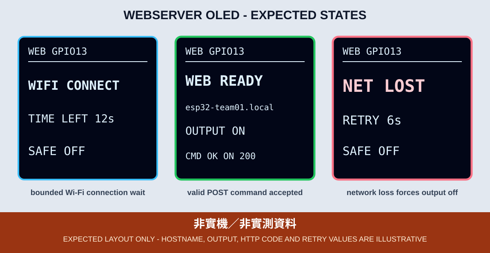

# 05. ESP32 WebServer 與安全輸出

本章把 ESP32 當成教室區網內的小型 Web Server。瀏覽器可以讀取 GPIO 13 狀態，只有通過登入與 CSRF 驗證的 POST 指令才能切換輸出。開機、斷線和異常命令一律先回到 `SAFE OFF`。

*圖：預期 OLED 版型，不是實機照片。主機名稱、HTTP 狀態碼與輸出狀態只作排版示例。*

## 為什麼不以網址控制輸出

早期範例常用 `GET /on`、`GET /off`。搜尋引擎、預載、瀏覽器重試或聊天軟體預覽都有機會自動發出 GET，因此讀取網址不應改變設備狀態。本章採用：

- GET 只讀取首頁與狀態。
- POST 才能控制 GPIO 13。
- 只允許 `on`、`off` 兩個精確值。
- 多餘欄位、未知指令、錯誤方法或錯誤 Token 一律拒絕。
- 拒絕異常控制時同時執行 `SAFE OFF`。

## 三層保護

1. `secrets.h`：Wi-Fi 與網頁登入資料只留在學生電腦，不提交 Git。
2. Digest Authentication：未登入不能讀取頁面或 API，程式會拒絕降級成 Basic Authentication。
3. CSRF Token：每次 Server 啟動或 Wi-Fi 重連時隨機產生；控制頁必須在 POST Header 帶回同一 Token。重連後舊網頁需重新整理，否則舊 Token 會得到 403 並觸發 `SAFE OFF`。

這些措施只降低教室區網內的誤操作風險，並沒有替明文 HTTP 加密。請只連接隔離或可信任的教室網路，禁止設定 Port Forwarding，也不可把本章直接用於市電、門鎖、加熱器或其他安全關鍵設備。

## 非阻塞主迴圈

`server.handleClient()` 必須頻繁執行，HTTP handler 內不能加入長時間 `delay()` 或感測器慢速讀取。本章的主迴圈同時處理：

1. 有上限的 Wi-Fi 連線等待。
2. 3、6、12、30 秒退避重試。
3. 首次連線逾時顯示 `WIFI TIMEOUT`；已上線後中斷才顯示 `NET LOST`，兩者都停止 Server 並安全關閉輸出。
4. 高頻呼叫 `handleClient()`。
5. 每 250 ms 更新 OLED；成功 HTTP 事件保留 2.5 秒，HTTP 錯誤則保留到下一個狀態改變或合法事件。

## 設定與操作

先依範例 README 複製 `secrets.example.h` 為不追蹤的 `secrets.h`。每組必須使用唯一的 `DEVICE_HOSTNAME`，例如 `esp32-team01`，避免多塊開發板爭用同一個 `.local` 名稱。

編譯及燒錄後：

1. OLED 先顯示 `WIFI CONNECT`，輸出維持 `SAFE OFF`。
2. 看到 `WEB READY` 後，在同一教室區網開啟 `http://DEVICE_HOSTNAME.local/`。
3. 輸入本機 `secrets.h` 的網頁帳密。
4. 按「開啟」或「安全關閉」，比對網頁結果、GPIO 13 可見輸出與 OLED 的 `CMD OK`。
5. 重新啟動 ESP32，確認 GPIO 13 不會保留前一次 ON。
6. 一般斷線驗收先關閉開發板電源，再關閉 AP 或更換網路條件後重新上電；只有教師預先建置的隔離治具才可做運轉中斷線測試。

如果 OLED 短暫顯示 `MDNS ERR`，或之後持續顯示 `MDNS NOT READY`，不要猜測位址或公開私人網址；由教師在教室 DHCP 管理介面確認位址與網路隔離設定。

## 完成判定

- 缺少 `secrets.h` 時固定停在 `CONFIG ERR`，GPIO 13 為 LOW。
- 未登入、錯誤 Token、錯誤方法與未知指令均無法開啟輸出；錯誤控制請求會先回到 `SAFE OFF`。
- 合法 POST 才能顯示 `CMD OK ON`；合法 OFF 顯示 `CMD OK OFF`。
- 首次 Wi-Fi 逾時時顯示 `WIFI TIMEOUT`；已上線後 Wi-Fi 中斷時顯示 `NET LOST`。斷線或 ESP32 重開都必須顯示 `SAFE OFF`，輸出回到 LOW。
- OLED 初始化失敗時，GPIO 2 依既有規範重複閃 2 次或 3 次。

## 失敗時回傳

請提供 OLED 正面照片、完整低壓接線照片、瀏覽器實際 HTTP 狀態碼、作業系統、瀏覽器、主機名稱、Sketch Commit 與 Core 版本。帳號、密碼、CSRF Token、Wi-Fi 名稱和私人網址必須遮蔽。

本章程式位於 [`examples/03_network_cloud_mqtt/05_webserver_oled`](../../examples/03_network_cloud_mqtt/05_webserver_oled)。CI 成功只表示可編譯，不能替代區網、瀏覽器、驗證機制或 GPIO 的實體測試。
