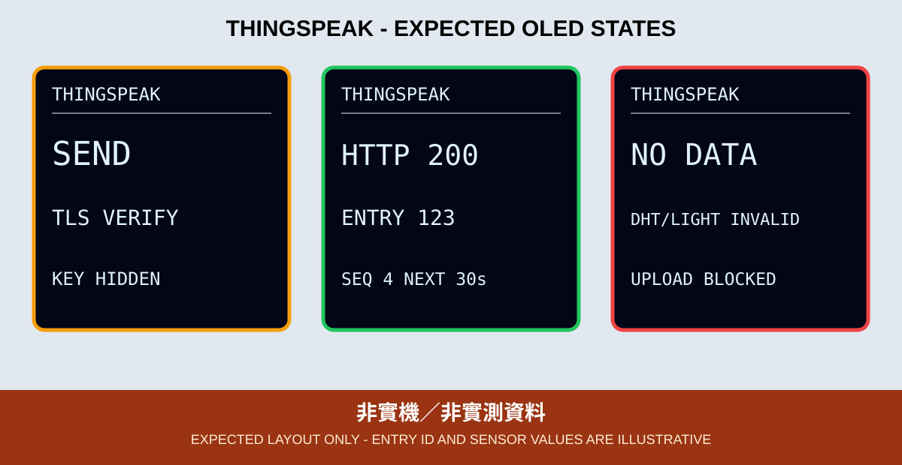

# 06. ThingSpeak 資料上傳與圖表

本章把第二篇的 DHT11／光敏讀值送到 ThingSpeak。重點不只是「HTTP 200」，而是確認回應 body 為大於 0 的 Entry ID，再到 Channel 圖表核對同一筆資料。



*圖：預期 OLED 版型，不是實機照片；Entry ID、讀值與倒數皆為示意。*

## 本章目標

- 建立 Channel，將 Field 1／2／3 定義為 `temp`、`humi`、`light`。
- 將 Write API Key 留在未追蹤的 `secrets.h`。
- 先完成 Wi-Fi 與 NTP，再以 DigiCert Global Root G2 驗證 `api.thingspeak.com`。
- 使用 HTTPS POST，不把 Key 放在 OLED、log、截圖或 Git。
- 解析 Entry ID、限制上傳頻率並在錯誤時退避。

## 資料流與頻率

```text
DHT11 GPIO14 + LIGHT GPIO33
          -> range/NaN check
          -> NTP time ready
          -> verified HTTPS POST
          -> HTTP status + Entry ID
          -> OLED + ThingSpeak chart
```

ThingSpeak 免費 Channel 的官方最短更新間隔目前為 15 秒；本章採至少 30 秒加 0～5 秒抖動。HTTP 429 退避 15 分鐘，其他失敗由 30 秒逐步增加。服務方案會變更，上課前重新核對官方限制。

## OLED 狀態

OLED 依序顯示 `CONFIG ERR`、Wi-Fi／NTP 等待或逾時、`READY`、`SEND`／`TLS VERIFY`、`HTTP 200`／`ENTRY n`、`TLS/NET ERR`／`UPLOAD ERR`、`RATE LIMIT` 及 `NO DATA`。找不到 OLED 時，GPIO 2 重複閃 2 下；SSD1306 初始化失敗時重複閃 3 下。

## 不能沿用的舊寫法

- `http://api.thingspeak.com` 明文端點。
- 把 Write Key 直接寫進 `.ino` 或完整 GET 網址。
- 永久等待 Wi-Fi、失敗後立即重開機、只顯示 Serial。
- 看到 HTTP 200 就宣稱成功；ThingSpeak body 為 `0` 仍代表寫入未被接受。

## 驗收

1. 尚未建立 `secrets.h` 時停在 `CONFIG ERR`，不發送網路請求。
2. DHT11 `NaN` 或 ADC 不合理時顯示 `NO DATA`，Channel 不新增資料。
3. 正常時 OLED 顯示 `HTTP 200` 與 `ENTRY n`，其中 `n > 0`。
4. ThingSpeak 三個 Field 的最新時間與 OLED 當次溫濕度、光敏值一致。
5. 快速重試、429 或斷網時能看到錯誤及重試倒數，不保留假成功畫面。

實作與 CLI 指令見 [`06_thingspeak_oled`](../../examples/03_network_cloud_mqtt/06_thingspeak_oled)。CI 不呼叫 ThingSpeak，也不驗證 Key、Channel、TLS 或實體感測器。
