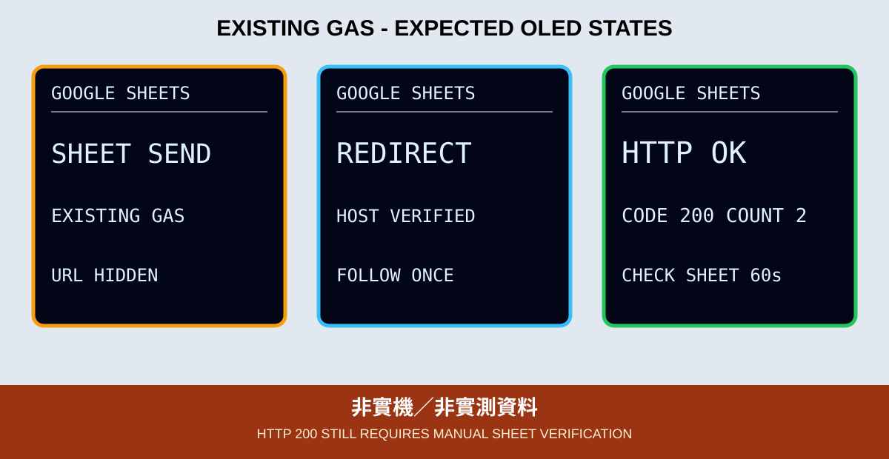

# 07. Google Sheets 與教師既有 GAS

本章依使用者指定，直接沿用教師原始範例中已開放的 GAS 服務與參數格式，**不重新設計、建立或部署 Apps Script**。新版工作只更新 ESP32 端的板型、DHT 腳位、OLED 診斷、連線上限與 TLS 驗證。



*圖：預期 OLED 版型，不是實機照片；HTTP 狀態、數值及倒數皆為示意。*

## 既有合約

教師範例以 HTTPS GET 呼叫既有 `/exec`，query 欄位為：

```text
type=insert&dateInclude=1&sheetId=...&sheetTag=...&data=...
```

`data` 維持原教材的 `溫度,濕度` CSV，再做 URL encoding。GAS URL、Sheet ID、工作表名稱與 Wi-Fi 全部只放在本機 `secrets.h`；公開 Repository 只提供欄位相同的佔位範本。

## 明確的安全邊界

既有 GAS 合約沒有裝置 Token、事件 ID 或去重機制，且由 query 指定 Sheet。因此這一章是「相容既有受控課堂服務」，不是新系統的安全設計範本：

- 隱藏 URL 不是驗證；GAS URL 加 Sheet ID 是可被濫用的存取能力，只能配合專用、非敏感的課堂 Sheet。
- 不公開完整 GAS URL、Sheet ID 或工作表名稱；課後是否撤銷／輪換由教師端處理，不要求學生重建 GAS。
- 只送通過型別／範圍檢查的 DHT11 數字，避免任意字串寫入 Sheet。
- HTTP 200 只表示請求／回應完成；仍須到 Sheet 人工確認新增列。
- 若 GAS 已寫入，但回應在途中遺失，OLED 顯示 `RESULT UNKNOWN`；不可盲目宣稱沒有重複資料。
- 若未來公開 URL 外洩、存取政策改變或服務停止，由教師處理端點，不在學生程式自行部署另一套 GAS。

Apps Script Content Service 可能回傳 302／303 到 `script.googleusercontent.com`。程式只接受這個 HTTPS 前綴、只跟隨一次，並以 GTS Root R4 驗證兩段 TLS；不使用 `setInsecure()`。

## OLED 狀態

OLED 依序顯示 `CONFIG ERR`、Wi-Fi／NTP 等待或逾時、`SHEET SEND`、允許的 `REDIRECT`、`HTTP OK`、`SEND ERR`／`RESULT UNKNOWN` 及 `NO DATA`。`HTTP OK` 只能證明 HTTP 200，不能代替 Sheet 新列核對。找不到 OLED 時，GPIO 2 重複閃 2 下；SSD1306 初始化失敗時重複閃 3 下。

## 驗收

1. 缺少既有設定時 OLED 固定顯示 `CONFIG ERR`。
2. 無效 DHT11 資料顯示 `NO DATA`，不送出。
3. 正常時依序顯示 `SHEET SEND`、可能的 `REDIRECT`、`HTTP OK CODE 200`。
4. 進入指定 Sheet，人工核對新列時間、溫度與濕度。
5. `SEND ERR` 時先核對 Sheet 是否已新增，再決定是否重試。

實作與 CLI 指令見 [`07_google_sheets_oled`](../../examples/03_network_cloud_mqtt/07_google_sheets_oled)。CI 不會呼叫教師 GAS 或存取 Google 帳號。
