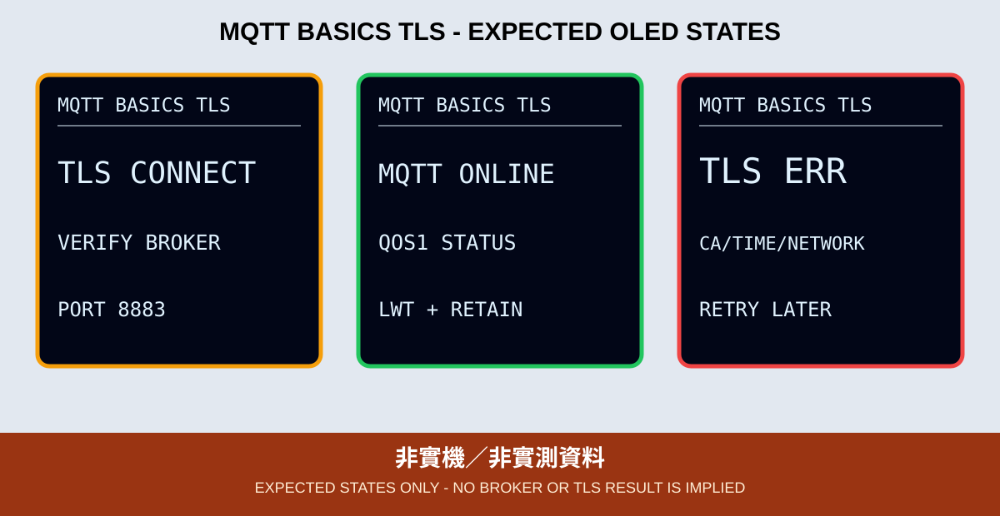

# 08. MQTT 基礎與 TLS 連線

MQTT 是長連線訊息協定。裝置不是直接把資料交給另一台裝置，而是先連到 Broker，再依 Topic 發布或訂閱。本章只建立連線、上線狀態與 Last Will，不控制硬體。

*圖：預期 OLED 版型，不是 Broker 或實機結果。*

## 六個核心概念

| 概念 | 本章決策 |
|---|---|
| Broker | 只接受可驗證 CA 的 TLS 主機，埠 8883 |
| Client ID | 每台唯一，1～23 個英數／連字號；不用完整 MAC |
| Topic | `class702/<group>/<device>/status` |
| QoS | status 使用 QoS 1；不宣稱 exactly once |
| Retain | Broker 保留最新 online 狀態 |
| Last Will | 非正常斷線時把 status 更新為 offline |

先完成 NTP 才能驗證憑證日期。程式先直接建立 TLS，成功後才送 MQTT CONNECT，讓 OLED 能把 `TLS ERR` 與 MQTT CONNACK／帳密錯誤分開顯示。

一般 SNTP 並非密碼學認證時間；本章只要求時間已同步且落在合理範圍，足以進行憑證日期檢查。`MQTT_ROOT_CA` 只能從 Broker 維運者或簽發 CA 官方來源取得，上課前核對憑證鏈、有效期與 SHA-256 指紋，不從不明網站複製，也不使用 `setInsecure()`。

舊能源專案的 MQTT 學習目標與 OLED 狀態可以保留，但明文 1883、固定 Topic、共用 Client ID、`setInsecure()` 與嵌入帳密不能搬入。本章改用仍有維護的 `MQTT` 2.5.3 library；這是新版遷移，不是原專案既有函式庫。

最小 ACL 是裝置只可發布自己的精確 `status`，觀察端只可訂閱同一 Topic，Broker 並允許裝置設定同 Topic 的 Last Will；不得授權整班共用的 `class702/#`。

## OLED 狀態

完整流程會顯示 `CONFIG ERR`、Wi-Fi／NTP 等待或逾時、`TLS CONNECT`／`TLS ERR`、`MQTT CONNECT`／`MQTT ERR`、`MQTT ONLINE`、`PUB OK`／`PUB ERR` 與 `LINK LOST`。找不到 OLED 時，GPIO 2 重複閃 2 下；SSD1306 初始化失敗時重複閃 3 下。

## 驗收

1. 設定缺失、CA 佔位或不是 8883 時顯示 `CONFIG ERR`。
2. 未校時停在 `TIME WAIT`，不得跳過 TLS。
3. CA／時間／網路錯誤顯示 `TLS ERR`；帳密或 Client ID 問題顯示 `MQTT ERR` 與數字碼。
4. 正常時顯示 `MQTT ONLINE`，受控訂閱端看到 retained online。
5. 非正常斷線後，Broker 發布 Last Will offline；重連後恢復 online。

實作見 [`08_mqtt_basics_oled`](../../examples/03_network_cloud_mqtt/08_mqtt_basics_oled)。CI 不等於 Broker、ACL、QoS、Retain 或 Last Will 實測。
