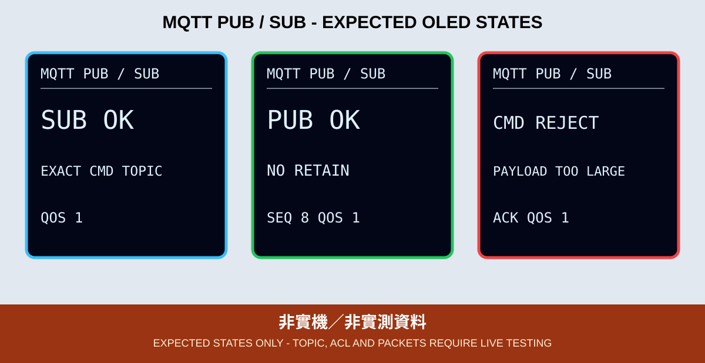

# 09. MQTT Publish／Subscribe

本章加入四個用途分離的精確 Topic：

```text
class702/<group>/<device>/data
class702/<group>/<device>/cmd
class702/<group>/<device>/ack
class702/<group>/<device>/status
```



*圖：預期 OLED 版型，不是實際 Broker 封包。*

裝置每 30 秒向 `data` 發布 heartbeat，控制端可向同一裝置的精確 `cmd` 發布非 retained `PING`，裝置再向 `ack` 回覆 `PONG`。本章不控制 GPIO，用來先驗證 Topic、ACL、方向、QoS 與重連。

## Callback 原則

MQTT callback 只確認精確 Topic、檢查最大 48 bytes 並把內容複製到待處理區。真正的判斷與 ACK 在 `mqttClient.loop()` 返回後執行；不要在 callback 中再呼叫 publish／subscribe，避免等待 ACK 時重入訊息處理。

## 多組隔離

- 每組的 `<group>/<device>`、Client ID 與 ACL 都要不同。
- 裝置只訂閱自己的完整 `cmd`，不使用 `#` 或 `+`。
- `data`／`cmd`／`ack` 不 Retain；只有 `status` 使用 Retain。
- 另一組向其 Topic 發送 `PING` 時，本裝置不得顯示 `CMD OK`。

最小 ACL 是裝置只可 publish 自己的精確 `data`、`ack`、`status`，並只可 subscribe 自己的精確 `cmd`；控制端方向相反。Broker 根憑證只向 Broker 維運者或簽發 CA 官方來源取得並核對指紋，不使用 `setInsecure()`。

## OLED 狀態

OLED 必須依實際階段顯示 `CONFIG ERR`、Wi-Fi／NTP 等待或逾時、`TLS CONNECT`／`TLS ERR`、`MQTT ERR`、`SUB OK`／`SUB ERR`、`PUB OK`／`PUB ERR`、`CMD OK`／`CMD REJECT` 與 `LINK LOST`。找不到 OLED 時，GPIO 2 重複閃 2 下；SSD1306 初始化失敗時重複閃 3 下。

## 驗收

訂閱端須看到遞增 heartbeat；合法 `PING` 得到 `PONG`，其他或超長內容得到 `REJECT`；斷線後 OLED 顯示 `LINK LOST`／重試，再連線時重新訂閱。實作與 CLI 指令見 [`09_mqtt_pubsub_oled`](../../examples/03_network_cloud_mqtt/09_mqtt_pubsub_oled)。CI 不驗證 Broker、ACL、TLS、QoS、Retain 或 OLED 實機。
