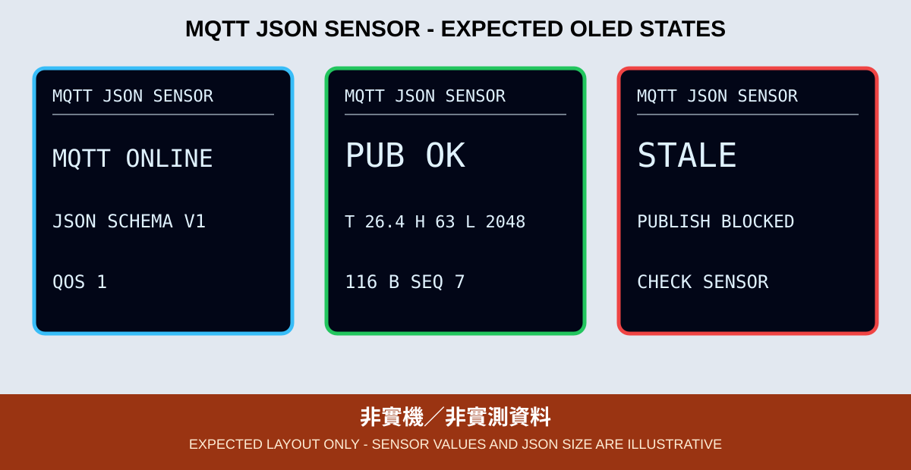

# 10. MQTT JSON Payload

本章把 `temp`、`humi`、`light` 三個能源專案既有欄位，放入有版本、裝置、順序、已同步時間與狀態的 JSON schema。

*圖：預期 OLED 版型，數值與封包長度都不是實測。*

## Schema v1

| 欄位 | 型別 | 意義 |
|---|---|---|
| `v` | integer | schema 版本，固定 1 |
| `device` | string | 每組非敏感裝置別名 |
| `seq` | integer | 本次開機遞增序號 |
| `ts` | integer | NTP 後的 Unix time |
| `temp` | number | DHT11 攝氏溫度 |
| `humi` | number | 相對濕度百分比 |
| `light` | integer | GPIO 33 ADC 原始值 0～4095 |
| `status` | string | 有效資料固定 `ok` |

ArduinoJson 7 建立 typed JSON，最大 384 bytes。感測器 `NaN`、超出防禦範圍或逾 10 秒未更新時顯示 `NO DATA`／`STALE`，不發布舊值。Payload 使用 QoS 1、no retain。

一般 SNTP 沒有提供密碼學身分驗證；本章只把通過合理範圍檢查的同步結果用於 TLS 憑證日期與資料時間，不把它描述為不可偽造的安全時鐘。需要高風險控制或稽核時，應另採受保護時間來源與伺服器端驗證。

## OLED 狀態與驗收

OLED 必須顯示 `CONFIG ERR`、Wi-Fi／NTP 等待或逾時、`TLS CONNECT`／`TLS ERR`、`MQTT ONLINE`／`MQTT ERR`、`PUB OK`／`PUB ERR`、`JSON ERR`／`JSON TOO LARGE`、`NO DATA`／`STALE` 與 `LINK LOST`；找不到 OLED 時則由 GPIO 2 的 2／3 下備援閃爍碼區分掃描與初始化錯誤。完整意義見範例 README。

完成時從受控訂閱端逐欄檢查 JSON 型別、裝置別名、遞增序號、時間與 OLED 當次讀值；先斷電再移除 DHT11，重新上電後 Topic 不可繼續出現假新資料。實作與 CLI 指令見 [`10_mqtt_json_oled`](../../examples/03_network_cloud_mqtt/10_mqtt_json_oled)。CI 不驗證感測器、Broker、TLS、QoS 或實際資料時間。
