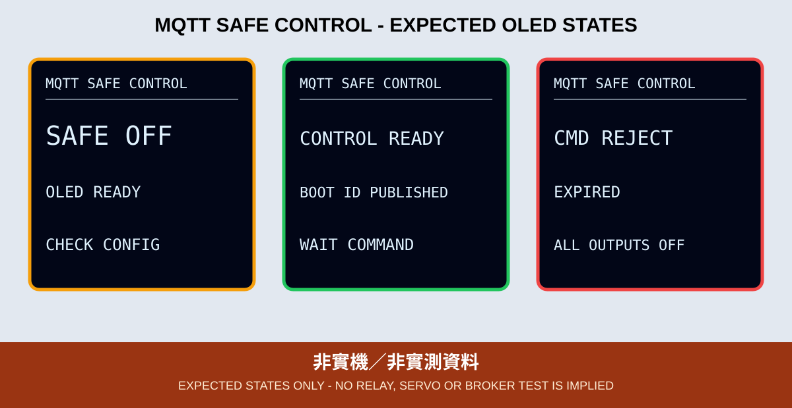

# 11. MQTT 安全遠端控制

本章重新實作能源專案的紅黃綠燈、低電位繼電器與 SG90 控制。舊例曾讓繼電器開機即啟動，也缺少 JSON schema、命令時效與重播保護；新版一律先 `SAFE OFF`。

*圖：預期 OLED 版型，不代表繼電器、馬達或 Broker 已實測。*

## 安全啟動

程式先把 GPIO 18 的輸出 latch 設為 HIGH，再設定 OUTPUT，降低韌體接管時產生 LOW 脈衝的風險。紅黃綠燈全關，SG90 未 attach。設定、Wi-Fi、時間、TLS、MQTT、訂閱或命令任一失敗，都回到同一命令安全狀態。ESP32 上電到韌體接管前可能是高阻抗；真正的 fail-safe 仍需硬體上拉與合適的驅動設計。

繼電器只可接低電壓測試負載或保持無負載；本教材不遠端指導市電操作。SG90 使用適當的獨立 5V 並與 ESP32 共地；停止 PWM 不等於機械機構已回到安全位置，因此不可連接危險機構。GPIO 2、5、15 都是 strapping pins，外部電路不得在開機時強迫錯誤電位。

## 命令與重播防護

命令固定八欄：`v`、`cmd_id`、`cmd_seq`、`boot_id`、`ts`、`ttl`、`target`、`value`。控制端先從 retained `status` 取得本次隨機 boot ID，並讓 `cmd_seq` 從 1 單調增加；舊 boot ID、小於或等於最後成功序號、超出 5～30 秒 TTL、到達時不足 2 秒、未來時間、錯誤欄位或超過 320 bytes 都拒絕並安全關閉。程式用 `gettimeofday()` 的毫秒值計算 `ts + ttl` 剩餘時間，並在套用輸出前建立 deadline；合法啟用租約總上限 30 秒，之後顯示 `LEASE EXPIRED` 並自動關閉。持續控制必須送新的遞增命令。這是韌體租約，實際關閉仍可能受單次 1 秒 MQTT timeout 延遲，不是硬體級安全計時器。

連線後裝置先用零長度 retained publish 清除自己的精確 `cmd` Topic，才開始訂閱。這是因為目前 library callback 沒有暴露 received-retained flag；本次 boot ID、TTL 與單調 `cmd_seq` 形成另外三層防護。控制端不得把命令設為 Retain。因裝置需要清除 retained，最小 ACL 必須額外允許它 publish 自己的精確 `cmd`，但不可放寬成 `class702/#`。

Retained `status` 只包含 `online` 與本次 `boot_id`，不宣稱實體輸出狀態。`ack` 也只表示韌體已接受並套用命令，不是繼電器接點、燈號或伺服位置的實體回授；高風險應用必須另加感測與硬體聯鎖。Broker 根憑證只向維運者或簽發 CA 官方來源取得並核對指紋，禁止 `setInsecure()`。

## OLED 狀態

OLED 必須顯示 `SAFE OFF`／`CONFIG ERR`、Wi-Fi／NTP 等待或逾時、`TLS CONNECT`／`TLS ERR`、`MQTT OFF`／`MQTT ERR`、`RETAIN CLEAR`／`RETAIN ERR`、`CONTROL READY`／`SUB ERR`、`CMD OK`／`CMD REJECT`、`ACK ERR`、`LEASE EXPIRED` 與 `LINK LOST`。找不到 OLED 時，GPIO 2 重複閃 2 下；SSD1306 初始化失敗時重複閃 3 下。GPIO 2 同時是本章黃燈，此閃爍碼只在 OLED 啟動失敗時使用。

## 分階段驗收

1. 先只接可見 LED，驗證合法、錯誤、過期、重複與舊 boot ID。
2. 接紅黃綠燈，確認每次只亮指定顏色。
3. 使用外部 5V 的 SG90，驗證 0～180 度範圍。
4. 最後在繼電器無市電負載下測試；重開機、斷網與 Broker 停止都必須維持 HIGH／OFF。
5. 對每個命令核對 `ack` 的 `ok`、`reason`、`cmd_id`、`cmd_seq`、`boot_id` 與 `ts`。

實作、完整命令格式與 CLI 指令見 [`11_mqtt_control_oled`](../../examples/03_network_cloud_mqtt/11_mqtt_control_oled)。CI 不驗證電源、GPIO、伺服馬達、繼電器、Broker ACL 或時序。
