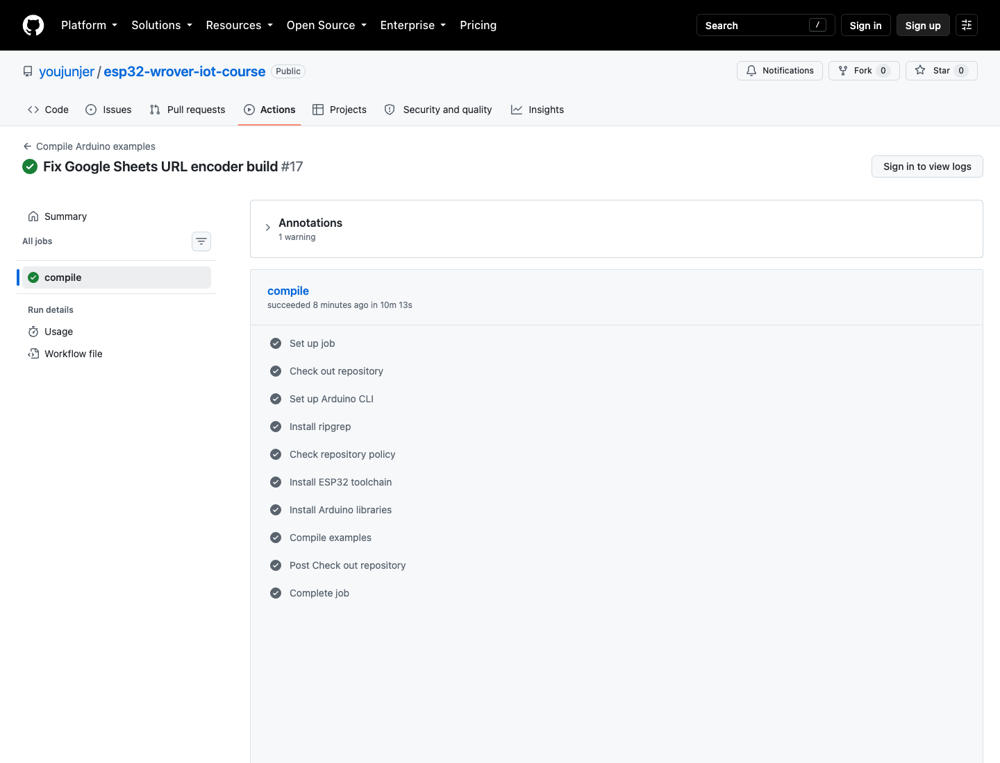
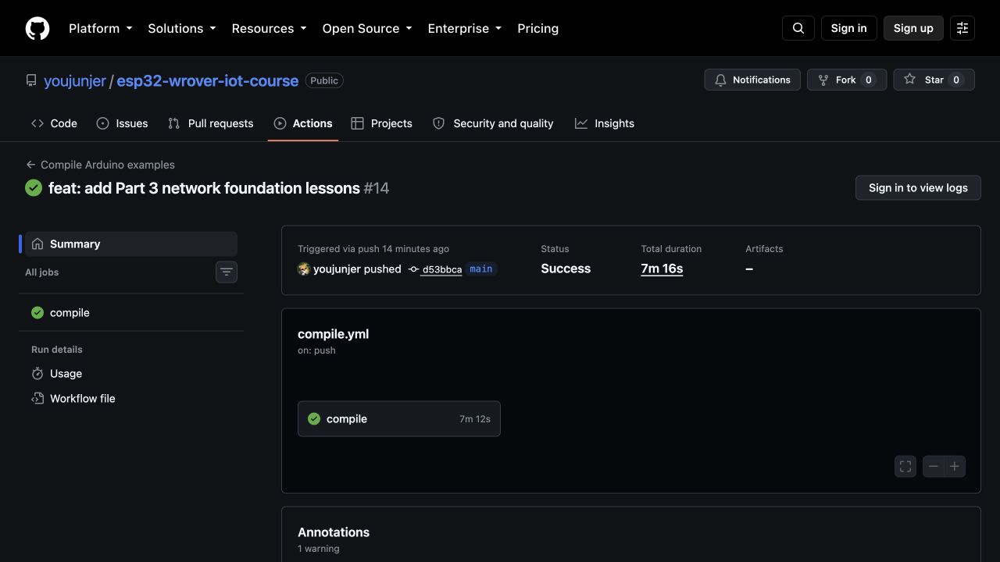

# 第三篇：Wi-Fi、雲端與 MQTT

第三篇把第二篇建立的 OLED 可視化診斷延伸到網路、雲端與 MQTT。學生先學會辨識 Wi-Fi 掃描、連線與重試狀態，再完成 NTP 系統校時；完成校時後才進入憑證驗證的 HTTPS、ArduinoJson 與公開空氣品質資料，之後再依序練習區網 WebServer、ThingSpeak、教師既有 Google Sheets GAS 合約，以及 MQTT TLS、Publish／Subscribe、JSON 與低風險遠端控制。

本篇不以 Serial Monitor 作為主要觀察工具。Wi-Fi、NTP、TLS／網路、HTTP、JSON、WebServer、雲端上傳與 MQTT 的啟動、成功、失敗、重試、資料過期及控制錯誤，都必須先顯示在 OLED；序列輸出只能是同步副本。若 Core 只回報合併的底層錯誤，畫面應如實標為 `TLS/NET ERR`，不猜測是 DNS 或其他單一原因。

## 章節規劃

1. [Wi-Fi 掃描、連線與重試](01_wifi_scan_connect.md)
2. [NTP 網路校時與資料新鮮度](02_ntp_clock.md)
3. [經過憑證驗證的 HTTPS GET](03_https_get.md)
4. [ArduinoJson 與 Open-Meteo 空氣品質資料](04_air_quality_json.md)
5. [ESP32 WebServer 與區域網路控制](05_webserver.md)
6. [ThingSpeak 資料上傳與圖表](06_thingspeak.md)
7. [Google Sheets 與教師既有 GAS](07_google_sheets.md)
8. [MQTT 基礎與 TLS 連線](08_mqtt_basics.md)
9. [MQTT Publish／Subscribe](09_mqtt_pubsub.md)
10. [MQTT JSON Payload](10_mqtt_json.md)
11. [MQTT 安全遠端控制](11_mqtt_control.md)

章序不可任意對調。HTTPS 憑證具有有效期間，因此先完成 NTP 校時，再讓系統時間參與 TLS 憑證日期檢查；一般 SNTP 校時只是本教材的系統時間前置條件，不是密碼學時間證明。JSON 章則建立在已能分辨 DNS、TLS 與 HTTP 錯誤的基礎上。雲端章先用單向上傳辨識服務回應與資料是否真正寫入，再進入長連線 MQTT；MQTT 也先練習上線狀態與 PING／PONG，然後才發布感測 JSON 與控制低風險輸出。

## 統一硬體與工具基準

- 開發板：ESP32 Wrover Module
- FQBN：`esp32:esp32:esp32wrover`
- OLED：SSD1306 128×64，SDA GPIO 21、SCL GPIO 22
- OLED 安裝方向基準：`setRotation(2)`；不同模組依實物調整
- 網路：ESP32 可使用的 2.4 GHz Wi-Fi；實際 AP 相容性必須由學生現場確認
- 編譯與燒錄：Arduino CLI 為正式流程，Arduino IDE 為輔助工具
- 函式庫與 Core：以 Repository 鎖定檔與 GitHub Actions 當次紀錄為準

## 憑證與隱私規則

- Wi-Fi SSID、密碼及任何私人端點放在 `secrets.h`；Repository 只提交 `secrets.example.h`。
- OLED、Serial、截圖、Issue 與課堂回報都不得顯示密碼、Token、API Key、完整私人 URL、MAC 位址或可識別裝置的 Client ID。
- Wi-Fi 掃描結果可能暴露附近住戶或機構名稱。OLED 只顯示 AP 數量、目標是否出現及 RSSI，不顯示 SSID 或完整 IP；學生回報照片前也要遮蔽可識別網路資訊。
- 第 3 章禁止使用 `setInsecure()` 當作完成方式；必須驗證伺服器憑證鏈，並把前置時間、TLS／網路與 HTTP 錯誤分層顯示。
- Open-Meteo 範例不需要把 API Key 寫進程式；座標仍可能透露位置，公開教材只用教學座標或模糊區域，不提交私人住址。
- WebServer 範例只定位為受信任區域網路內的教學服務，不宣稱可安全直接暴露到公網。
- ThingSpeak Write API Key 只放在本機 `secrets.h`；圖表有新資料且回應 Entry ID 大於 0，才能認定當次寫入成功。
- Google Sheets 章只相容教師原始範例已開放的 GAS query 合約，不新增 `Code.gs`、不重新部署 GAS；完整 GAS URL、Sheet ID 與工作表名稱都不公開。
- MQTT 只使用可驗證憑證鏈的 TLS Broker。每組必須有獨立 Topic root、Client ID 與 ACL；控制 Topic 不得使用萬用字元或 Retain。
- Broker Root CA 要從 Broker 維運方或 CA 官方來源取得並定期重新核對；不可從不明網站複製，也不得改用 `setInsecure()`。
- 遠端控制先驗證 LED、獨立 5V 供電且與 ESP32 共地的 SG90，最後才測試未接市電負載的低電位觸發繼電器。

## OLED 統一狀態

| 層級 | 啟動／等待 | 成功 | 失敗或資料過期 |
|---|---|---|---|
| Wi-Fi | `WIFI OLED`、`SCAN`、`CONNECT` | `ONLINE`、`IP ASSIGNED`、RSSI | `NO AP`、`CONN ERR`、`LINK LOST`、`RETRY` |
| NTP | `NTP CLOCK UTC+8`、`NTP SYNC` | `TIME OK`、日期時間、`SYNC Ns NET ON` | `NTP T/O`、`NTP STALE`、`NET LOST`、`RETRY` |
| HTTPS | `TLS VERIFY`、`GET`、`HTTP 200`、`BODY n/2048 B` | `TLS VERIFIED`、HTTP 狀態碼、TLS 錯誤碼、body bytes | `TIMEOUT`、`TLS/NET ERR`、`HTTP ERR`、`BODY EMPTY`、`BODY SHORT`、`BODY TOO LARGE` |
| JSON／AQI | `AIR QUALITY`、`HTTPS GET`、`JSON READ`、`JSON PARSE` | `OPEN-METEO/CAMS`、`EAQI`、`PM2.5`、`PM10`、`SRC`、`AGE` | `JSON ERR`、`FIELD/RANGE ERR`、`UNIT ERR`、`SOURCE FUTURE`、`SOURCE STALE` |
| WebServer | `WEB GPIO13`、`WIFI CONNECT`、`TIME LEFT` | `WEB READY`、`.local` 主機名、`CMD OK` | `WIFI TIMEOUT`、`NET LOST`、`RETRY`、`SAFE OFF` |
| ThingSpeak | `WIFI WAIT`、`TIME WAIT`、`SEND`、`TLS VERIFY` | `HTTP 200`、`ENTRY n`、`READY` | `NO DATA`、`TLS/NET ERR`、`UPLOAD ERR`、`RATE LIMIT` |
| Google Sheets | `WIFI WAIT`、`TIME WAIT`、`SHEET SEND` | `REDIRECT`、`HTTP OK`、`HTTP 200` | `NO DATA`、`SEND ERR`、`RESULT UNKNOWN` |
| MQTT | `TIME WAIT`、`TLS CONNECT`、`MQTT CONNECT` | `MQTT ONLINE`、`SUB OK`、`PUB OK`、`CMD OK` | `TLS ERR`、`MQTT ERR`、`SUB ERR`、`PUB ERR`、`LINK LOST` |
| MQTT 控制 | `SAFE OFF`、`RETAIN CLEAR`、`CONTROL READY` | `CMD OK` | `CMD REJECT`、`LEASE EXPIRED`、`ACK ERR` |

錯誤畫面必須保留到狀態改變或使用者確認，不能一閃而過。重試畫面要顯示次數或倒數；有最後成功資料時仍要顯示 `AGE`，超過章節定義時限後改標 `STALE`，不能只留下舊數字。

## 預期畫面與證據邊界

- [Wi-Fi OLED 預期畫面](../assets/part3/guides/wifi-expected.svg)
- [NTP OLED 預期畫面](../assets/part3/guides/ntp-expected.svg)
- [verified HTTPS OLED 預期畫面](../assets/part3/guides/https-expected.svg)
- [Open-Meteo AQI OLED 預期畫面](../assets/part3/guides/air-quality-expected.svg)
- [WebServer OLED 預期畫面](../assets/part3/guides/webserver-expected.svg)
- [ThingSpeak OLED 預期畫面](../assets/part3/guides/thingspeak-expected.svg)
- [Google Sheets OLED 預期畫面](../assets/part3/guides/google-sheets-expected.svg)
- [MQTT 基礎 OLED 預期畫面](../assets/part3/guides/mqtt-basics-expected.svg)
- [MQTT Publish／Subscribe OLED 預期畫面](../assets/part3/guides/mqtt-pubsub-expected.svg)
- [MQTT JSON OLED 預期畫面](../assets/part3/guides/mqtt-json-expected.svg)
- [MQTT 控制 OLED 預期畫面](../assets/part3/guides/mqtt-control-expected.svg)

這十一張圖都是 Repository 原生 SVG，直接標示「非實機／非實測資料」。它們只能說明狀態名稱、欄位與版面，不能證明 Wi-Fi、NTP、TLS、公開 API、ThingSpeak、Google Sheets、MQTT、WebServer 或任何輸出硬體已在實體板上成功。

## GitHub Actions 編譯證據

上圖是公開 Repository 的真實 [GitHub Actions Run 34484466016](https://github.com/youjunjer/esp32-wrover-iot-course/actions/runs/34484466016) 畫面，對應 Commit `01435e8fd49b3a63b5c68ce1b02d723aefc87c48`。該次工作流程使用 Arduino CLI 1.5.1、ESP32 Core 3.3.11、FQBN `esp32:esp32:esp32wrover` 與 `config/libraries.lock` 的函式庫版本，編譯通過清單內全部 31 個 Sketch，其中包含本篇全部 11 個 Sketch。

這張圖只證明上述 Commit 能在 CI 以鎖定工具鏈完成編譯。它不代表程式已燒錄，也不證明 OLED、Wi-Fi、NTP、TLS、Open-Meteo、WebServer、ThingSpeak、教師既有 GAS、MQTT Broker／ACL／QoS／Retain 或任何輸出硬體已在實體板上通過。截圖來源、時間與 SHA-256 見 [第三篇真實操作截圖來源](../assets/part3/captures/SOURCES.md)。

下圖為第三篇前五章剛完成時保留的歷史編譯證據：

上圖是公開 Repository 的真實 [GitHub Actions Run 34241431791](https://github.com/youjunjer/esp32-wrover-iot-course/actions/runs/34241431791) 畫面，對應 Commit `d53bbcaa0168b98e3c8a2e5df2ab688abfdb6135`。該次工作流程使用 Arduino CLI 1.5.1、ESP32 Core 3.3.11、FQBN `esp32:esp32:esp32wrover` 與 `config/libraries.lock` 的函式庫版本，編譯通過清單內全部 25 個 Sketch；其中包含第三篇前五章的 5 個 Sketch。

這張圖只證明上述 Commit 能在 CI 以鎖定工具鏈完成編譯。它不代表程式已燒錄，也不證明 OLED、Wi-Fi、NTP、TLS、Open-Meteo、瀏覽器操作或 GPIO 13 已在實體板上通過。截圖來源、時間與 SHA-256 見 [第三篇真實操作截圖來源](../assets/part3/captures/SOURCES.md)。

舊 Run 只能證明 Commit `d53bbca` 的 25 個 Sketch；新 Run 才是第 6～11 章加入後 31 個 Sketch 的編譯證據。兩者都是 CI compile only，不可當成外部服務或硬體驗收。

## 本篇完成條件

- 十一章課文、十一個自足式 Sketch、各章 README、接線表／資料流說明與 OLED 預期畫面齊全。
- `secrets.h` 不進版控；`secrets.example.h` 只包含明確的佔位值。
- 每個等待操作都有上限、可見進度及重試間隔，不使用永久阻塞連線迴圈。
- HTTPS 驗證憑證，不以 `setInsecure()` 或明文 HTTP 取代。
- JSON 解析檢查反序列化錯誤、缺少物件或欄位、錯誤型別、非數字值、單位與資料時間。
- WebServer 使用明確 route、404 回應及安全的輸出啟動狀態。
- ThingSpeak 檢查正整數 Entry ID 並遵守更新間隔；Google Sheets 只沿用教師既有 GAS query 合約，HTTP 200 後仍人工核對新列。
- MQTT 每組使用獨立 Topic、Client ID 與 ACL，以 TLS、QoS、Retain／Last Will、JSON schema、訊息時效與安全輸出逐章驗證。
- 所有 Sketch 使用鎖定工具鏈通過 GitHub Actions；真實 Run 截圖需記錄 Commit、版本與 `CI compile only` 邊界。
- 實體板另行驗證 Wi-Fi 相容性、OLED 畫面、NTP 時間、TLS 憑證、API 內容、WebServer、ThingSpeak、既有 GAS、MQTT Broker／ACL、QoS／Retain、伺服馬達與繼電器安全狀態；CI 不代替硬體或外部服務驗收。

教材依據與淘汰項目見 [第三篇來源與遷移記錄](source-map.md)，共通畫面規範見 [OLED 執行狀態與除錯訊息規範](../oled-status-standard.md)。
