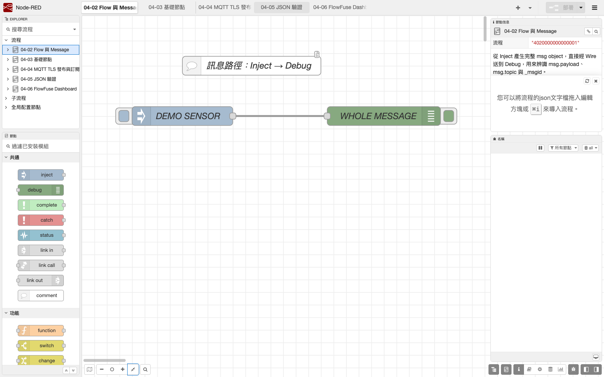

# 1. Node-RED 5 環境與專用 userDir

第四篇把 Node-RED 當作一個可重現、可備份的開發環境，不把個人電腦原有的 `~/.node-red` 直接搬進課程。本篇以 CLI 安裝鎖定版本，並為教材建立專用 `userDir`。

## 本章目標

- 確認 Node.js 24 與 npm 可用。
- 在專用目錄安裝 Node-RED `5.0.7` 與 FlowFuse Dashboard `1.31.0`。
- 以 `--userDir` 指定課程資料目錄，不讀取或修改舊 `~/.node-red`。
- 先將編輯器限制在本機 `127.0.0.1:1880`，確認完成後再進入 Flow 練習。

## 版本基準

| 項目 | 本教材鎖定版本 | 用途 |
|---|---:|---|
| Node.js | 24.x | Node-RED 執行環境 |
| Node-RED | 5.0.7 | Flow 編輯器與 Runtime |
| `@flowfuse/node-red-dashboard` | 1.31.0 | 第 6 章 Dashboard 2 基準 |

這些是 Repository 的教學鎖定值，不等於「自動追隨當日最新版」。升級前必須重新驗證 Flow、額外 Node 與畫面。

## 1. 先確認 Node.js

從 Node.js 官方取得適用於作業系統的 24.x 版本後，關閉原本的終端再重新開啟，然後執行：

```bash
node --version
npm --version
```

`node --version` 必須顯示 `v24.` 開頭的實際版本。不要只因為安裝程式完成，就假定新終端已經使用正確的 `node`。

## 2. 安裝 Repository 鎖定套件，並建立全新 userDir

Repository 的 `nodered/package-lock.json` 是本課安裝基準；學生在 Repository 的 `nodered` 目錄執行 `npm ci`，不自行重新解析「當天最新」相依套件。

`userDir` 會放置 Flow、憑證檔、`settings.js`、context 與其他 Runtime 資料。它與套件目錄分開，不應推送到 GitHub。下列 `course_repo_dir` / `$CourseRepoDir` 必須改成你實際下載的 Repository 中 `nodered` 目錄絕對路徑。

### macOS／Linux

```bash
course_repo_dir="/absolute/path/to/esp32-wrover-iot-course/nodered"
course_user_dir="${HOME}/ESP32_NodeRED_Runtime"
mkdir -p "$course_user_dir"
cd "$course_repo_dir"
npm ci
```

### Windows 11 PowerShell

```powershell
$CourseRepoDir = "C:\absolute\path\to\esp32-wrover-iot-course\nodered"
$CourseUserDir = Join-Path $env:USERPROFILE "ESP32_NodeRED_Runtime"
New-Item -ItemType Directory -Force $CourseUserDir
Set-Location $CourseRepoDir
npm ci
```

本教材不要求把 Node-RED 安裝為全域 npm 套件。`npm ci` 只會依 Repository 內已提交的 lockfile 建立局部 `node_modules`；不可提交該目錄。

## 3. 確認套件版本

在 Repository 的 `nodered` 目錄執行：

```bash
npm list --depth=0 node-red @flowfuse/node-red-dashboard
```

預期清單應包含：

```text
node-red@5.0.7
@flowfuse/node-red-dashboard@1.31.0
```

`npm list` 只能證明套件已安裝在當前目錄，還不能證明 Runtime 已成功啟動或 Dashboard 可用。

## 4. 啟動 Node-RED

### macOS／Linux

```bash
course_repo_dir="/absolute/path/to/esp32-wrover-iot-course/nodered"
course_user_dir="${HOME}/ESP32_NodeRED_Runtime"
cd "$course_repo_dir"

./node_modules/.bin/node-red \
  --userDir "$course_user_dir" \
  --port 1880 \
  -D uiHost=127.0.0.1 --no-telemetry \
  "$course_user_dir/flows.json"
```

### Windows 11 PowerShell

```powershell
$CourseRepoDir = "C:\absolute\path\to\esp32-wrover-iot-course\nodered"
$CourseUserDir = Join-Path $env:USERPROFILE "ESP32_NodeRED_Runtime"
Set-Location $CourseRepoDir

.\node_modules\.bin\node-red.cmd `
  --userDir $CourseUserDir `
  --port 1880 `
  -D uiHost=127.0.0.1 --no-telemetry `
  (Join-Path $CourseUserDir "flows.json")
```

看到 `Server now running`、`User directory`、`Flows file` 與 `Starting flows` 後，再用瀏覽器開啟：

```text
http://127.0.0.1:1880/
```

`uiHost` 若沒有指定，Node-RED 預設可能監聽所有 IPv4 介面。本篇還沒有建立編輯器認證與 HTTPS，所以只綁定 `127.0.0.1`，不向教室區網或 Internet 開放。按 `Ctrl+C` 可停止 Runtime。

## 不搬入舊 userDir

禁止把舊電腦的下列內容整包複製到新目錄：

- `flows_cred.json` 或其他憑證檔。
- 舊 `settings.js`、`.config.*`、`.sessions.json` 與管理員設定。
- 舊 `node_modules`、全部 `package-lock.json` 或來源不明的自訂 Node。
- 內嵌 MQTT 帳密、Token、私人 IP、TLS private key 或真實客戶資料的 Flow。

若後續要參考舊 Flow，先在不啟動 Flow 的環境審查 JSON 與所需 Node，再手動新建相容版本。不用舊 Dashboard 畫面當作新版操作指引。

## 可見驗收

1. `node --version` 是 `v24.x.x`。
2. `npm list` 顯示 Node-RED `5.0.7` 與 FlowFuse Dashboard `1.31.0`。
3. Runtime log 顯示的 `User directory` 是新建的 `ESP32_NodeRED_Runtime`，不是原有 `.node-red`。
4. Runtime log 沒有 `missing node types`、套件載入失敗或憑證解密錯誤。
5. `http://127.0.0.1:1880/` 顯示 Node-RED 5 編輯器。
6. 關閉當前終端後編輯器無法使用；重新執行同一指令後恢復。

## 失敗診斷

| 現象 | 最小檢查 | 處理原則 |
|---|---|---|
| `node` 或 `npm` 找不到 | 重開終端後再執行版本指令 | 確認 Node.js 24 的安裝路徑，不混用舊 Node.js |
| `npm ci` 失敗 | 保留第一個完整錯誤與 npm 版本 | 先查網路、Proxy、磁碟空間與系統時間；不隨意改成不明 registry |
| 執行檔找不到 | 確認 Repository 的 `nodered/node_modules` 存在 | 重新 `cd` 到 Repository 的 `nodered` 目錄並執行 `npm ci`，不改用版本不明的全域指令 |
| 1880 埠已被使用 | 關閉先前的 Node-RED 終端 | 課程先只保留一個 Runtime；若改埠要同步記錄 |
| 瀏覽器無法開啟 | 確認終端仍顯示 Runtime 正在運作 | 使用 `127.0.0.1`，不先查公網 IP 或設定 Port Forwarding |
| 啟動時出現舊 Flow／舊 Node | 核對 log 的 `User directory` | 停止 Runtime，用本章專用目錄重新啟動 |

## ESP32 與 Node-RED 的可觀測邊界

Node-RED Runtime 的錯誤可以看終端 log；後續 Flow 中的訊息可以看 Debug sidebar。但這些都不能代替 ESP32 本身的 OLED：裝置端仍必須在 OLED 顯示 Wi-Fi、NTP、MQTT、發布、訂閱、資料過期與控制錯誤。

## 已驗證的環境與操作畫面



本機已用鎖定檔完成 `npm ci`，並從全新 userDir 啟動。Node.js、npm、Node-RED、Dashboard 版本、啟動 log 與 `FLOW JSON OK` 的真實 CLI 輸出保存在[環境驗證紀錄](../assets/part4/captures/environment-verification.txt)。該檔僅遮蔽一次性目錄路徑，沒有將文字重畫成終端截圖。

完整驗證方式與範圍見[第四篇驗證紀錄](verification.md)；操作截圖來源、時間與 SHA-256 見[截圖來源](../assets/part4/captures/SOURCES.md)。以上是 Node-RED 本機環境驗證，不含 ESP32 或外部 Broker。
