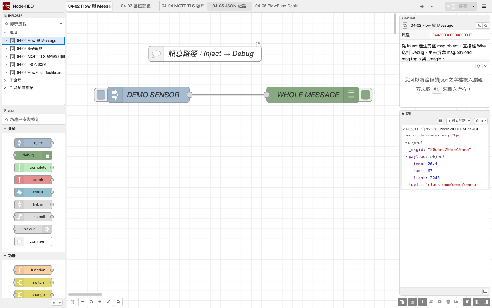

# 2. Flow、Node、Wire 與 Message

Node-RED 的基本單位不是「畫一張圖」，而是讓訊息沿著 Wire 通過一個個 Node。本章只用 Inject 與 Debug 建立最小 Flow，先學會追蹤 `msg`，再進入資料轉換、MQTT 與 Dashboard。

## 本章目標

- 分清 Flow tab、Node、輸入／輸出 port 與 Wire。
- 理解 `msg` 是 JavaScript object，而 `msg.payload` 只是常用欄位。
- 使用 `msg.topic`、`msg.payload` 與 `_msgid` 追蹤訊息。
- 完成 Inject → Debug，並以 Debug sidebar 驗證型別與內容。
- 確認 Deploy 會將 Flow 寫入本章使用的專用 `userDir`。

## 四個名詞

| 名詞 | 在編輯器的樣子 | 實際意義 |
|---|---|---|
| Flow | 工作區上方的 tab | 組織一組相關 Node；一個 tab 內仍可有多條資料流 |
| Node | 有名稱與 port 的方塊 | 接收、處理或送出訊息 |
| Wire | 連接兩個 port 的線 | 指定訊息的傳遞方向 |
| Message | 在 Wire 中傳遞的 object | 可包含 `payload`、`topic`、`_msgid` 與其他欄位 |

常見訊息可以長成：

```json
{
  "_msgid": "由 Node-RED 產生",
  "topic": "classroom/demo/sensor",
  "payload": {
    "temp": 26.4,
    "humi": 63,
    "light": 2048
  }
}
```

`payload` 可以是字串、數字、布林值、array、object 或 `null`。畫面上看起來相同的 `"26.4"` 與 `26.4` 是不同型別，後續判斷前必須先用 Debug 確認。

## 1. 啟動同一個 Runtime

依第 1 章的指令啟動 Node-RED，並確認 log 的 `User directory` 與 `Flows file` 沒有改變。

macOS／Linux：

```bash
course_user_dir="${HOME}/ESP32_NodeRED_Runtime"
course_repo_dir="/absolute/path/to/esp32-wrover-iot-course/nodered"
cd "$course_repo_dir"
./node_modules/.bin/node-red \
  --userDir "$course_user_dir" \
  --port 1880 \
  -D uiHost=127.0.0.1 --no-telemetry \
  "$course_user_dir/flows.json"
```

Windows PowerShell：

```powershell
$CourseUserDir = Join-Path $env:USERPROFILE "ESP32_NodeRED_Runtime"
$CourseRepoDir = "C:\absolute\path\to\esp32-wrover-iot-course\nodered"
Set-Location $CourseRepoDir
.\node_modules\.bin\node-red.cmd `
  --userDir $CourseUserDir `
  --port 1880 `
  -D uiHost=127.0.0.1 --no-telemetry `
  (Join-Path $CourseUserDir "flows.json")
```

## 2. 建立最小 Flow

可先匯入本 Repository 已建立的範例，再對照以下步驟自己重建一次：

[`nodered/flows/02_message_path.json`](../../nodered/flows/02_message_path.json)

1. 開啟 `http://127.0.0.1:1880/`。
2. 將當前 Flow tab 改名為 `04-02 Flow 與 Message`。
3. 從 Palette 拖入一個 Inject 與一個 Debug。
4. 從 Inject 的輸出 port 拉一條 Wire 到 Debug 的輸入 port。
5. 開啟 Inject 設定，將 `msg.payload` 類型選為 JSON object，值填入：

```json
{"temp":26.4,"humi":63,"light":2048}
```

6. 在同一個 Inject 增加 `msg.topic`，型別選 String，值為 `classroom/demo/sensor`。
7. 將 Inject 命名為 `DEMO SENSOR`，Debug 命名為 `WHOLE MESSAGE`。
8. Debug 的輸出選擇 `complete msg object`，不只顯示 `msg.payload`。
9. 按 Deploy；確認 Node 上方表示未部署的藍點消失，且沒有紅色錯誤三角形。
10. 開啟 Debug sidebar，按 Inject 左側的按鈕一次。

## 3. 讀懂 Debug 輸出

Debug sidebar 應顯示：

- `topic` 是 `classroom/demo/sensor`。
- `payload` 的型別是 object，展開後可看到 `temp`、`humi`、`light`。
- `temp` 是 number，不是 string。
- `_msgid` 存在；再按一次 Inject 時會得到另一個訊息 ID。

Debug 中的 object 可展開，也可複製欄位路徑。當後續要在 Change、Switch 或 Function 讀取溫度時，路徑是 `msg.payload.temp`，在 Node 設定中通常填寫為 `payload.temp`。

## 4. 用 CLI 確認 Flow 檔可讀

先在編輯器完成 Deploy，然後新開另一個終端，進入專用 `userDir` 執行：

```bash
node -e "JSON.parse(require('fs').readFileSync('flows.json','utf8')); console.log('FLOW JSON OK')"
```

看到 `FLOW JSON OK` 只表示 `flows.json` 是可解析 JSON，不表示 Flow 的邏輯已正確，也不證明 MQTT、Dashboard 或 ESP32 已經連線。

## 可見驗收

1. Flow tab 命名為 `04-02 Flow 與 Message`。
2. Inject 只透過一條 Wire 連到 Debug。
3. Deploy 後沒有藍點與紅色錯誤標記。
4. 每按一次 Inject，Debug sidebar 剛好新增一筆訊息。
5. Debug 顯示完整 `msg`，`payload` 是 object，三個值的型別是 number。
6. CLI 檢查顯示 `FLOW JSON OK`。
7. 重新啟動同一 `userDir` 後，這條 Flow 仍存在；使用另一個空目錄啟動時不應看到它。

## 失敗診斷

| 現象 | 可能層級 | 最小處理 |
|---|---|---|
| 按 Inject 無訊息 | Flow／Wire | 確認已 Deploy、Debug 已啟用、Wire 方向由 Inject 到 Debug |
| Debug 只看到數值 | Debug 設定 | 改為 `complete msg object` |
| `payload` 是 String | Inject 型別 | 將 Typed Input 選為 JSON object，不是把 JSON 當普通文字貼入 |
| Node 上方有紅色三角 | Node 設定 | 開啟該 Node，完成必填欄位後再 Deploy |
| 訊息出現兩次 | Wire／多個 Debug | 檢查是否有重複 Wire、兩個啟用的 Debug 或 Inject 自動重複 |
| 重啟後 Flow 消失 | userDir | 核對啟動 log 的 `User directory` 與 `Flows file` |
| JSON CLI 檢查找不到檔案 | 當前目錄 | 進入本章專用 `userDir`，不在 Repository 或舊 `.node-red` 目錄檢查 |

## Debug 與 OLED 的分工

Node-RED 端可以使用 Debug sidebar 看 `msg`、欄位型別、路由與 Flow 錯誤。這是主機端的正式診斷方式，但不是 ESP32 端的替代品。ESP32 仍必須在 OLED 顯示本身的 Wi-Fi、MQTT、發布、訂閱、錯誤與重試狀態；「Node-RED 有收到一次訊息」不能證明 ESP32 後續仍正常。

## 實際操作畫面




*圖：本地 Inject 產生 DEMO，Debug 展開完整 message 與 payload。`_msgid` 是本次模擬訊息的隨機 ID；Topic 為公開教學字串，沒有實體裝置或私人設定。CLI JSON 解析結果見[環境驗證紀錄](../assets/part4/captures/environment-verification.txt)；時間、工具與雜湊見[截圖來源](../assets/part4/captures/SOURCES.md)。*
