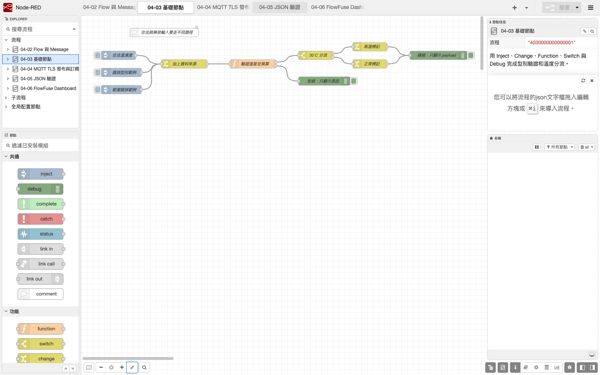
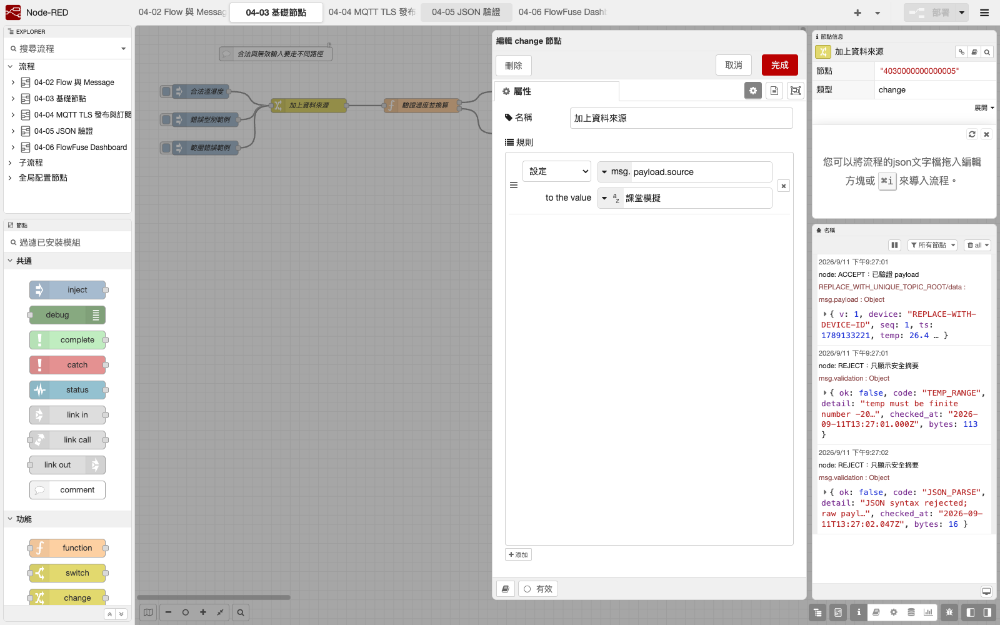
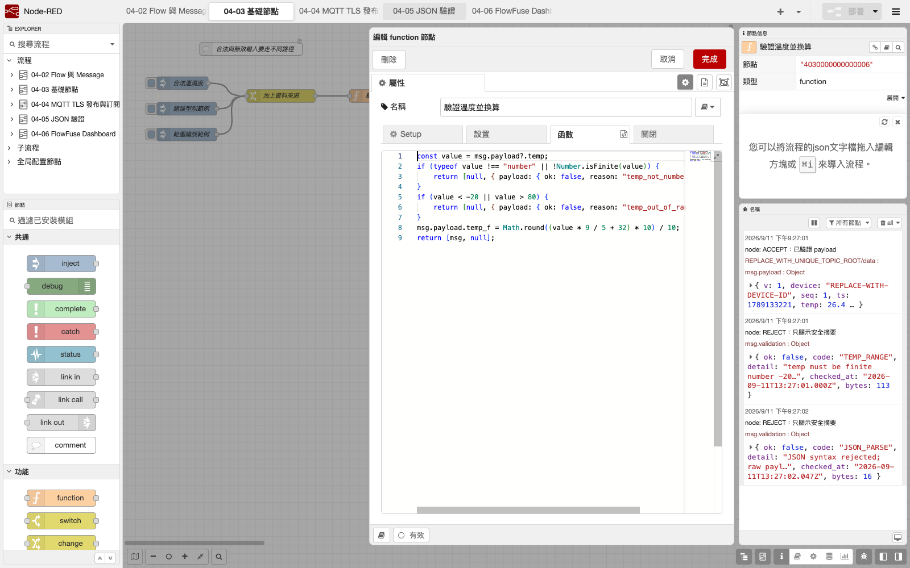
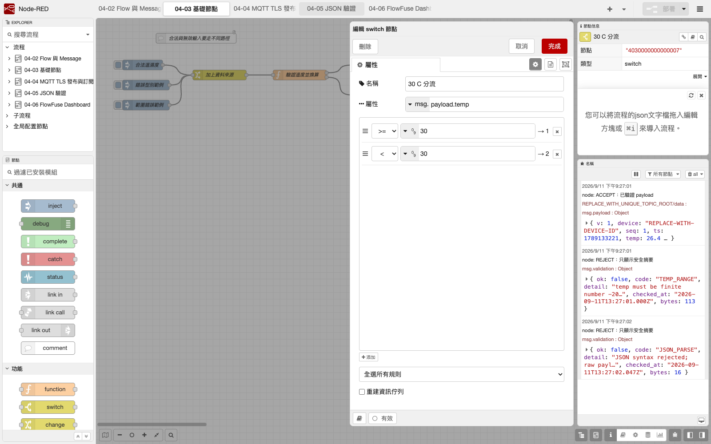
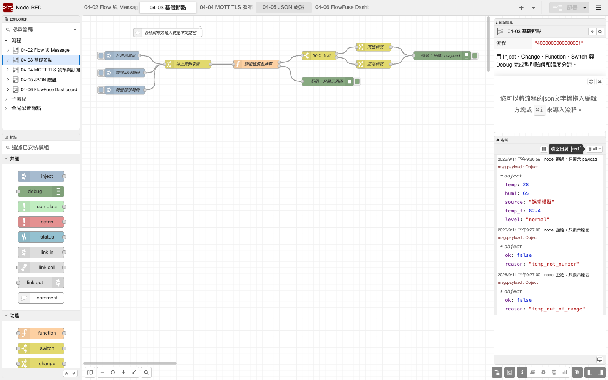
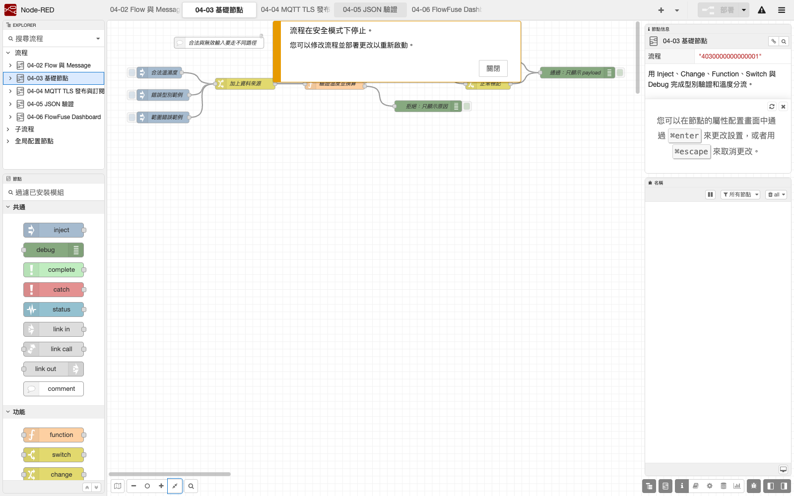

# 3. Inject、Debug、Change、Switch 與 Function

本章用五個 Core Node 完成一條「產生示範資料 → 標記來源 → 驗證與換算 → 30 °C 分流 → 觀察結果」的 Flow。原則是以 Change 處理單純欄位、Function 處理有界驗證與計算、Switch 處理通過後的分類。

## 本章目標

- 用 Inject 建立可重複、不需實體感測器的測試輸入。
- 用 Debug 對照通過資料與固定拒絕原因。
- 用 Change 修改或搬移欄位，不為單純賦值寫 JavaScript。
- 用 Switch 將已驗證數值分成高溫與正常兩個輸出。
- 在 Function 內驗證輸入、保留 `msg` 其他欄位，並回傳合法 message object。

## Core Node 分工

| Node | 本章任務 | 不應做的事 |
|---|---|---|
| Inject | 手動產生 DEMO object | 把真實帳密、Token 或私人 MQTT Topic 放在公開 Flow |
| Debug | 顯示通過 Payload 或固定拒絕原因 | 產品環境永久啟用大量完整 Payload 輸出 |
| Change | 設定 `topic`、搬移或刪除欄位 | 為單純欄位操作增加不必要的 Function |
| Switch | 依已驗證數值分流 | 在驗證前直接信任外部輸入 |
| Function | 計算與需要 JavaScript 的有界轉換 | 信任未驗證輸入、回傳字串而不是 `msg` 物件 |

## 1. 建立三種輸入

可先匯入本 Repository 的範例，再對照本章手動重建：

[`nodered/flows/03_core_nodes.json`](../../nodered/flows/03_core_nodes.json)

新增 Flow tab `04-03 基礎節點`，再建立三個 Inject：

| Inject 名稱 | `msg.payload` 類型 | 值 | 目的 |
|---|---|---|---|
| `合法溫濕度` | JSON object | `{"temp":28,"humi":65}` | 正常路徑 |
| `範圍錯誤範例` | JSON object | `{"temp":-99,"humi":65}` | 範圍錯誤 |
| `錯誤型別範例` | JSON object | `{"temp":"unknown","humi":65}` | 型別錯誤 |

三個輸入都是教材 DEMO，不是 ESP32 或 DHT11 實測；本章尚未使用真實 MQTT Topic。

## 2. Change：標記資料來源

建立名為 `加上資料來源` 的 Change Node：

1. 將 `msg.payload.source` 設為 String `課堂模擬`。
2. 不改寫 `msg.payload.temp` 與 `msg.payload.humi`。

把三個 Inject 都連到這個 Change。欄位路徑必須選擇 `msg` 類型；如果把 `payload.source` 當成普通字串，資料不會被寫入 Payload object。

## 3. Function：驗證溫度並換算

建立兩個輸出的 Function Node `驗證溫度並換算`，填入：

```javascript
const value = msg.payload?.temp;
if (typeof value !== "number" || !Number.isFinite(value)) {
  return [null, {payload: {ok: false, reason: "temp_not_number"}}];
}
if (value < -20 || value > 80) {
  return [null, {payload: {ok: false, reason: "temp_out_of_range"}}];
}
msg.payload.temp_f = Math.round((value * 9 / 5 + 32) * 10) / 10;
return [msg, null];
```

注意：

- 第一輸出只送出驗證成功的原 `msg`；第二輸出只送固定拒絕分類。
- 拒絕訊息不複製原始無效 Payload，避免將未過濾內容留在 Debug 或截圖。
- 字串即使看起來像數字也不靜默轉型。
- Function 的每一個輸出都必須是 message object 或 `null`。

## 4. Switch：30 °C 分流

將 Function 第一輸出接到 `30 C 分流` Switch：輸出 1 為 `payload.temp >= 30`，輸出 2 為 `payload.temp < 30`。兩個輸出分別經 Change 寫入 `payload.level = high` 或 `normal`，最後合流到 `通過：只顯示 payload`。Function 第二輸出直接接到 `拒絕：只顯示原因`。

## Flow 拓撲

```text
合法輸入 --------\
範圍錯誤 ----------> 加上資料來源 -> 驗證溫度並換算 -> 30 C 分流 -> high／normal -> 通過 Debug
錯誤型別 --------/                    |
                                      +-------------------------------> 拒絕 Debug
```

## CLI 與操作檢查

部署後，在專用 `userDir` 開另一個終端：

```bash
course_user_dir="${HOME}/ESP32_NodeRED_Runtime"
course_repo_dir="/absolute/path/to/esp32-wrover-iot-course/nodered"
cd "$course_repo_dir"
npm list --depth=0 node-red @flowfuse/node-red-dashboard
node -e "JSON.parse(require('fs').readFileSync('${course_user_dir}/flows.json','utf8')); console.log('FLOW JSON OK')"
```

若 Runtime 因 Flow 設定而無法正常啟動，可先停止它，再以原指令加上 `--safe` 啟動。

macOS／Linux：

```bash
course_user_dir="${HOME}/ESP32_NodeRED_Runtime"
course_repo_dir="/absolute/path/to/esp32-wrover-iot-course/nodered"
cd "$course_repo_dir"
./node_modules/.bin/node-red \
  --safe \
  --userDir "$course_user_dir" \
  --port 1880 \
  -D uiHost=127.0.0.1 --no-telemetry \
  "$course_user_dir/flows.json"
```

Windows PowerShell：

```powershell
$CourseUserDir = Join-Path $env:USERPROFILE "ESP32_NodeRED_Runtime"
$CourseRepoDir = "C:\absolute\path\to\esp32-wrover-iot-course\nodered"
Set-Location $CourseRepoDir
.\node_modules\.bin\node-red.cmd `
  --safe `
  --userDir $CourseUserDir `
  --port 1880 `
  -D uiHost=127.0.0.1 --no-telemetry `
  (Join-Path $CourseUserDir "flows.json")
```

Safe mode 會開啟編輯器但不自動啟動現有 Flow，方便修正錯誤。一旦按 Deploy，Flow 就會開始執行，因此在尚未審查的舊 Flow 上不要盲目部署。

## 可見驗收

1. `合法溫濕度` 只到通過 Debug。
2. 通過結果的 `temp` 是 `28`、`temp_f` 是 `82.4`、`source` 是 `課堂模擬`、`level` 是 `normal`。
3. `範圍錯誤範例` 只到拒絕 Debug，原因是 `temp_out_of_range`。
4. `錯誤型別範例` 只到拒絕 Debug，原因是 `temp_not_number`。
5. 每按一次 Inject，該訊息只走一條終點路徑，不同時出現在成功與拒絕 Debug。
6. 關閉不需要的 Debug 後，訊息邏輯仍正常。

## 失敗診斷

| 現象 | 原因方向 | 最小檢查 |
|---|---|---|
| 三種輸入全部被拒絕 | Change／Function 路徑錯誤 | 在 Function 前加暫時 Debug，確認 `payload.temp` 保持原型別 |
| 錯誤型別被當成成功 | Function 做了靜默轉型 | 確認先檢查實際 number 型別，不使用 `Number(...)` 自動轉換 |
| 合法資料同時走兩條分類 | Switch 設定 | 確認兩條規則互斥，並在 Debug 對照同一 `_msgid` |
| Function 顯示回傳類型錯誤 | Function 回傳值 | 兩輸出使用 `[msg, null]` 或 `[null, msg]`，不直接回傳數字／字串 |
| 華氏值是文字串 | 輸入或 Function | 檢查 `typeof msg.payload.temp`，不先用字串拼接 |
| Deploy 後舊結果還在 | Debug sidebar | 清除舊 Debug 訊息，再逐一按三個 Inject，不把舊記錄當成新測試 |
| Runtime 無法啟動 | Flow／Node 設定 | 用 `--safe` 啟動，檢查紅色錯誤標記後再 Deploy |

## Debug 與 ESP32 OLED

本章全部使用 Inject DEMO，因此 Debug sidebar 是主要驗收畫面。從第 4 章接入 MQTT 與 ESP32 後，Node-RED Debug 負責觀察「主機端收到什麼」；ESP32 OLED 仍負責顯示「裝置端現在為何無法發布或接收」。任何一端的綠色畫面都不能單獨證明端到端已通過。

## 實際教學截圖













*以上為 Node.js 24.19.0、Node-RED 5.0.7 的真實操作畫面，全部輸入均為本地 DEMO／非 ESP32 實測。Safe mode 未按 Deploy；它只證明編輯器可供修復 Flow。對應來源與 SHA-256 見[截圖來源](../assets/part4/captures/SOURCES.md)。*
