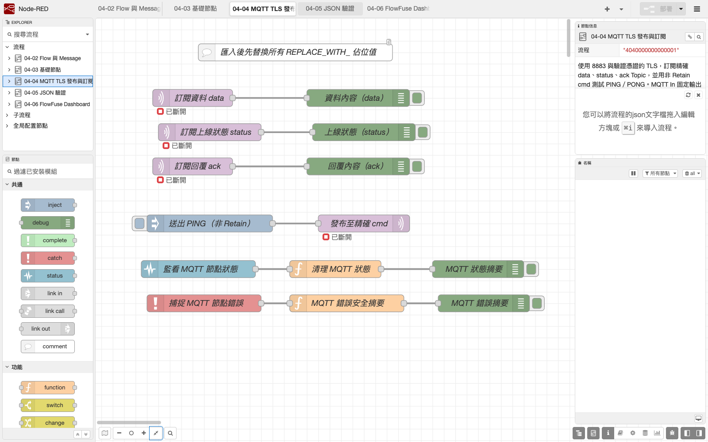
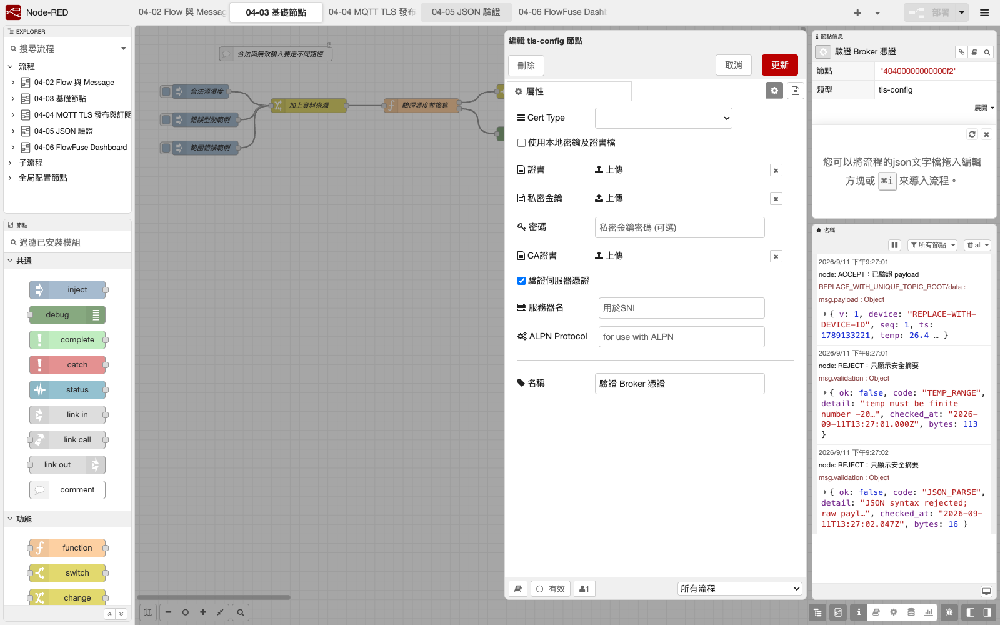

# 04. Node-RED 與 MQTT TLS

本章把第三篇已完成的 ESP32 MQTT 範例接到 Node-RED。Node-RED 可以用節點狀態與 Debug sidebar 觀察主機端訊息，但 ESP32 仍以 OLED 為主要診斷介面；任何端到端判定都要同時查看兩端。

本篇鎖定 Node.js 24.x 與 Node-RED 5.0.7。`mqtt in`、`mqtt out`、`inject`、`status` 與 `debug` 都是 Node-RED Core Node，不需另裝 MQTT 套件。

## 學習目標

- 用共用 MQTT Broker config 建立會驗證伺服器憑證的 TLS 連線。
- 為每組設定獨立的 Node-RED Client ID，並只使用本組精確 Topic。
- 區分 `data`、`cmd`、`ack`、`status` 的方向、QoS 與 Retain 邊界。
- 從 Node-RED 節點狀態、Debug 與 ESP32 OLED 交叉定位問題。
- 說明 Debug、ACK、retained status 與 CI 能證明及不能證明的事情。

## 第三篇裝置合約

本章沿用第三篇的四個精確 Topic。下列文字只表示格式，不是可共用的設定：

| Topic | 方向 | QoS | Retain | 用途 |
|---|---|---:|---|---|
| `class702/<group>/<device>/data` | ESP32 → Node-RED | 1 | 否 | heartbeat 或 JSON 感測資料 |
| `class702/<group>/<device>/cmd` | Node-RED → ESP32 | 1 | **否** | `PING` 或後續控制命令 |
| `class702/<group>/<device>/ack` | ESP32 → Node-RED | 1 | 否 | `PONG` 或命令處理結果 |
| `class702/<group>/<device>/status` | ESP32 → Node-RED | 1 | 是 | online／offline，控制章另含本次 `boot_id` |

多人上課時，每組的 `<group>/<device>`、ESP32 Client ID、Node-RED Client ID 與 Broker ACL 都必須不同。Node-RED Client ID 也不能和 ESP32 Client ID 相同，否則 Broker 可能反覆中斷其中一端。

QoS 1 是「至少一次」，斷線重送時可能看到相同訊息，不能描述成 exactly once。`cmd` 永遠不得 Retain；只有 `status` 使用 Retain，讓新訂閱者取得 Broker 保存的最新連線宣告。

## 匯入 Flow

下載或開啟：

[`nodered/flows/04_mqtt_tls_pubsub.json`](../../nodered/flows/04_mqtt_tls_pubsub.json)

1. 啟動第 1 章建立的課程專用 Runtime，確認為 Node-RED 5.0.7。
2. 在右上角選單選 **Import → Clipboard**，貼入檔案內容並匯入為新 Flow。
3. 先檢查未知節點、紅色三角與所有 `REPLACE_WITH_` 佔位值。
4. 完成本機 Broker、TLS、Topic、Client ID 與 credentials 設定後才 Deploy。

預期拓撲：

```text
MQTT In data   ──> Debug data
MQTT In status ──> Debug status
MQTT In ack    ──> Debug ack
Inject PING    ──> MQTT Out cmd（QoS 1、no retain）
Status Node    ──> 安全化狀態摘要 ──> Debug
Catch Node     ──> 安全化錯誤摘要 ──> Debug
```

公開 Flow 故意不含可用 Broker、完整 Topic、Client ID、username、password 或 CA 內容，而且 Broker 預設 `autoConnect=false`。匯入後若仍看見 `REPLACE_WITH_`，表示尚未完成設定，不可為了消除紅色標記而填入別組資料。

## 本機設定步驟

### 1. Broker 與 TLS

雙擊任一 MQTT Node，再編輯共用的 **課程 TLS Broker（請替換）**：

1. Server 填教師提供的 Broker hostname；不要用 IP 取代憑證上的 hostname。
2. 本教材 Flow 以 MQTT over TLS 埠 8883 作為預設，但 8883 不是全球所有 Broker 的固定值。若教師提供其他 TLS 埠，以該服務正式設定為準。
3. Client ID 改成本組唯一值，使用 1～23 個英數或連字號，且不得與 ESP32 Client ID 相同。
4. 在 Security 頁籤本機輸入 username／password，不寫入 Function、Comment 或公開截圖。
5. TLS 必須啟用，**Verify server certificate** 必須保持勾選。
6. 公開 CA 簽發的 Broker 可使用系統信任鏈；私有 CA 只接受 Broker 維運者提供並完成核對的 CA。

若發生 hostname、有效期、主機時間或 CA 錯誤，應修正真正原因。不能改成明文 1883、停用憑證驗證，或使用來源不明的 PEM。

### 2. 四個精確 Topic

把四個 MQTT Node 內的 `REPLACE_WITH_UNIQUE_TOPIC_ROOT` 全部換成本組 Topic root，並與 ESP32 `MQTT_TOPIC_ROOT` 逐字一致。

- 訂閱：完整 `data`、`status`、`ack`。
- 發布：完整 `cmd`。
- 不使用 `#`、`+` 或 `class702/#` 尋找資料。
- 不把真實 Topic root 留在要提交 GitHub 的 Flow。

最小 ACL 的方向應為：Node-RED 可訂閱本裝置的精確 `data`／`status`／`ack`，並只可發布該裝置的精確 `cmd`。不要為排錯將權限放寬到全班命名空間。

### 3. QoS、Retain 與輸出型別

- 三個 MQTT In 使用 QoS 1。
- `data` 的 Output 應設為 UTF-8 string，交由下一章在大小檢查後解析 JSON。
- `cmd` MQTT Out 使用 QoS 1、Retain `false`。
- TLS、ACL、Client ID 與所有精確 Topic 都核對完成後，才啟用 Broker 自動連線並 Deploy；占位值存在時不得啟用。
- Node-RED 不另行發布 retained `cmd`。
- retained `status` 由 ESP32 的 online／Last Will 合約產生；本章只訂閱。

設定完成後才 Deploy。真實設定只存在學生本機；再次 Export 前仍須恢復佔位值或另做乾淨公開副本。

## 可見驗證

先用第三篇 [`09_mqtt_pubsub_oled`](../../examples/03_network_cloud_mqtt/09_mqtt_pubsub_oled) 做最小雙向測試：

1. Node-RED MQTT Node 下方應由 `connecting` 轉成 `connected`。
   `MQTT 狀態摘要` Debug 應同步顯示去除原始內容後的 `CONNECTED`。
2. ESP32 OLED 應依序出現 `TLS CONNECT`、`SUB OK` 與 `PUB OK`；不能只憑 Node-RED connected 判定完成。
3. `data` Debug 每 30 秒收到 heartbeat。
4. 按 `送出 PING（非 Retain）`，ESP32 OLED 顯示 `CMD OK`，`ack` Debug 收到 `PONG`。
5. 非正常中斷 ESP32 連線後，`status` Debug 收到 retained offline；裝置重連後恢復 online。
6. 另一組發布相似 Topic 時，本 Flow 不得收到資料，ESP32 也不得顯示 `CMD OK`。

進入感測 JSON 時改用第三篇 [`10_mqtt_json_oled`](../../examples/03_network_cloud_mqtt/10_mqtt_json_oled)。`data` Debug 此時顯示的是尚未驗證的原始字串，不能直接接 Dashboard 或控制。

## 失敗診斷

| Node-RED／OLED 現象 | 優先檢查 | 禁止作法 |
|---|---|---|
| MQTT Node 反覆 `connecting` | Broker hostname、TLS port、DNS、防火牆、主機時間 | 改成 1883 或關閉憑證驗證 |
| 連上後反覆被踢除 | 是否有另一台使用相同 Client ID | 全班共用一個 Client ID |
| `not authorized`／OLED `MQTT ERR` | 本機 credentials、精確 Topic ACL、帳號是否屬於本組 | 放寬為 `class702/#` |
| connected 但沒有 `data` | Topic 是否逐字一致、OLED 是否 `PUB OK` | 暫用 `#` 猜 Topic |
| PING 沒有 PONG | `cmd`／`ack` 方向、QoS、Retain、ACL、OLED 的 `CMD REJECT`／`SUB ERR` | 重複快速發送或把命令 Retain |
| 一訂閱就看到 status | 這是 retained 訊息；判讀 online／offline 與本次 `boot_id` | 把 retained online 當實體設備正常 |
| 相同 `seq` 偶爾重複 | QoS 1 允許重送，後段必須能辨識重複 | 宣稱 QoS 1 是 exactly once |

排錯時一次只處理一層：先看 OLED 的 Wi-Fi／NTP／TLS，再看兩端 MQTT 狀態，最後才查 Topic、Payload 與應用邏輯。不要同時換 Broker、改 Topic、放寬 ACL 和停用 TLS。

## Debug 與 OLED 的分工

- Node-RED 節點狀態：顯示主機端 Broker 連線狀態。
- Node-RED Debug：觀察主機端收到的 `data`、`status`、`ack`，以及不含原始錯誤內容的 MQTT 狀態／錯誤摘要。
- ESP32 OLED：顯示裝置端 Wi-Fi、NTP、TLS、MQTT、Publish、Subscribe 與重連原因。

其中任一端顯示成功都不能單獨代表端到端完成。若 Node-RED 沒資料，學生要回傳去識別化的 Node 狀態／Debug 畫面及 ESP32 OLED 照片，不只回覆「連不上」。

## 證據邊界

- MQTT Node connected：只證明 Node-RED 當下建立 Broker 連線，不證明 ESP32 已連線。
- Debug 收到 `data`：證明該訊息到達 Flow，不證明感測值正確、新鮮或唯一。
- 收到 `PONG`／ACK：只證明 ESP32 韌體處理訊息，不是 GPIO、繼電器接點或 SG90 位置的實體回授。
- retained status：是 Broker 保存的最新連線宣告，不是設備健康檢查或安全聯鎖。
- 匯入成功或 CI 通過：不能證明 DNS、TLS 憑證鏈、Broker ACL、QoS、Retain、Last Will、OLED 或實際網路已驗證。

## 實際截圖與待補實機證據



*圖：本機 Node.js 24.19.0、Node-RED 5.0.7 與 FlowFuse Dashboard 1.31.0 實際載入公開占位 Flow。Broker 保持停用、畫面顯示斷開；這證明節點與連線可載入，不證明 Broker、TLS、ACL、ESP32 或 OLED。來源與 SHA-256 見 [第四篇截圖來源](../assets/part4/captures/SOURCES.md)。*



*圖：目前公開 Flow 的 TLS 設定視窗；Verify server certificate 已勾選，沒有填入私人 CA 或憑證。它只證明設定，尚未連線至 Broker。*

以下屬於後續 ESP32／Broker 實機驗收，須另外擷取同次操作畫面：

- 四條 MQTT 路徑及 connected Node 狀態。
- `PING` → OLED `CMD OK` → Debug `PONG` 的同次操作證據。
- 非正常斷線後 retained offline 與重新上線。
- 去識別化的錯誤畫面：TLS、ACL／credentials、重複 Client ID 各一例。

截圖不得出現完整 Broker、Topic、Client ID、username、password、CA 檔名、內網 IP 或其他學生資料。密碼即使只顯示圓點也不要納入公開畫面。

## 官方依據

- [Node-RED 5.0.7 MQTT Core Node](https://github.com/node-red/node-red/blob/5.0.7/packages/node_modules/@node-red/nodes/core/network/10-mqtt.html)
- [Node-RED 5.0.7 TLS config Node](https://github.com/node-red/node-red/blob/5.0.7/packages/node_modules/@node-red/nodes/core/network/05-tls.html)
- [Node-RED：Import／Export Flow](https://nodered.org/docs/user-guide/editor/workspace/import-export)
- [Node-RED：Node credentials 不包含在一般 Flow export](https://nodered.org/docs/creating-nodes/credentials)
