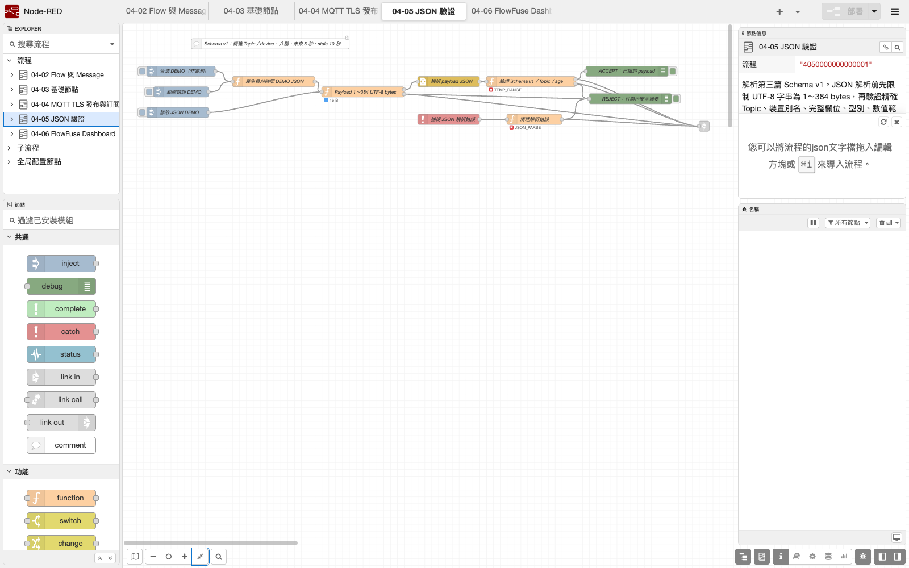
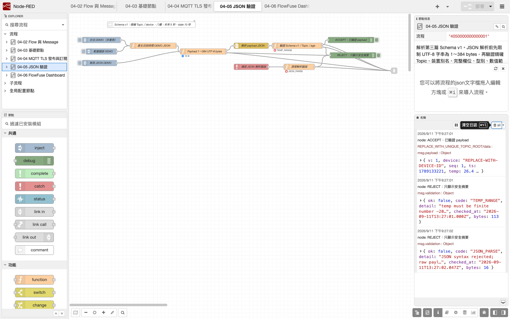

# 05. JSON 解析、欄位驗證與異常分流

上一章的 MQTT In 只能證明 Node-RED 收到一段 Payload，不能證明它是合法、新鮮或可信的感測資料。本章先限制原始 Payload 大小，再解析 JSON，最後檢查精確 Topic、欄位、型別、合理範圍與時間。只有通過全部檢查的訊息才可送往 Dashboard、儲存或後續控制。

Node-RED Debug 可以顯示主機端的接受／拒絕結果；ESP32 的感測器、JSON、時間與發布錯誤仍須顯示在 OLED，不能因 Node-RED 有 Debug 就移除裝置端可見診斷。

## 學習目標

- 在 JSON 解析前用 UTF-8 bytes 檢查 384 bytes 上限。
- 分清「JSON 語法正確」與「資料 schema 正確」。
- 驗證精確 Topic、八個必要欄位、型別及感測器合理範圍。
- 用 `ts` 計算 `age`，拒絕未校時、未來或超過 10 秒的 stale 資料。
- 將接受與拒絕訊息分流，讓原因在 Node status 與 Debug 可見。
- 避免在錯誤分支、log、截圖或 Flow export 回顯原始不可信 Payload。

## Schema v1

本章與第三篇 [`10_mqtt_json_oled`](../../examples/03_network_cloud_mqtt/10_mqtt_json_oled) 使用相同合約：

```json
{
  "v": 1,
  "device": "esp-gXX-devXX",
  "seq": 7,
  "ts": 1789000000,
  "temp": 26.4,
  "humi": 63.0,
  "light": 2048,
  "status": "ok"
}
```

這些值只是格式範例，不是實測資料或可共用設定。實際 `device`、精確 Topic 與 Client ID 不得放入公開教材、Issue、聊天紀錄或未遮蔽截圖。

| 項目 | 驗證規則 | 錯誤分類 |
|---|---|---|
| 原始 Payload | UTF-8 string，1～384 bytes | payload type／size |
| `msg.topic` | 逐字等於本組 `data` Topic | topic mismatch |
| JSON 根節點 | object，不接受 array、`null` 或純量 | payload type |
| 欄位集合 | 恰好為 `v, device, seq, ts, temp, humi, light, status` | fields |
| `v` | safe integer，固定 1 | version |
| `device` | 1～23 個英數或連字號，且等於本機預期別名 | device |
| `seq` | safe integer，1～4294967295 | sequence |
| `ts` | Unix time **秒**，safe integer，且大於 `1700000000` | time invalid |
| `temp` | finite number，-20～80 °C | range |
| `humi` | finite number，0～100 %RH | range |
| `light` | integer，0～4095 | range |
| `status` | string，固定 `ok` | status |
| 資料年齡 | 最多允許未來 5 秒；`age > 10` 秒為 stale | future／stale |

`Date.now()` 是毫秒，Payload 的 `ts` 是秒，計算前要除以 1000。Node-RED 主機時間若未同步，新資料也會被錯判為 future 或 stale；這時應修主機時鐘，不是把容許值改成無限大。

## 匯入 Flow

下載或開啟：

[`nodered/flows/05_json_validation.json`](../../nodered/flows/05_json_validation.json)

1. 使用第 1 章相同的課程專用 Runtime，在右上角選 **Import → Clipboard**。
2. 貼入 Flow JSON，匯入後先確認沒有未知節點或紅色三角。
3. 保留 Flow 內的 DEMO 輸入，先在沒有 ESP32／Broker 的情況驗證正常、範圍錯誤與 JSON 語法錯誤。
4. 在本機設定預期的精確 `data` Topic 與 ESP32 `device` 別名；公開副本仍保留 `REPLACE_WITH_`。
5. DEMO 全部通過後，再將第 4 章的 `data` 接入本 Flow 的 Payload 大小檢查節點。

預期拓撲：

```text
VALID DEMO -----\
RANGE ERROR ------> UTF-8 bytes 1..384 -> JSON Parse -> Schema/age validate -> ACCEPT
INVALID JSON ----/             |              |                |
LIVE MQTT data ----------------+              +-> parse error  +-> REJECT
```

若第 4、5 章分別位於不同 Flow tab，使用一組命名清楚的 Link Out／Link In 傳遞 `data`，不要再建立第二個具有相同 Client ID 的 MQTT Broker config。保留第 4 章原本的 data Debug 作為解析前觀察點，但正式後段只能使用本章驗證結果。

本章 Flow 的「驗證結果送往 Dashboard」 Link Out 同時送出成功與安全化拒絕摘要：

- 成功：`msg.payload` 仍然只有 schema v1 的精確八欄；計算結果放在 `msg.validation = {ok, code, bytes, age_s}`。
- 失敗：只有 `msg.validation` 的安全摘要，不帶原始 Payload。
- 本地 Inject 會在 message envelope 保留 `msg.demo = true`，讓第 6 章不會把模擬資料誤標成 `LIVE`。

## 驗證順序

```text
精確 data Topic
        ↓
UTF-8 string 且 1～384 bytes
        ↓
JSON 語法解析成功
        ↓
八欄完整且沒有未知欄位
        ↓
型別、版本、device、感測範圍
        ↓
ts 合理、未超前、age ≤ 10 秒
        ↓
ACCEPT                         任一步失敗 → REJECT
```

### 1. 先限制 Payload bytes

大小檢查必須位於 JSON Node 前。若先解析無界輸入，錯誤裝置仍可讓 Runtime 對過大的字串做解析工作。

UTF-8 的中文字可能使用多個 bytes，所以應以 `Buffer.byteLength(msg.payload, "utf8")` 計算，不能用 JavaScript 字串 `.length` 代替。上一章 MQTT In 的輸出必須設成 UTF-8 string；不應在驗證器中默默接受任意 object。

### 2. JSON Node 只檢查語法

例如 `{"temp":200}` 是合法 JSON，卻不符合本課程 schema。JSON Node 成功後仍要進入 Function 檢查欄位、型別與範圍。

解析錯誤由限定 scope 的 Catch Node 接收，再轉成固定錯誤摘要。摘要不附原始 Payload，也不直接複製可能包含輸入片段的 exception message。

### 3. 必須比對完整欄位集合

不是只檢查「有沒有 `temp`」。本章要求剛好八欄，缺欄、拼錯或多出未知欄位都拒絕，避免後續誤把另一版 schema 當成 v1。

數值欄位不能靜默轉型。字串 `"26.4"` 和 number `26.4` 不相同；`temp`／`humi` 必須是 finite number，`light`、`seq`、`ts` 必須是 integer。

### 4. 比對來源與新鮮度

固定 MQTT In 已限制 Topic，驗證 Function 仍要比對 `msg.topic` 與本機預期精確值，避免後續改線時繞過命名空間。

`device` 必須等於本機設定的非敏感裝置別名，不能只檢查「它看起來像字串」。`age = Node-RED 現在時間 - ts`；資料超前 5 秒以上或 age 超過 10 秒都拒絕。時間比較依賴兩端已同步的系統時鐘，但一般 NTP 不應被描述成不可偽造的安全時鐘。

## 可見驗證

### DEMO Flow

1. 按合法 DEMO：驗證節點顯示綠色 `OK`／age，`ACCEPT` Debug 的 Payload 仍然恰好八欄，計算後的 age 放在 `msg.validation.age_s`。
2. 按範圍錯誤 DEMO：驗證節點顯示紅色 range 錯誤，只到 `REJECT`。
3. 按無效 JSON DEMO：Catch 路徑顯示 parse 錯誤，Debug 不得回顯原始字串。
4. 將 DEMO `ts` 暫時改成現在時間減 11 秒：必須得到 stale。
5. 暫時加入第九欄或把 `seq` 改成字串：必須分別得到 fields／type 錯誤。
6. 暫時產生 385 bytes：必須在 JSON Parse 前被拒絕。

測試完成後恢復 Flow，不把故障注入留在正式資料路徑。DEMO 數值必須標示 `DEMO／非 ESP32 實測`。

### ESP32 到 Node-RED

1. ESP32 OLED 顯示 `MQTT ONLINE`、`PUB OK`，Node-RED `ACCEPT` 持續收到資料。
2. `device`、`seq`、`ts`、`temp`、`humi`、`light` 與 OLED 當次畫面一致；QoS 1 重送時可能看到相同 `seq`。
3. 先將 ESP32 斷電，再移除 DHT11，重新上電。OLED 應顯示 `NO DATA`／`STALE` 並阻止發布，Node-RED 不得持續收到冒充新資料的新 `seq`。
4. Node-RED 若判定 future／stale，先比較主機與 ESP32 時鐘，再檢查排隊、重送與網路延遲。

## 錯誤分支安全

拒絕分支只保留固定分類、簡短原因、bytes、age 或檢查時間；不得保留或 Debug 原始不可信 Payload。這同時避免：

- 過大 Payload 再次占用 sidebar／log。
- 誤放在 JSON 中的密碼、Token 或私人 URL 被 Debug 顯示。
- JSON parser 的 exception message 帶出輸入片段。
- Dashboard 誤把 invalid／stale 資料顯示為 LIVE。

Node status 要讓最後結果可見：通過顯示綠色 `OK` 與 age，拒絕顯示紅色錯誤分類。Debug 只顯示已驗證 Payload 或安全摘要，不設為 complete message。

## 失敗診斷

| 錯誤／現象 | 原因方向 | 最小處理 |
|---|---|---|
| payload type | MQTT In 不是 UTF-8 string，或 Wire 接錯 | 修正 MQTT In Output，不在 Function 靜默轉型 |
| payload size | 空 Payload 或超過 384 bytes | 修 ESP32 schema／發布端，不擴大上限掩蓋問題 |
| JSON parse | 缺引號、括號、逗號或 Payload 被截斷 | 同時看 OLED `JSON ERR`／`PUB ERR` |
| topic mismatch | 接到另一組或錯誤來源 | 修精確 Topic／Link，不用 `#` 尋找 |
| fields | 缺欄、拼字錯或未知欄位 | 確認雙方都是 schema v1 |
| type／version | 數字被送成字串、整數帶小數或版本不同 | 修發布端，不自動轉型 |
| device | 本機預期別名與 Payload 不同 | 核對本組設定，不刪除驗證 |
| range | 感測器、ADC、接線或單位異常 | 查 OLED 與感測器章，不把值硬截成正常值 |
| time invalid | ESP32 未 NTP 同步，或送了毫秒／字串 | 先修裝置時間與單位 |
| future | 任一端主機時間錯誤 | 比較兩端時鐘來源 |
| stale | 排隊、重送舊資料、斷線或時鐘錯誤 | 不把 stale 送往 Dashboard |
| MQTT 有資料但驗證沒反應 | 第 4 章輸出未連到本章，或 Link 名稱／方向錯誤 | 先用 Debug 逐段追蹤 Wire |

一次只注入一種錯誤，確認 Node status、Debug 分支與 ESP32 OLED 都符合預期後再恢復。不要同時改 Topic、schema 與時間容許範圍。

## Schema 與證據邊界

- `seq` 每次 ESP32 開機會重新從 1 開始；schema v1 沒有 `boot_id`，所以 `seq` 只能協助發現短期重複，不能單獨作為跨重開機防重播證據。
- `age ≤ 10` 只代表資料時間接近 Node-RED 主機時間，不代表 NTP 具密碼學認證，也不代表資料來源不可偽造。
- 合理範圍是防禦性檢查，不是感測器校正；數值通過範圍仍可能因位置或偏差而不準。
- `status: "ok"` 是 ESP32 韌體的自我宣告，Node-RED 仍須獨立驗證每欄。
- 本章只接受 telemetry schema v1，不能把第 11 章控制命令接入同一驗證器。
- `ACCEPT` 只證明訊息通過這份軟體規則，不證明感測器、發布者或實體設備狀態。
- `REJECT` 證明該筆資料未進後段；若未另設計告警，不代表維運者已看到問題。
- OLED `PUB OK` 只證明裝置發布流程成功，不保證 Node-RED 已收到或接受。
- CI／Flow 匯入成功不能驗證 Broker、TLS、ACL、真實 Payload、時鐘、OLED 或感測器硬體。

## 匯出與截圖安全

Node-RED 會把 Node 宣告的 credentials 與一般 Flow JSON 分開，但 Flow export 仍可能包含 Broker hostname、Topic、Client ID、Function 常數、`device`、內部 URL 與 Comment。Flow Export 不是秘密掃描器。

上傳 GitHub 前要匯出 formatted JSON 並人工檢查。公開版本只保留佔位值，不提交 `*_cred.json`、credential key、`.env`、私鑰、內部 CA 或真實執行 Flow。



*圖：本機 Node.js 24.19.0、Node-RED 5.0.7 與 FlowFuse Dashboard 1.31.0 實際載入驗證 Flow。畫面中的輸入是 DEMO／非 ESP32 實測；只證明目前拓撲可載入，不證明 MQTT、時鐘或感測器。來源與 SHA-256 見 [第四篇截圖來源](../assets/part4/captures/SOURCES.md)。*



*圖：公開 DEMO 的 ACCEPT／REJECT 與 Node status，錯誤摘要不回顯原始輸入。缺欄／多欄、錯誤型別、過期與超過 384 bytes 等分支另由[Runtime 自動測試](verification.md)驗證；截圖不冒充這些未呈現的分支。ESP32 OLED 與 Node-RED 同次 LIVE 驗證仍待實機測試。*

## 官方依據

- [Node-RED：Message 結構](https://nodered.org/docs/user-guide/messages)
- [Node-RED 5.0.7 JSON Core Node](https://github.com/node-red/node-red/blob/5.0.7/packages/node_modules/@node-red/nodes/core/parsers/70-JSON.html)
- [Node-RED：Catch 與錯誤處理](https://nodered.org/docs/user-guide/handling-errors)
- [Node-RED：Import／Export Flow](https://nodered.org/docs/user-guide/editor/workspace/import-export)
- [Node-RED：credentials 邊界](https://nodered.org/docs/creating-nodes/credentials)
