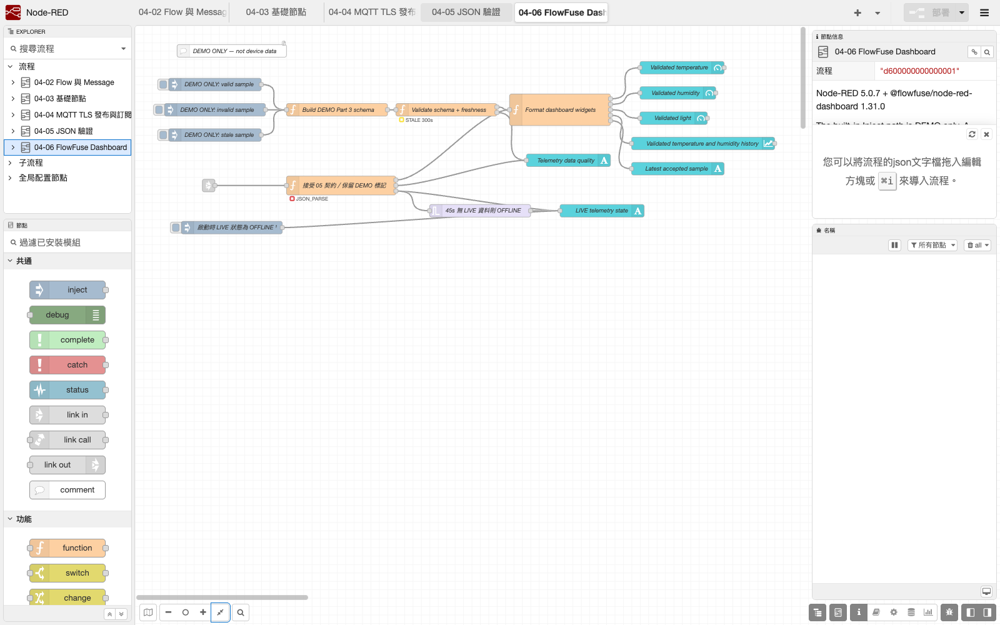
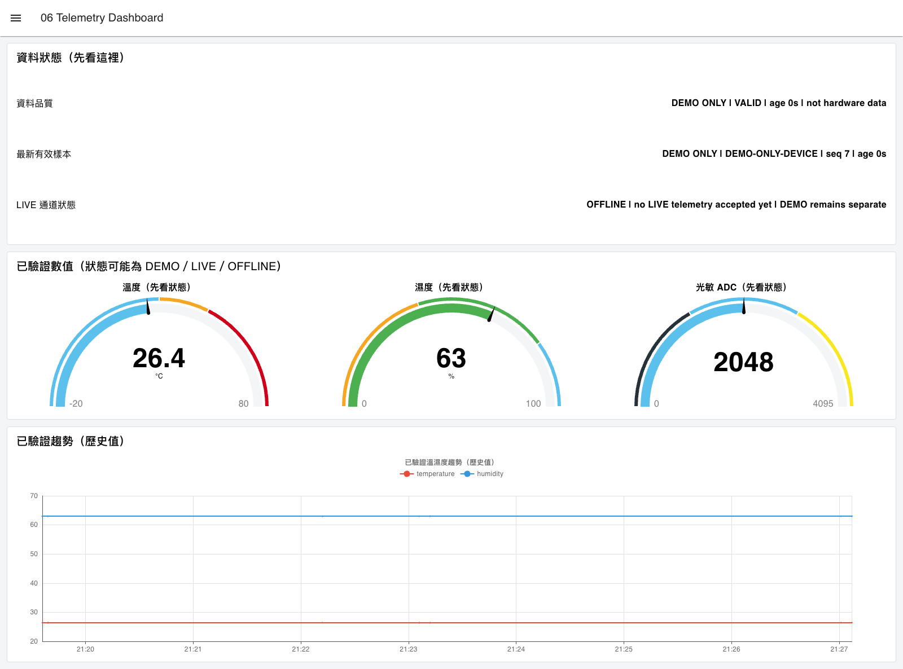
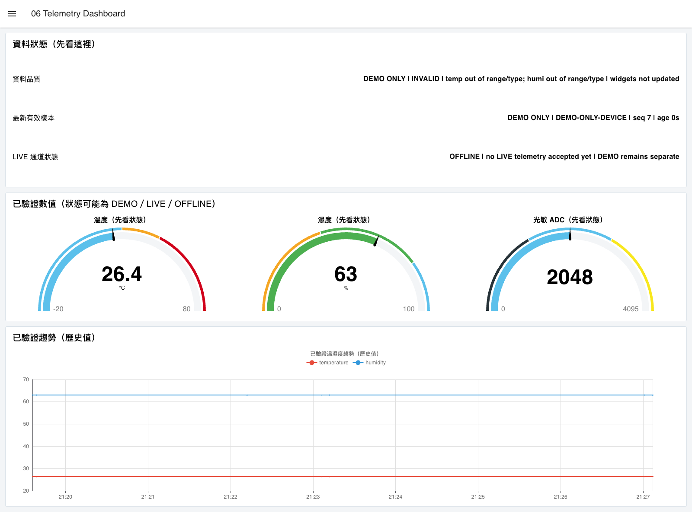
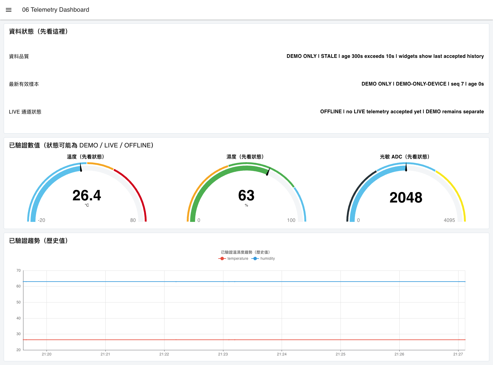

# 06. FlowFuse Dashboard 2 儲表板

本章使用 `@flowfuse/node-red-dashboard` 1.31.0 建立 Dashboard 2。不安裝舊 `node-red-dashboard`，也不把舊 Flow 的 `ui_tab`、`ui_group`、`ui_gauge` 或 `ui_chart` 直接複製進新教材。

## 學習目標

- 理解 `ui-base → ui-page → ui-group → widget` 層級。
- 使用 Text、Gauge 與 Chart 顯示溫度、濕度、亮度與資料狀態。
- 區分 `DEMO／非實機`、`LIVE`、`STALE`、`INVALID` 與 `OFFLINE`。
- 知道 Gauge／Chart 是「最後一筆通過驗證的歷史值」，不把殘留數字當成現況。

## 環境與匯入

Dashboard 2 已包含在第 1 章的 Repository lockfile。不需要在這一章再次 `npm install`；先在 Repository `nodered` 目錄執行 `npm ci`，再使用[第 1 章](01_environment.md)的平台別指令啟動同一個課程 userDir。

匯入：

[`nodered/flows/06_flowfuse_dashboard.json`](../../nodered/flows/06_flowfuse_dashboard.json)

若 `ui-base` 使用 `/dashboard`，本 Flow 的 `ui-page` 使用 `/part4-demo`，且未修改 Node-RED HTTP root，則本機網址為：

```text
http://127.0.0.1:1880/dashboard/part4-demo
```

若修改 Base path、Page path 或 `httpNodeRoot`，以 Dashboard sidebar 顯示的實際網址為準。

## 先用 DEMO 驗證

內建三個 Inject 都是課堂模擬，沒有連線 ESP32 或 Broker：

- `DEMO ONLY: valid sample`：通過驗證後更新 Gauge、Chart 與最新樣本。
- `DEMO ONLY: invalid sample`：顯示 `INVALID`，不更新 widget。
- `DEMO ONLY: stale sample`：顯示 `STALE`，不更新 widget。

Dashboard 中的「資料品質」和「LIVE 通道狀態」是判讀基準。當 invalid、stale 或 offline 發生時，Gauge 與 Chart 仍可保留最後一筆合法歷史值；這些數字不再是即時值，必須與狀態文字一起讀。

## 與第 5 章的精確介面

第 5、6 章 Flow 同時匯入時，已設定的 Link Out／Link In 會傳遞清理後的驗證 envelope：

```text
msg.payload    = 恰好八欄 v1 telemetry
msg.validation = { ok, code, bytes, age_s }
msg.demo       = true                 // 只有內建 DEMO 會帶這個標記
```

本章 adapter 只會在 `validation.ok === true`、`code === "OK"`、Payload 仍是精確八欄，且 `age_s` 仍在 -5～10 秒時更新 widget。有 `msg.demo === true` 時繼續標示 `DEMO ONLY`；只有通過第 4、5 章、且不是本地 Inject 的訊息才標示 `LIVE`。

第三篇裝置每 30 秒發布一次。LIVE adapter 每次接受新資料時會重置 45 秒 watchdog；45 秒內沒有下一筆通過驗證的 LIVE 資料，「LIVE 通道狀態」改為 `OFFLINE`。DEMO 不會啟動或重置這個 watchdog。

## 狀態語意

| 狀態 | 何時出現 | widget 行為 |
|---|---|---|
| `DEMO ONLY` | 內建 Inject 或第 5 章標記的 DEMO | 合法時更新，但不得當成實機證據 |
| `LIVE` | 非 DEMO 且通過第 5 章契約 | 更新儀表與曲線，啟動／重置 45 秒 watchdog |
| `STALE` | `age_s > 10` | 不更新；歷史數字不再代表即時值 |
| `INVALID` | 缺欄、型別、範圍或介面不合 | 不更新，顯示安全化錯誤分類 |
| `OFFLINE` | 尚未接受 LIVE，或 45 秒沒有新 LIVE | 保留歷史圖表，但明確標示非現況 |

## 可見驗收



*圖：Dashboard 2 Flow 在本機 Runtime 實際載入；內建輸入都是 DEMO，LIVE 介面與 watchdog 只能以正確驗證 envelope 觸發。*



*圖：本機 Node.js 24.19.0、Node-RED 5.0.7 與 FlowFuse Dashboard 1.31.0 的實際執行結果。畫面已明示 `DEMO ONLY`、`not hardware data`；它只證明本地 Inject、驗證 Flow 與 widget 資料路徑，不證明 ESP32、MQTT 或感測器。來源與 SHA-256 見[第四篇截圖來源](../assets/part4/captures/SOURCES.md)。*

1. Editor 沒有未知節點，Deploy 後 Runtime 沒有載入錯誤。
2. 按 valid DEMO 後，資料品質顯示 `DEMO ONLY／VALID`，LIVE 通道仍是 `OFFLINE`。
3. 按 invalid 或 stale DEMO 後，畫面顯示 `INVALID` 或 `STALE`，widget 不更新。
4. 第 5 章 DEMO 通過 Link 後仍顯示 `DEMO ONLY`，不是 `LIVE`。
5. 實際 MQTT 只能在第 4、5 章通過後才顯示 `LIVE`；停止發布超過 45 秒後改為 `OFFLINE`。這項需學生的 Broker 與裝置另行實測，不由公開截圖代替。

## 失敗診斷與證據邊界

回傳 Node.js、Node-RED、Dashboard 版本，Editor 中紅色三角或未知節點畫面、Dashboard 路徑、資料品質／LIVE 通道狀態與 ESP32 OLED 照片。回傳前要遮蔽 host、Topic root、Client ID、帳密與 IP。

公開 DEMO 畫面不能證明 ESP32、感測器、MQTT Broker 或外部網路已通過；LIVE 與 OFFLINE 邏輯的 Function 測試也不是實機測試。

FlowFuse Dashboard 2 同一 Runtime 只能有一個 `ui-base`。進入第 7 章前，必須刪除本章的 Dashboard config nodes，或使用另一個乾淨 userDir；單純停用 Flow tab 不當成已移除 `ui-base`。

## 無效與過期資料的實際畫面





*圖：先送入合法 DEMO，再分別送入錯誤與過期 DEMO。儀表保留上一次接受值，品質欄改為 INVALID／STALE；LIVE 通道仍是 OFFLINE。所有數字均是示範資料。45 秒 watchdog 另由[Runtime 測試](verification.md)使用合成 LIVE 輸入驗證，不宣稱已接上 ESP32。*
