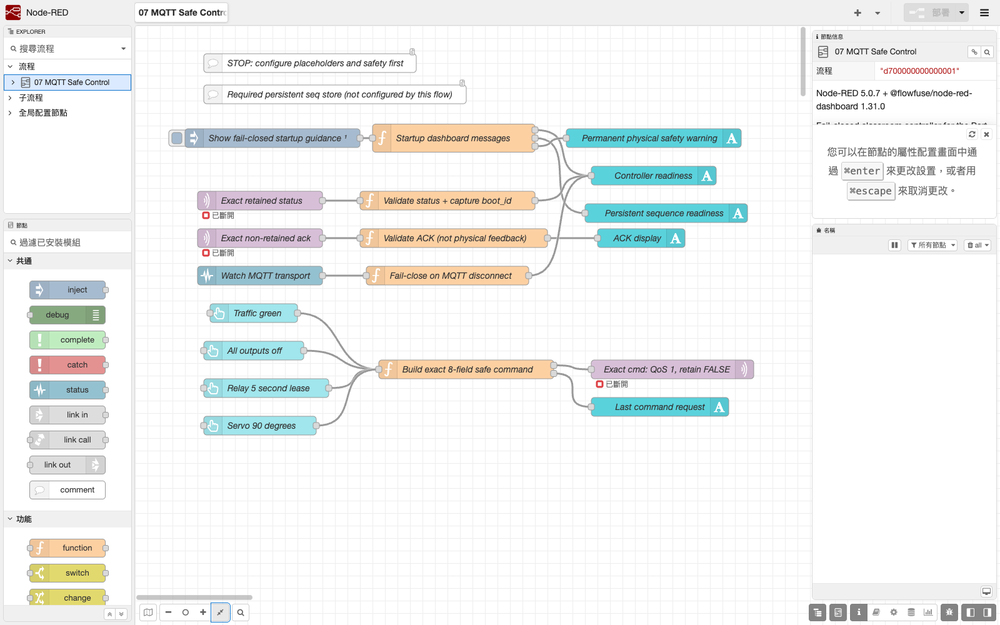
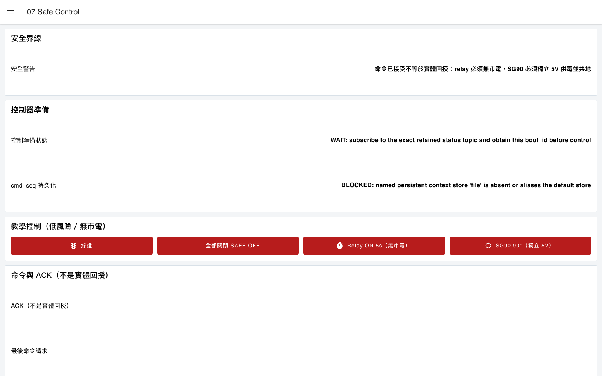

# 07. 雙向安全控制、匯出與還原

本章串接第三篇 `11_mqtt_control_oled` 的 `status`、`cmd` 與 `ack` Topic。Dashboard 不會因為按了按鈕就顯示「設備已完成」；它必須先知道當次 ESP32 `boot_id`，產生有時效的指令，並將 ACK 標示為「韌體已接受／套用」，而不是實體回授。

## 學習目標

- 等待 retained `status` 中的當次 `boot_id`，斷線或開機識別改變時讓命令 gate 重新回到阻擋狀態。
- 產生八個欄位的命令：`v`、`cmd_id`、`cmd_seq`、`boot_id`、`ts`、`ttl`、`target`、`value`。
- 使用 QoS 1、精確 `cmd` Topic 且不 Retain。
- 區分「Node-RED 已發布」、「韌體 ACK」與「實體狀態」。
- 完成不含秘密的 Flow 匯出、新 userDir 還原與異常測試。

## 資料流

```text
status (retained) → 驗證 online + boot_id → 命令 gate 才可放行
Dashboard 按鈕 → gate 檢查 boot_id／file seq／TTL → cmd (QoS 1, not retained)
ack (not retained) → 精確對應 pending cmd_id/cmd_seq/boot_id → 顯示韌體結果
MQTT Node 非 connected 或 status offline → 清除 boot ID 與 pending command，gate 不放行
```

匯入：

[`nodered/flows/07_safe_control.json`](../../nodered/flows/07_safe_control.json)

公開 Flow 的 Broker、Topic 與 Client ID 都是占位值。匯入後先完成第 4 章的 TLS、ACL 與本組精確 Topic 設定，並在沒有接上市電負載的情況下驗證。

本章含有自己的 `ui-base`。FlowFuse Dashboard 2 同一 Runtime 不支援多個 `ui-base`，因此不可與第 6 章 Dashboard Flow 同時 Deploy；請使用乾淨 userDir，或先移除第 6 章的 Dashboard config nodes。

## 命令建立規則

對應第三篇韌體的命令範例：

```json
{"v":1,"cmd_id":"nr-12ab34cd-1","cmd_seq":1,"boot_id":"12ab34cd","ts":1789000000,"ttl":10,"target":"traffic","value":"green"}
```

- `boot_id` 必須來自當前 retained `status`，不在 Flow 寫死。
- ESP32 韌體要求同一 `boot_id` 內 `cmd_seq` 只能遞增。本 Flow 採用更保守的作法：Node-RED 持續使用同一個上限有界的持久序列，即使 ESP32 `boot_id` 改變也不重設為 1。
- Node-RED 若在 ESP32 未重開機時自己重啟，memory context 可能遺失序號。進入真實控制前，必須在本機 `settings.js` 配置名為 `file` 的 file-backed context，並實測重啟後序號繼續遞增。`settings.js` 與 context 資料不提交。
- Node-RED 5 在找不到指定 store 時可能警告後退回 default store，不會拋出 exception。本 Flow 會先寫入一次性 probe，確認 `file` 與 default 真的是分開的 store；若不是就顯示 `BLOCKED` 且不產生命令。
- `ts` 來自 Node-RED 主機當前 Unix time，主機時間未同步時禁止控制。
- `ttl` 必須為 5～30 秒；教材預設 10 秒，繼電器測試使用更短的 5 秒租約。
- 控制 Flow 不得使用排程、離線 queue 或 retained `cmd` 重播過期命令。

## 設定持久序號

先停止本章 Runtime，只編輯該次 `userDir` 內的 `settings.js`，在 `module.exports` 物件中加入下列設定；若已有 `contextStorage`，修改原項目，不建立同名的第二項：

```javascript
contextStorage: {
    default: "memoryOnly",
    memoryOnly: { module: "memory" },
    file: { module: "localfilesystem" }
},
```

重新啟動同一 userDir，再按 `Show fail-closed startup guidance`。持久序號欄應顯示 `READY`；裝置欄仍須等待當次 status，單有 file store 不會放行控制。

分離探測只確認 `file` 不會退回 default store，無法從 Function 證明底層一定寫入磁碟。因此必須採用上面的 `localfilesystem` 設定，並完成一次停止、重啟、序號遞增測試。Node-RED 的檔案 context 預設在記憶體快取，約每 30 秒寫入；正常停止也會保存，突然斷電可能遺失尚未落盤的序號。ESP32 仍應拒絕重複序號；遇到拒絕先核對兩端狀態，不清除 context 或放寬韌體檢查。[官方 context 說明](https://nodered.org/docs/user-guide/context)

Repository 自動測試會用同一個暫存 userDir 完整停止並重啟 Runtime，驗證序號由 1 變成 2；輸入是合成 status／ACK，Broker 保持停用，不代表已控制實體設備。

## 輸出安全順序

1. 只啟用綠燈與全關，確認 OLED `CMD OK`、當次 ACK 與租約到期。
2. SG90 使用適當的獨立 5V 電源並與 ESP32 共地，先移除機械負載，再測試 90 度。
3. 繼電器是低電位觸發，必須先確認 GPIO 18 啟動時為 HIGH／OFF。只做未接市電負載測試。
4. 重開 ESP32、重啟 Node-RED、斷 Wi-Fi、關 Broker，以及送入舊 boot ID、重複序號、過期與超長 JSON；任一錯誤都不能使危險輸出繼續動作。

Dashboard 按鈕在畫面上仍可按；安全性來自後端 Function gate 在條件不足時返回 `BLOCKED` 且不傳給 MQTT Out，不是視覺上把按鈕變灰。不可把「按鈕看起來可按」解讀為控制已就緒。

`ACK MATCHED ACCEPTED` 只能在 ACK 不是 retained，schema 合法，且與目前 pending command 的 `cmd_id`、`cmd_seq`、`boot_id` 全部一致時出現。它只代表韌體通過檢查並執行對應程式路徑；不能證明燈泡真的亮、繼電器觸點真的切換，或伺服馬達真的到位。有風險的系統必須另加實體感測、聯鎖、急停與獨立斷電。

## 匯出前安全檢查

1. 只匯出本章所需 Flow，選擇 formatted JSON。
2. 搜尋 Broker host、網域、IP、Topic root、Client ID、使用者名、Token、檔案路徑與電子郵件。
3. 檢查 Inject、Change、Function、Template、Comment 及 Dashboard 標題；credentials 沒有出現在 Editor 匯出檔，不表示一般欄位沒有秘密。
4. 不提交 `flows_cred.json`、`.env`、private key、CA 私有路徑、`settings.js`、context 資料、整個 userDir 或 `node_modules`。
5. 用全新 userDir 匯入公開 JSON，確認必須由學生重新輸入 Broker/TLS 設定，而不是從備份還原秘密。

## 可見驗收





*圖：本機 Node.js 24.19.0、Node-RED 5.0.7 與 Dashboard 1.31.0 的真實載入結果。Broker 保持停用、未設定 `file` context、未連 ESP32，因此控制維持 `WAIT／BLOCKED`；這不是硬體控制成功證據。來源與 SHA-256 見 [第四篇截圖來源](../assets/part4/captures/SOURCES.md)。*

- 啟動畫面能區分 `file` store 已確認的 `READY` 與未配置／別名到 default 的 `BLOCKED`。
- 沒有 status 或 `online:false` 時，即使按鈕仍可點擊，Function gate 也不產生命令，Dashboard 顯示 `BLOCKED`。
- MQTT Node 由 connected 轉為 disconnected／connecting 時，Flow 立即清除已保存的 boot ID；即使先前收到 online，也必須等待重新連線後的新 status。
- 取得新 `boot_id` 後，序號從 file-backed 持久基準繼續遞增，不因 boot 變更歸零；發布節點是 QoS 1 且 Retain 為 false。
- 合法指令同時在 Node-RED 顯示已發布、ESP32 OLED 顯示 `CMD OK`，只有對應相同 pending `cmd_id`、`cmd_seq`、`boot_id` 的非 retained ACK 才顯示 `ACK MATCHED`。
- 重複、過期、錯誤 boot ID 或未知 target 顯示拒絕，ESP32 回到 `SAFE OFF`。
- 租約到期後 ESP32 OLED 顯示 `LEASE EXPIRED`並回到 `SAFE OFF`。公開 Flow 的「最後命令請求」會保留歷史文字，所以必須以 OLED 或另加的實體回授判定當前輸出，不能把該文字解讀為仍在動作。
- 公開 Flow 可在新 userDir 匯入，且節點必須重新輸入私有設定才能連線。

回傳問題時，請提供去識別化的 Flow 片段、Node-RED Debug、Dashboard 狀態、MQTT 伺服器回應碼與 ESP32 OLED 照片；不可提供帳密、真實 host、Topic root、Client ID 或完整內網資訊。
