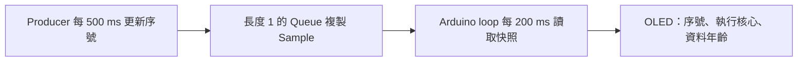

# FreeRTOS Task、延遲與共享資料

本章把「背景產生資料」與「畫面顯示」分成兩個工作。資料是程式計數器，不是感測器實測值。

## 執行架構

OLED 接一般模式 SDA 21／SCL 22；不需其他感測器。`xQueueCreate(1, sizeof(Sample))` 配置一個固定大小的快照；`xQueueOverwrite()` 在尚未讀取時覆蓋舊快照，因此此實驗適合「最新狀態」，不適合不能漏掉的計費或警報事件。

## 程式要點

- Producer 以 `xTaskCreate()` 建立，優先序為 1，堆疊大小 3072 **bytes**。ESP-IDF FreeRTOS 的這個參數不是一般 FreeRTOS 教材常寫的 words。
- `vTaskDelayUntil()` 以規律的醒來時間推進；`vTaskDelay()` 則從呼叫當下計算等待。用 `pdMS_TO_TICKS()` 明確換算時間。
- Task 不能直接 return；持續工作就使用迴圈，需要結束時用 `vTaskDelete(nullptr)`。
- Queue 複製整個 Sample，OLED 不會讀到序號與時間戳來自不同次更新的半套資料。`volatile` 無法提供這種一致性。
- 只有 Arduino `loop()` 使用 Wire 和 OLED，不在不同 Task 同時畫面更新。

## 觀察與練習

燒錄後應看到遞增 `SEQ`、Producer 的 CPU 核心、UI 核心與 `AGE`。`xTaskCreate()` 不固定核心，不能假設它一定執行於 Core 0 或 Core 1。

把 Producer 間隔從 500 ms 改為 2000 ms，重新編譯燒錄；當資料年齡超過 1500 ms，OLED 應顯示 `STALE`，下次取得新資料再回到 `OK`。觀察完改回 500 ms。不要透過無限忙等或停用 watchdog 製造延遲。

`TASK/QUEUE ERR` 表示記憶體配置或建立 Task 失敗；`NO DATA` 表示 Queue 尚未有快照。提高優先序會影響其他工作取得 CPU 的機會，不代表資料自然更準確。

## 編譯、燒錄與回報

範例：[`05_freertos_tasks`](../../examples/05_camera_ble_multitasking/05_freertos_tasks/README.md)。

在 Repository 根目錄使用 Arduino CLI 1.5.1、ESP32 Core 3.3.11 與鎖定函式庫。請先看[第五篇首頁](README.md)的命令與驗證邊界，燒錄後保留 OLED 正面、完整接線和板上操作結果。OLED 初始化失敗的 GPIO 2 閃爍碼見首頁。
