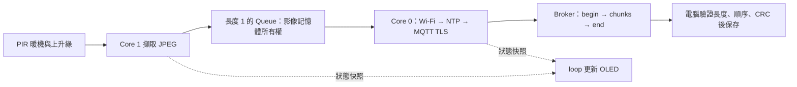

# PIR、相機與 MQTT 影像分段多工

把 PIR 觸發、相機擷取、OLED 更新與 TLS 傳圖拆成有明確資料所有權的工作。相機／替代 OLED 已驗證之後，還要核對額外的 PIR 腳位；預設 `CAMERA_PIR_PIN=-1`，不能沿用與 OLED 或其他模組重複的腳位。

## 執行架構



PIR 暖機 60 秒；之後必須先觀察 LOW，再偵測 LOW→HIGH，持續 HIGH 不反覆拍照。兩次嘗試至少間隔 30 秒。Queue 滿時丟棄新影像並顯示 `QUEUE FULL / DROP`；不建立無上限待傳列表。

擷取 Task 將 JPEG 複製到有上限的 PSRAM buffer，立即歸還相機 framebuffer。成功入 Queue 後，記憶體由網路 Task 負責釋放，包含失敗與逾時路徑。只有主迴圈碰 OLED；跨核心只在短 critical section 內複製狀態字串，不把網路傳輸包在鎖裡。

## 設定與傳輸合約

`camera_config.h` 填入經驗證的替代 OLED 和 PIR 腳位，打開對應測試旗標。`secrets.h` 延續第三篇的 Wi-Fi、Broker CA、8883、每組獨立 Client ID／帳密／Topic root。Broker ACL 只允許指定組別的 Topic；相機影像不得發布到第四篇公開狀態 Topic。

發布至 `<自己的 Topic root>/image`，QoS 1、Retain=false，單張上限 49152 bytes：

| kind | 核心欄位 |
|---|---|
| `begin` | `v:1`、`id`、`bytes`、`chunks`、`crc32`、`mime:"image/jpeg"` |
| `chunk` | `v:1`、同一 `id`、從 0 開始的 `index`、Base64 `data` |
| `end` | `v:1`、同一 `id`、相同 `crc32` |

`id` 由每次開機隨機 128-bit 值與遞增序號組成，不取 MAC。每片原始資料 384 bytes，最後一片可能較短；上限 128 片。CRC-32 用來檢查傳輸重組的一致性，**不是身分認證或防偽簽章**。

擷取後超過 15 秒才輪到傳送則捨棄；整個傳送超過擷取後 30 秒便中止，不發布完成標記。Wi-Fi／校時／TLS 失敗以 10 秒間隔重試。NTP 為憑證日期檢查前置條件，不是經密碼學驗證的時間。

## 電腦接收

使用 Node.js 24 與 Mosquitto 2.1+ 的 `mosquitto_sub`。先在 **Repository 外**建立權限受限的 subscriber 設定檔，一行一個選項，填入自己的 `-h`、`-p 8883`、`-u`、`-P`、`--cafile` 與精確的 `-t` Topic。憑證不放到 shell 指令列或 Git。依 [Mosquitto 官方手冊](https://mosquitto.org/man/mosquitto_sub-1.html) 核對安裝版本與格式。

在 Repository 根目錄執行下列命令前，將路徑與 Topic 替換為自己的值。macOS／Linux shell 使用：

```bash
mosquitto_sub -o /path/to/private-camera.conf -q 1 -F '%j' |
  node scripts/camera-receiver.mjs YOUR_EXACT_CAMERA_TOPIC /path/to/private-captures
```

`%j` 將 Topic、retain flag 與字串 payload 包成一行 JSON。接收器只接受精確 Topic、retain=0、合法格式與大小；同一片 QoS 1 重送可略過，相同 index 不同內容、缺片、亂序、CRC 錯誤與逾時都丟棄。未收到完整 `end` 不輸出 JPEG。只保留一張組裝中的照片及有限的短期完成 ID，不做永久重播防護。

成功顯示 `JPEG ASSEMBLED` 後，還要實際用影像檢視器開啟 JPEG；程式只驗證 bytes、CRC 與 JPEG 首尾標記，不包含完整 JPEG 解碼器。照片以限制權限寫入指定本機資料夾，課堂結束依同意範圍處理，不提交 GitHub。

## OLED 與驗收

四行分別顯示模組、PIR／相機狀態、網路狀態與傳送進度。`BROKER ACK` 只代表 broker 接受，不代表訂閱端收到或成功開圖；以電腦實際結果完成驗收。

依序確認 `PIR WARMUP 60s` → `PIR READY` → `QUEUED` → 分片 → `BROKER ACK`。再測試關閉 Wi-Fi、錯誤 CA／帳密、PIR 長時間 HIGH、連續觸發與斷線後過期影像。離線單元測試使用合成 byte fixture，不能把其結果記為 PIR、拍照或遠端 MQTT 實測。

## 編譯、燒錄與回報

範例：[`09_camera_mqtt`](../../examples/05_camera_ble_multitasking/09_camera_mqtt/README.md)。

在 Repository 根目錄使用 Arduino CLI 1.5.1、ESP32 Core 3.3.11 與鎖定函式庫。請先看[第五篇首頁](README.md)的命令與驗證邊界，燒錄後保留 OLED 正面、完整接線和板上操作結果。OLED 初始化失敗的 GPIO 2 閃爍碼見首頁。
