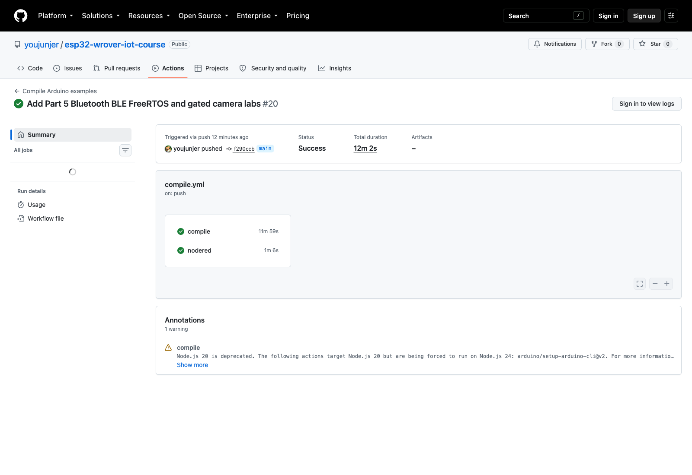

# 第五篇驗證紀錄

日期：2026-09-12。Arduino CLI 1.5.1／ESP32 Core 3.3.11／`esp32:esp32:esp32wrover`。

## 本次軟體檢查

- 已建立 9 個 Sketch、8 章課文及逐例編譯／燒錄指南。
- C++17 主機測試：文字分行、非法／超長指令、毫秒計時回繞、角度範圍、Beacon 格式、相機已知腳位衝突、CRC 已知向量與分片數。
- Node.js 接收器測試：大小上限、完整傳送、同片重送、重複 begin／end、漏片、亂序、非 canonical Base64、逾時、retained、錯誤 Topic、CRC 不符與非法 JSON。
- 本機開發期間以鎖定 CLI／Core／FQBN 編譯 9 個新 Sketch 與 3 個相機啟用分支；正式全庫結果如下。
- 接收器另測試真實 CLI stdin 與暫存檔案寫入；正常完成才新增檔案，超長行與未完成影像不產生新檔。

接收器 fixture 只是一段符合合約的測試 bytes，不是真實相機 JPEG，未驗證影像解碼。本機和 CI 都不會以合成憑證連到任何 Broker。

## 正式 GitHub Actions 結果

[Run 34686731748](https://github.com/youjunjer/esp32-wrover-iot-course/actions/runs/34686731748) 已在 Commit `f290ccb5d753b0a8f57020d439cb4a3b7c2b3dc9` 全部成功：

| 工作 | 結果 | 時間 |
|---|---|---|
| Repository policy／主機合約測試 | 通過，包含分段接收器真實 CLI I/O 與相機預設設定檢查 | compile 工作內 |
| 全部 40 個 Arduino Sketch | 通過，包含第五篇 9 個新範例 | compile 工作內 |
| 3 個相機啟用分支 | 通過，預檢／Web／MQTT 使用合成設定，未燒錄 | compile 工作內 |
| compile 工作 | 成功 | 11 分 59 秒 |
| Node-RED Runtime | 成功，6 份 Flow、45 秒 watchdog、控制阻擋與序號持久化 | 1 分 6 秒 |

正式 compile 於 2026-09-12 17:46:53～17:58:52（Asia/Taipei）執行。以上使用官方 CI 工具預設值，沒有本機 ctags 覆寫。後續證據文件提交不改動這次測試的程式；請以列出的實際 Commit 判讀。

圖說：真實 CI 成功摘要，只證明軟體編譯與主機測試；數量已與原始 Run log 逐筆核對。來源、工具、SHA-256 與警告說明見 [SOURCES.md](../assets/part5/captures/SOURCES.md)，可核對清單見 [CI 證據 JSON](../assets/part5/captures/ci-run-evidence.json)。

## 本機工具補充

Apple Silicon 上的 Arduino 內附 ctags 5.8-arduino11 回報 CPU 不相容。本次從 [Arduino ctags 同 Tag](https://github.com/arduino/ctags/tree/5.8-arduino11)（`abc8fca7499f44c725122881cd380a88c37abe0e`）在暫存目錄編譯 ARM64 版本，只調整與 macOS SDK 衝突的 unused 巨集名稱，透過當次 build property 指定；未修改 Core／函式庫或覆寫原 ctags。正式 CI 不使用此本機覆寫。

BluetoothSerial 的 4.0.0 deprecated 提示與 ESP32Servo 的未使用變數提示保留，不能據此宣稱相容未來 Core 4.x。

## 相機啟用分支

公開相機設定預設關閉，另用 `compile-camera-branches.sh` 在暫存目錄產生合成 pins／secrets，確保實際相機、WebServer、Base64、TLS 與 MQTT 路徑也能編譯和連結。暫存設定絕不燒錄，不從本機複製真實設定。

## 實體與外部服務待驗收

| 範圍 | 必須補上的證據 | 目前狀態 |
|---|---|---|
| OLED／一般接線 | 正面、全接線、錯誤閃爍碼 | 待實測 |
| Classic SPP | 手機連線、LF 指令、斷線重連 | 待實測 |
| DHT／控制 | 當次讀值、按鈕、5 秒逾時、SG90 停止 PWM | 待實測 |
| BLE | 兩板廣播／掃描、無訊號、改變位置的多輪 RSSI | 待實測 |
| FreeRTOS／核心 | 實際 CPU 回報、序號、STALE、同核心／雙核心耗時 | 待實測 |
| 替代 OLED／相機 | 指定板電路、替代 pins、上拉電壓、供電、連續共存照片 | **未驗證；不宣稱完成** |
| 拍照／Web | 可解碼 JPEG、Base64、兩種尺寸、短串流、認證與斷線恢復 | 須先過相機預檢 |
| PIR／MQTT | 追加 PIR 腳位確認、TLS／ACL、接收後開圖、錯誤與逾時 | 須先過相機預檢 |

操作證據不得露出密碼、Client ID、完整私人網址、附近裝置識別或未同意的人物。編譯成功與主機合約測試不取代以上實體結果。
