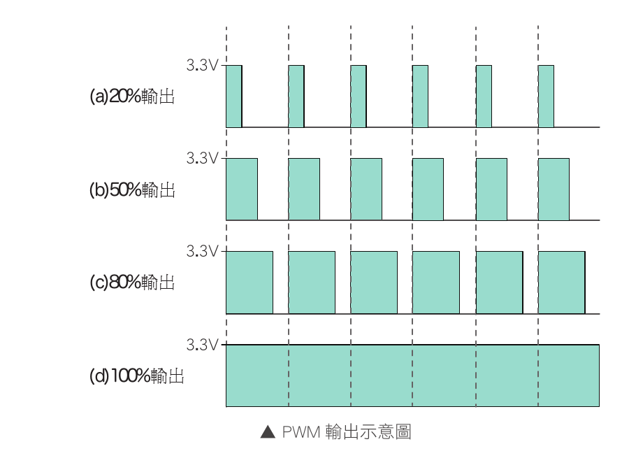

# 06 PWM 漸亮漸暗

本範例延續 AB143 舊教材的 LED 漸亮漸暗實驗，但改用 ESP32 Core `3.3.11` 的新版 LEDC API：

- `ledcAttach(pin, frequency, resolution)`：設定 PWM 腳位、頻率與解析度。
- `ledcWrite(pin, duty)`：寫入指定腳位的工作週期。

不再使用 Core 2.x 教材常見的 `ledcSetup()` 與 `ledcAttachPin()`。程式也不把訊息只送到 Serial；LED 本身就是可見狀態。



*圖：工作週期愈大，每個週期保持 HIGH 的時間愈長；圖像只說明 PWM 概念，程式仍使用 Core 3.x LEDC API。*

## 接線

| 元件 | 接線 |
|---|---|
| LED 正極（長腳） | 接 GPIO 15 |
| LED 負極（短腳） | GND |

改動接線前先拔除 USB 或外部電源。GPIO 15 是 ESP32 的啟動綁定腳位之一，不要在開機期間由外部電路強制拉成不正確的電位；本實驗只使用 LED 作為輸出負載。

## 可見結果

1. LED 約 2.5 秒內由暗漸亮。
2. 保持最亮約 1 秒。
3. LED 約 2.5 秒內由亮漸暗。
4. 保持熄滅約 1 秒後重複。

若 LED 重複「短閃三次、停頓約 1.2 秒」，表示 `LEDC ERR`，代表 PWM 初始化或寫入失敗。請確認使用的 ESP32 Core 是否為 `3.3.11`，以及 GPIO 15 是否被其他硬體占用。

## 編譯目標

```text
FQBN: esp32:esp32:esp32wrover
ESP32 Core: 3.3.11
外部函式庫: 無
```

API 參考：[Espressif Arduino-ESP32 LEDC](https://docs.espressif.com/projects/arduino-esp32/en/latest/api/ledc.html)
