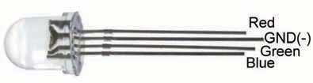

# 07 RGB LED

本範例使用 ESP32 Core `3.3.11` 的新版 LEDC API，分別控制 RGB LED 的紅、綠、藍三個通道。程式依序顯示紅、黃、綠、青、藍、紫、白與熄滅，直接以燈色呈現執行狀態，不需要序列監控器。

三個色彩通道的最高 PWM duty 限制為 `96/255`，避免初次接線時過亮。

## 元件

- 四腳共陰極 RGB LED 一顆。



*圖：AB143 課本的共陰極 RGB LED 腳位示意；不同廠牌腳序可能不同。*

## 接線

| RGB LED | ESP32 |
|---|---:|
| 紅色腳 | GPIO 15 |
| 綠色腳 | GPIO 2 |
| 藍色腳 | GPIO 4 |
| 共陰極 | GND |

這組腳位延續 AB143 程式中的 R15／G2／B4；舊版教材的部分接線文字與程式不一致，本範例已統一。GPIO 2 與 15 是啟動綁定腳位，不要在開機期間用外部電路強制拉高或拉低。改動接線前先斷電。

本範例只正式支援共陰極 RGB LED。不要將共陽極零件直接改接到這組腳位；GPIO 2 與 15 是啟動綁定腳位，外部拉高可能影響燒錄與開機。共陽極版本必須另行選擇不影響啟動的腳位與驅動方式，實體驗證後才能納入教材。

## 可見結果與錯誤碼

- 正常：每 `700 ms` 切換一種顏色，完整循環後重複。
- 紅燈短閃三次後停頓：`LEDC ERR`，代表至少一個 PWM 腳位初始化或寫入失敗。
- 顏色不正確：先確認元件為共陰極、LED 腳序與三個 GPIO 的接線。不同廠牌的 RGB LED 腳序可能不同。

## 編譯目標

```text
FQBN: esp32:esp32:esp32wrover
ESP32 Core: 3.3.11
外部函式庫: 無
```

API 參考：[Espressif Arduino-ESP32 LEDC](https://docs.espressif.com/projects/arduino-esp32/en/latest/api/ledc.html)
